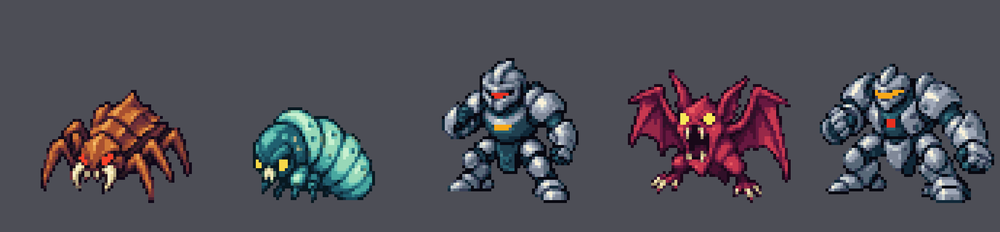

# Opponent native-art candidates

Source references and indexed sprite candidates for the five existing tutorial
opponents: **Scuttler, Grub, Guard, Howler and Warden**, in that order.
These source-derived candidates are staged for a separate integration pass.
They are **not gameplay screenshots or runtime-accepted replacements**.



The preview above shows the actual 64x64 indexed battle candidates enlarged 6x.
[Native 1x battle preview](previews/battle-native-1x.png) ·
[Small-asset preview](previews/world-native-6x.png) ·
[Final generated reference](source/opponents-reference-v2.png)

The small-asset preview shows five icons. Its Grub cell is an icon only; **no Grub
map object or overworld token exists in this package**. Four stationary tokens
are included for the four opponents already mapped in the game.

## Scope

- 24 indexed PNGs, encoded at 4bpp with transparent index 0.
- Five independent 16-entry battle-palette pairs; normal and shiny are identical.
  Guard and Warden happen to use the same palette definitions.
- Five two-frame icons and four stationary map tokens retain the existing shared
  palette and index binding. The shared runtime palette is not changed.
- Battle backs intentionally duplicate fronts. Each packed battle animation and
  icon contains two identical frames. No rear views or motion were authored.
- Original generated draft/final references, provenance prompts, deterministic
  converter, technical validator, byte checksums and reproduction reports.

Read [INTEGRATION_HANDOFF.md](INTEGRATION_HANDOFF.md) before importing anything.
This documentation package changes no engine code or assets, runtime generator,
shared palette, gameplay rules, encounters, save layouts, frames or timings.
Only the existing five original tutorial adaptations are represented; no claim
of book-canon enemy identification or underlying character-IP clearance is made.

## Reproduction

Requirements: Python 3, Pillow and NumPy. Verified with Python 3.12.14,
Pillow 12.3.0 and NumPy 2.3.5. Run from this directory:

```sh
sha256sum -c SHA256SUMS
python3 validate_native.py
python3 verify_reproduction.py
```

`verify_reproduction.py` regenerates in a separate temporary directory, validates
all candidates and checks all **41 generated outputs byte-for-byte twice**.
It also verifies the shared palette against its recorded Git blob identity.
Do not disable Python assertions with `-O` or `PYTHONOPTIMIZE`.

Technical checks: PASS. Build: not run for this docs/reference-only package.
Runtime: NOT RUN. Emulator screenshots: N/A; neutral-background previews are
source-asset diagnostics. Actual battle, map, palette, collision and return-flow
acceptance remain pending. Staging or merging these documents cannot satisfy
those acceptance requirements.

## Provenance and audit correction

OpenAI's built-in image generator produced the original draft, then one targeted
pixel-density revision. Both generated PNGs are preserved byte-for-byte.
The final source SHA256 is
`000068d6bdae0a60e93836438920f4f3b847cee6aca8335733d3f05c7ac4a279`.
The native candidates derive from that generated source through deterministic
conversion with limited source-color-mask preservation, not a claim of hand-drawn
native animation. No third-party image was supplied or traced.

The archived generation prompt has one conversation-relative phrase generalized
without changing the requested art direction. The revision prompt is unchanged.
The delivered palette copy contained one extra trailing blank line; staging
removed that blank line to restore the exact 185-byte repository blob
`a53187e0f6ff720864149e69d6855dbce4db2c91`. All color entries, palette indices,
24 PNGs and 41 regenerated outputs remain unchanged by that correction.

Contract inspection base: `d8f8ae62a3fba0dbe4c2c17fa2a4a1ce193bc530`.
The actual integration branch must recheck loader and generator bindings against
its current commit rather than assuming the historical base still applies.

Staging base: `c9669a132b03161392ee23ec347541042beb68d1` on
`task/i01-opponent-art`, after the S03 baseline merge.
Task: [I01 issue #31](https://github.com/12nuskek/DungeonCrawlerCarlemon/issues/31).
Integration: [draft PR #32](https://github.com/12nuskek/DungeonCrawlerCarlemon/pull/32).
