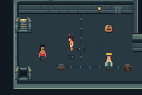
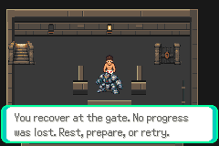

# F1-A01 partial checkpoint — not accepted

Base `168a0dabfe717e1ee29667c5460d45035506d786` (verified T01 PR56).
Production compiled/tested `c5d0f1e0c3fa45063f66375c39ccf50b3b0e1175`.
Fixture-only correction `7444dbd`: mutable fixture state explicitly uses EWRAM;
its compile/runtime verification is pending. Production engine/harness unchanged.
Issue59 / draft PR60; **unmerged**. Work paused under the user's budget condition.

Production SHA256:
`5c4f865a95c0b9e4c65f13d86c8ba44c9082599432b387f6fc350c0bd99b7230`.
Clean isolated production build passes. All84 inherited sessions/1393 assertions
pass (1173 production,220 labeled fixtures),84 empty errors. The whole runner
exited2 at the new membership fixture link, before its two GBA identity sessions,
final pixel/motion review and the216 recovered-victory/cold extension. Do not
claim86/1399 or98/1615 acceptance. Partial summary is labeled explicitly.

The diagnostic fixture's local static booleans landed in discarded .data. Failed
build/source preserved under local artifacts/floor1/a01/failure-01 and original
commit. First narrow correction moves them to explicit EWRAM; no repeat build or
runtime pass is claimed yet. This is a fixture blocker, not a production defect.

Actual emulator frames above are from c5d0f1e and the named routes. Their raw logs
and inputs are alongside them. All84 raw sessions/frames, build products and
ordinary saves remain in local artifacts/floor1/a01/run-I7PJq0; no ROM/save binary
is committed. Actual generator reproduces2009 engine/contract inputs. Source scope
review passes; host compilation of the unmodified classifier exhausts131072
identities, independently of pending GBA probes. Neither proves GBA acceptance.

Source review cautions: the current GBA probes are designed to exercise classifier,
presentation and two resolved graphics only. Nonmember palette/cache/object reload
and battle-end boundaries need bounded claims or focused direct probes where practical.
Synthetic trainer901 is classifier-only, outside TRAINERS_COUNT860/MAX864; never
instantiate it or write its trainer defeat flag (0x885 is system-flag space).
Future content must reserve valid trainer/flag IDs deliberately. Multiple encounters
sharing a graphics ID require object-specific state before larger-field production.

Resume only when the20%-remaining plan condition can be enforced or the user chooses
a fallback. No exposed tool reports actual Codex plan percentage/reset; no estimate
from context/tokens/time is valid. Parent pauses the sole continuation. Exact next:
reconcile PR60/head and budget authority; compile/replay corrected normal+extended
fixtures from unchanged production snapshot, add practical negative boundary probes
or bound their claims; complete full acceptance and216 recovery checks, actual
visual/motion review and evidence publication, then review/merge. F1-G01 stays gated.
