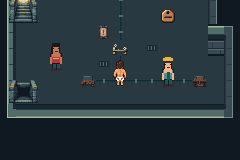
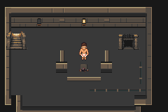

# F1-A01 explicit crawler identity — verified

Base `168a0dabfe717e1ee29667c5460d45035506d786` (T01 PR56).
Clean production compiled/tested `c5d0f1e0c3fa45063f66375c39ccf50b3b0e1175`.
Production ROM SHA256:
`5c4f865a95c0b9e4c65f13d86c8ba44c9082599432b387f6fc350c0bd99b7230`.
Corrected core fixture test source `5e0756e869f1c74fcc25dfd30fc5e645611fa540`.
Recovery test source `0a4d92bc918542acc7e690e6a010dc7e447fd2f3`.
Boundary fixture test source `c4d63b359d2e77526cac943baf2da22ad81621a2`.
Engine/harness verified identical to the compiled source at each later test source.
Issue59 / PR60; integration pending final reviewed evidence commit.

Six current maps and five crawler encounters are explicitly registered. Saved
viewport reload, object template refresh, Donut palette and local battle recovery
use this registration. Presentation tiles and resolved-object dispatch use full
map identity. No new map/trainer, geometry, art, balance, flag or save layout.

Actual mGBA0.10.5 evidence passes **100 sessions /1621 assertions**:

- 86/1399 main coverage:1173 production +226 labeled fixtures, retaining every
  prior1393 assertion and adding two identity fixture sessions.
- 12/216 production recovered-victory/cold sessions on this exact production ROM,
  retaining all six original retry/victory/repeat-interaction/save/reload routes.
- 2/6 additional labeled boundary fixture sessions. Combined1389 production and
  232 fixture assertions; all100 emulator error logs empty.
- 38 exact rendered comparisons:9 opponent,18 prop and11 background cases.





Both core fixtures exhaust65536 map and65536 trainer identities each in GBA code,
then check presentation/marker alias rejection and registered state. The extension
opts map35/2 and35/4 plus synthetic trainer901 into its isolated classifier only.
No warp/battle/defeat-flag write uses a synthetic trainer. Actual APIs are unchanged
production code; diagnostic setup temporarily alters and restores fixture state.
Harness only supplies normal controller input and reads values.

Both boundary fixtures repeat the identity checks and directly exercise:

| Boundary | Direct probe and scope |
|---|---|
| Palette | GetObjectPaletteTag selects Donut for registered IDs and stock tags for nonmembers; no negative VRAM palette-load claim |
| Saved viewport | Actual LoadSavedMapView discards member cache, applies nonmember cache and clears it; current entrance buffer snapshot fully restored |
| Object reload | Actual loader updates two declared member templates/active-object graphics versus stock64 script refresh; valid mocked header/template arrays, all original values restored |
| Battle end | Actual callback dispatch for five valid crawler losses restores HP/local return; valid stock trainer854 selects whiteout without healing; stock secret-base exception retains local return |

These controlled boundary calls are not full stock-map playthroughs. The extended
cases prove the new classification can admit another group without presentation
or marker aliasing. Both post-probe room framebuffers exactly equal production's
ordinary intro room; temporary party/map/cache/template/object/callback state was
restored. Synthetic trainer901 lies beyond TRAINERS_COUNT860/MAX864 and would map
to system flag0x885: never allocate it for content. Reserve valid trainer/flag IDs
in the expansion register. Multiple same-sprite encounters need object-specific
cleared state before production in larger fields.

```sh
DCC_LEGACY_RUN=/path/to/accepted/I01/run \
DCC_CORNER_SAVE=/path/to/ordinary/N01-corner.sav bash scripts/test-f1-a01.sh
DCC_A01_BASE_RUN=/path/to/completed/A01/run python3 scripts/test-f1-a01-boundaries.py
DCC_RECOVERY_BASE_RUN=/path/to/completed/A01/run python3 scripts/test-n04.py
```

Use the pinned environment in [testing](../../../testing.md). This run initially
failed core fixture linking mutable local statics into discarded.data; explicit
EWRAM storage fixed it. The committed resume runner completed just the two missing
fixtures against the preserved84-session clean build. Boundary attempt1 linked
unavailable libc memcmp; a direct buffer loop fixed it on attempt2. Both failed
sources/logs remain local and the [partial checkpoint](partial/README.md) stays
historical. Production compile and all prior sessions were never relabeled failures.
No gameplay defect or production code change was needed for these fixture fixes.

Source scope review passes. Actual generator reproduces2009 engine/contract inputs,
including full-ID table. Raw build/replay logs, routes and selected actual frames
are in final/, recovery/ and boundaries/; complete raw artifacts remain local at
floor1/a01/run-I7PJq0, n04/run-07n4ok69 and floor1/a01/boundaries-162utiud.
No ROM/save/executable is committed. Main source identity, fixture identities and
ordinary recovery input hashes are recorded alongside results.

Production link footprint: EWRAM249700/262144B, IWRAM30892/32768B,
ROM14931704/33554432B, SaveBlock1 15752/15872B, SaveBlock2 3884/3968B.
Fixture overhead is excluded from production headroom. Existing map buffer remains
10240cells; larger fields must measure camera, objects, palette/VRAM and frame peaks.

Actual legacy/state frames, all six victory/cold pairs and sampled walking frames
reviewed. Walking clip is6.36s of native240×160 emulator frames with normal timing,
no interpolation; no new animation claimed. Human pacing remains unmeasured.
Next F1-G01: reviewed D1 graybox/relocation/migration/width/T/camera proof. User's
05:15:54UTC fallback resumes implementation; quota unknown, no automatic20% guard.
