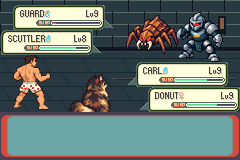
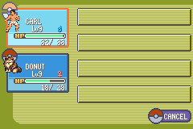

# C01 opening4 stopped at STOP101; no retry or cold

One actual opening process stopped at native frame **27,144**, Guard turn4.
The fixed policy required a Potion with stock0: Carl22HP (threshold27 while
Guard lived), Donut18HP, Guard3HP and Scuttler18HP. Carl STRIKE still had4PP;
both actors remained alive. No Guard victory, manual Save or cold verification.
Blank flash is unchanged. Atomic claim consumed; STOP is terminal, no retry.

[Exact actual results/identities](actual-results.json). Runtime helper/source
`ff6f5180fdeca60380b782da61998cb1fe77ff87` was published before freeze/claim;
scoped wiring tested `fd24d3e76e370a9ab2c15bab0fbededba0ea2391`, underlying
reviewed observer/helper source `32a25769c5427656a010287bed6cf03c5f62b45c`.
Main/base `b51e27d96f7ea43667ed20c4ce7bc7ca113d1eae`; game/ROM/ELF/library/
proof and exact input policy unchanged. No game build. Final68+2=70wiring
negatives pass; reviewed aggregate/37closed-gate tests preserved unchanged.

Actual boot/note/supply/guide/trial/earned Scrap/post-trial-guide phase checks pass.
Both Donut-owned Potions on Carl completed native acknowledgement, fade, reverse
party transaction and battle return. Independent full600-party/all-other-state
medicine audits and fresh-A lifecycle audits PASS for both uses:

| Use | Native heal | Restored / wasted | Stock | Fresh A / return frame |
| --- | --- | --- | --- | --- |
| 1 | Carl22→33 | 11 / 9HP | 2→1 | 25419 / 25502 |
| 2 | Carl27→33 | 6 / 14HP | 1→0 | 26451 / 26534 |

These demonstrate the two actual medicine closures, not a whole-fight guarantee
or acceptance of every hypothetical native instruction cut. At the next risk
check the fixed no-stock terminal rule fires. No fallback or assertion waiver.
The accepted limits/cadence/controls/thresholds were not changed. Failed Guard-only
opening remains incomplete; full uninterrupted opening, original oracle/legacy,
G02/prepared/human/full-floor gates remain open.

All **27,144 raw native frames** retained in14RGB24 chunks:3,126,988,800bytes.
Sequential16-byte native indices, per-frame SHA256 ledger, complete field/battle
traces, first-failing frame/CPU/snapshot and17indexed captures retained privately.
All17PNGs were compared pixel-for-pixel to their indexed raw frame. The bounded
review MP4 contains every frame at native262144/4389fps;3,127,031bytes, lossy
review only. [Native-timing review motion](opening/native-review.mp4),
[indexed export receipt](opening/actual-export-receipt.json).

The second image preserves the native HP animation/display timing; the full
native snapshots and return audit establish the exact heal. No picture editing,
retiming or synthetic runtime capture. Raw bytes remain the lossless authority.

Private output has102manifested entries/3,190,319,959bytes before separately added
readcheck/publication metadata, below8,837,820,160 opening allocation. Exact
manifest/capacity in results.json. Historical98entries/31previous gzip chunks and
both original full-frame receipts rehashed exact. No new compression, deletion,
upload, backup or representation change. Local retention is not independent
backup; Library5failed uploads+1failed supported download remain unknown-cause/
zerooriginalbytes, no retry.

Cumulative C01opening claims/processes **4/4**, cold **0/0**. Preserve old
STOP82/90/104; V016baseline/4candidate andSTOP117visual8536beforeB8402,
lateraccepted1/1,ordinary5,C01aactual5/3/1 andclaims6/3/1. Other69heads/main/
issue116/accepted nine-district plan unchanged, draftPR117 unmerged.
Next only read-only review of this native failed policy sequence. Any later run
requires a separately reviewed contract/explicit continuation; no remaining
execution authority in this increment. Earlier pre-execution report below is
historical and remains byte-for-byte intact.

---

# C01 Guard-choice opening4: scoped wiring admitted; execution pending

Independent review accepted source32a25769c5427656a010287bed6cf03c5f62b45c,
publishedfd73289ae75dcbb61b3fb2fbb576cdc605e53361. Explicit continuation admits
one new Guard-only opening4 and at most one actual-Save-bound conditional cold.
Separately named output/workspace/scratch/c01-guard-choice-opening4-r3-20261010.
Historical three opening claims/processes and STOP82/90/104,cold0/0 verified;
unused r2/new output absent. This checkpoint creates no freeze/claim/process.

Clean wiring source `fd24d3e76e370a9ab2c15bab0fbededba0ea2391` passes70 scoped
negative cases: every reviewed identity, output/order/count/bounds/routes/contract,
missing/changed frozen files, strict boolean substitutions, capacity shortfall
and optimized CLI rejection before output. [Exact results](wiring-offline-results.json).
The earlier68case candidate is retained separately; final correction additionally
binds the exact scoped test receipt into preparation/freeze/runtime admission.
No failed offline test or blind repetition; no game build/native compilation.

Reviewed generated C/compiled observer are byte-identical. All original aggregate
source dependencies/artifacts and native proof/bindings/ELF/library still rehash
exactly. Reuse the actual compiled observer; original full aggregate/37closed-gate
negatives remain unchanged, not substituted or weakened. Historical CLOSED
wrapper/record stays closed. The new named launcher compares an entire strict
reviewed execution record, validates exact frozen source/files/tools/executable
0700/owner/device/inode, and requires fresh full10000408128B reservation/headroom.
Its conditional cold admission rechecks actual opening claim/freeze/log/Save/full
live-disk state. Atomic claims and terminal STOP prevent replay/retry.

[Scoped contract](../../../../floor1/c01-guard-choice-opening4-r3-contract.md)
freezes unchanged ordinary note/supply/guide/offensiveTrial/earnedScrap/guide/Guard/
guide/manualSave QuietLanding35,1(4,5), no field Potion demo or Howler/Warden/
preparation/stairs. Same fixed Donut-owned Potion policy/Carl STRIKE/target,
72000global/36000encounter/3600medicine/6000cold/600seconds/12-frame cadence;
first failure terminal. No injection/grants/RNG search, timing tweak or waiver.

Publish before preparation; then freeze exact reviewed observer/source/build/
route/tool/proof/receipts/output/storage and consume exactly one opening claim.
Only successful actual manual Save with all14sectors/fulllive-disk equivalence
admits one independent Continue-only cold process. Retain all raw frames/traces/
indices/screenshots and bounded native-timing review motion; no compression,
evidence deletion/upload/private backup or representation change. Local retention
is not independent backup; Library5+1 unknowncause/zerooriginalbytes unchanged.
Main/all69otherheads/issue116/history/accepted nine-district plan remain preserved.
DraftPR117 unmerged. Return a clean actual-evidence checkpoint; no later increment.
