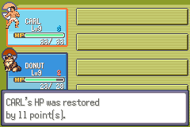

# Guard choice r1: terminal STOP104, cold blocked

The one separately authorized opening stopped104 at native frame28707, Guard
turn2, encounters2. Trial and seven phases passed. Donut used one earned Potion
on Carl:22→33,11 restored/9 wasted,Potion2→1. Full native heal-boundary checks
passed with Carl chosen STRIKE355 and no Donut PP cost; return to battle did not
complete within the frozen3600-frame medicine bound. Guard outcome0 unresolved;
no incapacitation or balance-defeat conclusion. No retry or helper correction.

[Complete native-timing review MP4](opening/native-review.mp4) retains all28707
frames,3189536 bytes, lossy. [Actual indexed-pixel export receipt](opening/actual-export-receipt.json)
binds14 exact240×160 PNGs to retained RGB frames and tested source/build. All
3307046400 raw RGB bytes/15 chunks remain the private lossless authority; no FFV1
or second lossless container/export. [Sanitized actual result](actual-result.json)
and [local retention status](local-retention-status.json) record verification.

Read-only diagnosis: native `gText_PkmnHPRestoredByVar2` ends in
`{PAUSE_UNTIL_PRESS}`. `Task_PrintAndWaitForText` keeps the printer active until
native acknowledgement; `Task_ClosePartyMenuAfterText` waits for that task.
Frozen stage5 sent zero keys while awaiting battle return. Offline closure mocks
jumped to BattleMain without this native text acknowledgement. The admitted
mocks missed that gate; native closure is not accepted. Stop image shows the
restoration text still open. Full3324 healed/terminal snapshots are byte-equal.
Observer exited; no active emulator, second opening, cold claim or new Save.

At stop Carl/Donut levels9/9,XP495/805,HP33/23,max33/28,status0,uses6/40/0/40,
friendship75/75,native counter72,money3320,Potion1,Scrap2. Actual map35,0(37,31),
facing1,trial win set,Guard/Howler/preparation/boss/checkpoint/loop unset. All six
party checksums/reencoding valid,unused400 exact, saved count0/zero600 buffer;
actual131072-byte flash remains allFF. Native CPU context96 bytes retained,
r0–r15/CPSR valid,SPSR unavailable. Guide-after-Guard/manual Save/actual disk14-sector
verification/cold were not reached; offline persistence checks are not actual Save
acceptance. This partial reconstruction is not original oracle/legacy recovery.

Start `ce7d2c43604488cab3446182a355c5425872cbeb`; source/offline-tested/pushed-before-runtime
`4418015741dde07d987cd3216bca961ad4033378`; main/base
`b51e27d96f7ea43667ed20c4ce7bc7ca113d1eae`. Compiled game
`4a92a9de70848b9d7275f9f255bb0d2f53232ab8`, engine tree
`0fedd142f43f136ceee189c54101b095fc88f495` unchanged, zero rebuilds.
Exact ROM/ELF identities are in [offline admission](offline-admission.json).
Recovered GCC14.2.0/ARM binutils2.44-3+23+b1/agbcc source
`da598c1d918402c42c0c0d7128ba14567f3175e9`/libmGBA0.10.5 files match manifests;
recovered compiler binaries are not historical original-tool identity.

[Contract](../../../../floor1/c01-guard-choice-r1-contract.md):Carl retains normal
STRIKE/target; Donut medicine on the single threatened living actor, thresholds
Carl27 while GUARD lives/Carl12 after KO/Donut12. New route omits redundant field
Potion demonstration; original4HP evidence and superseded Carl-heals proposal
remain intact. NewGame/note/supply/guide/offensive trial/Scrap/guide/Guard/guide/
manual Save at Quiet Landing35,1(4,5) only; no Howler/Warden/preparation/stairs.

Final offline aggregate passed74124 policy vectors,8 native medicine UI/animation
cases,26304 complete-snapshot byte corruptions,10 phases/60 endpoint negatives/
412 unused-slot cases/265 walking transitions/10 map lifecycles/30 rekeys/30
Save-cold cases,32 ABI values/82 actual ELF bindings/11 terminal-driver mocks/5
executable negatives. Full source11734 entries/exact ROM/ELF/tool identities and
executable verified. Native runtime demonstrates the omitted acknowledgement gap;
these inert checks do not override the terminal failure or admit cold.

One r1 opening claim/process; cumulative C01 opening3/3,cold0/0. Source checkpoint
published before freeze/claim. Complete reservation10000408128 bytes,free atfreeze
10512089088;72000 global/36000 each encounter. Full raw captures/traces/index,
logs,captures,source,audits,bounded review copies,conditional cold and256MiB
headroom reserved without compression/deletion/transfer savings. No optional
8858370048-byte FFV1 export. Diagnose/retain only after first terminal failure.

Private originals/new source/freeze/claim/raw/traces/CPU/Save/export/preparation
records are locally retained with all indexed payloads SHA256 read back. This is
not independent backup: approval pending/unverified,no private upload. Library
five failed uploads and one failed supported existing-backup download remain
unknown cause/zero recovered original bytes; no retry. Both earlier C01 STOP82/
STOP90/raw/incomplete480MiB FFV1/complete MP4 untouched. OriginalV016/4 STOP117
requestedvisual8536 beforeB8402,later accepted separate1/1,ordinary5,C01a5/3/1
processes and6/3/1 claims,all other branches/history remain preserved.

DraftPR117 review only,no merge/issue116/extra writer/schedule. Next dependency:
review STOP104 and a separate native restoration-text acknowledgement admission,
including actual printer-task closure mocks, before any further process. No
balance change or full-opening continuation follows this failure. Original
oracle/legacy/human/C01/G02/full-floor gates and accepted nine-district plan stay
open/unchanged.
