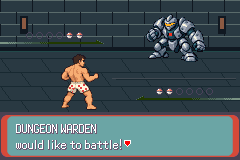

# C01a r2 — corrected startup PASS; terminal first-dialogue STOP122

**Runtime menu coverage remains blocked.** Parent accepted the reviewed two-line
slot-count correction at PR115 head554ec0157e211b5a8e3989476d9c8b2d53ed3358.
Applied only a[17]→a[16] and mandatory startup check17→16. The corrected observer
passes startup; the same frozen menu route then stops at the first neutral
`ui wait action 0 900`. C01a process2/baseline attempt2 reaches14 assertions,
5449 absolute/3405 visual/2101 battle frames; no move/action selection. Candidate
process3/attempt1 is not claimed or run. No retry or Save.

The actual STOP122 image still shows “DUNGEON WARDEN would like to battle!”
with a native down-arrow. Last retained main CB2 is BattleMainCB2; opponent
controller is scoped CompleteOnInactiveTextPrinter, execution flags0x2, hardware
keys1023 (none held). sText_Trainer1WantsToBattle ends `\p` (CHAR_PROMPT_CLEAR);
RENDER_STATE_CLEAR waits in TextPrinterWaitWithDownArrow for fresh A/B when
native autoScroll is off. A neutral wait cannot discharge this prompt or activate
Carl's input callback. [Exact source/state diagnosis](stop-diagnosis.json),
[actual safe log](baseline-safe.log), [partial trace counts](partial-trace-counts.json).
This is the first unexpected runtime failure of the separately frozen r2 claim.

[Actual ordinary-speed baseline intro/STOP motion](actual-baseline-intro-stop.mp4):
3405 native frames at16777216/280896 fps,240×160. Private FFV1 decoded RGB equals
every captured RGB byte, SHA256df5ebcc08ebf680ded4177006bedd721a344fdb06f33f11833112315b4b9f325.
[Exact capture identities/counts](capture-retention.json). These are baseline
field/intro/prompt pixels, not C01a action-pane before/after or candidate motion.
No menu glyph/pixel, depleted SPARK, target/cancel, Bag/Summary return, full
state/purity baseline-candidate/typedE+EOF acceptance is claimed.

[Reviewed r2 contract](contract.md), [exact freeze/build/input/observer identities](freeze-summary.json).
Corrected helper source477f499fafa331875236e17028849fb8ba626c7b; freeze/execution
c4774762db9fdae221f26c9af50b0d8ea08e00e9. Observer C
9cbe47619817803bb075f8b59470b24b45deccb172e87e7a0859fa2c71d76c18, binary
8589d38042ea026d8a7a8b936ae98dad79b90dfc806e9f3a997b2f97c185964c;
private freeze df2f541c222111e4048211ff759f7a886634074d0dd3e24a17aa912c5f65f012.
One corrected host compile, no game build/reconstruction/tool acquisition or V01
pair replay. Base mainbdff4e1a/engine8d8c7761 reuses accepted active build9c83611e,
ROM6b7a83f2/actual ELF1bc654d9. Candidate compiled/offline-tested source
807eeea457c973b097be9eab9e1556e20d0204aa, engine
3ef0d46368e45c3e4a5b8084eeec2a81b50a688b, retained ROM
3e6fa891385e38a900fa307660bc8916f8f0b9776098a76378f27e238d962248 and ELF
c5f7e26472f61831bf0166086ef86f42ccdedb615044b3a8e7e7bc9bc939d653, both hash
verified before execution. Verified recovered GCC14.2.0/binutils2.44-3+23+b1,
agbcc source da598c1d918402c42c0c0d7128ba14567f3175e9, libmGBA0.10.5;
recovered compiler binaries differ from historical, no original-tool claim.

[Focused actual binding proof](start-binding-proof.json):16/16 declared/checked,
nine data/seven scoped callbacks, consumer max15, all real addresses nonzero
in both actual symbol sets;66 missing/zero/extra cases rejected offline. Generated
C differs from failed source only in the two reviewed places. Every prior57
retention-manifest entry verified unchanged; old failed observer, contract,
freeze, claim and STOP121 at2044/12/zero battle remain preserved. New output and
exclusive baseline claim are separately named. All real readiness/state/native
boundary/bounds/first-stop guards remain unchanged; no assertion weakening.

Cold input passes the complete native party/count/flags/logical resources/counter/
legal-field gate. [Last retained state](last-frame-safe-state.json) has all six
party checksums valid, all600 party bytes/all300 flags exact across3405 frames,
count2/counter47, Carl/Donut11/10,XP748/1058,HP38/30,clear status,uses8/40/2/40,
friendship89/81, preparation/boss/checkpoint/loop/both Warden flags unset.
Raw resource ciphertext rotates at visual1294 through native CB2_InitBattle →
MoveSaveBlocks_ResetHeap. Actual post-STOP encryption context was not captured;
full post-STOP canonical resource equality is not claimed. Original normal Save
and both independent copies remain53f62dc2e283d89236d5572f47c3e7449c0bc1c06de738b1427fc9664ae67eb6.
Partial trace retains3391 full B snapshots/3405 F/14 zero-boundary frames, no E;
it is not a complete successful reference and cannot authorize candidate.

[Unapplied dialogue-handoff proposal](proposed-dialogue-handoff.patch) changes
only route command24 from `ui wait action 0 900` to the existing
`ui next action 0 900`. [Source-only proposal guards](proposed-dialogue-handoff-proof.json)
verify all155 other commands and every native gate/bound remain unchanged.
Existing ui next sends ordinary A every60 frames only while the real receiving
callback is not ready, then releases keys. It already handles native post-round
messages in the route. Proposal is not applied, no further claim created. Next:
review this source-backed handoff, then separately name/freeze another baseline
claim and conditional candidate from the same verified builds/ordinary Save.
No neutral-wait enlargement, timing/RNG search or blind retry.

One diagnosed offline capture-analysis failure is [retained](offline-pixel-preparation-failure-01.json):
checker incorrectly rejected atlas box index3. Native sFontHalfRowOffsets maps
3 to background0; all256 lookup bytes/six mask strings now [verified offline](offline-pixel-correction-proof.json).
Separate corrected capture-analysis helper preserves the frozen checker and
runtime observer/input identities. No menu/candidate glyph check was reached;
this offline fix is not substituted for runtime pixels. Earlier five offline
preparation failures and read-only diagnosis flag mistake remain historical.

[Private local retention](private-retention-summary.json):21,140,478 bytes,
3472 byte-verified entries, archive SHA256
ba172a84626a0676e662198a8a63be6c54abc2c59e6df16348a1f2f88cbb47c5.
Builds/tools separate; original STOP121 archive3fc4ed0f unchanged. No verified
independent transfer or backup. Workspace private download is available; it does
not automatically verify an independent destination. Public only actual PNG/
viewing MP4 and safe summaries; no ROM/ELF/Save/raw states/traces/full symbols.
Library5 upload+1 supported backup download failures/zero original bytes/unknown
cause unchanged, no retry. Historical V01 6/4/STOP117, completed new V01 pair1/1
and ordinary reconstruction5 remain separate; C01a now2 baseline processes/
2 baseline attempts/0 candidates/0 selected actions, separate STOP121 and122.
Human comprehension/pacing/legacy/prepared-unprepared opening/branch-order/
optional skips/full-floor gates and accepted bounded nine-district plan remain.
This checkpoint goes to existing draftPR115, unmerged; main/other heads untouched.
