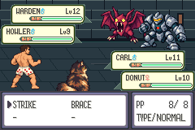
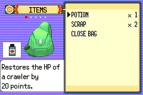

# C01a r3 — complete offline route proof; after-Bag STOP122

**Baseline attempt3 stopped; candidate remains unclaimed.** Parent accepted the
challenge acknowledgement and nine direction corrections at published
 d9208aeb8d4b1156bd47a705cc4ff7df9ffb5670. Separately named156-command route
f03cae6c47e866b49209f1a78f6fd2ca34e1653084422b5bab7c3c1e7175b3fa changes
only reviewed commands24,38,41,47,56,84,91,101,104,149; [exact scoped input diff](reviewed-inputs.patch). Original route7105211c,
failed observers/contracts/freezes/claims and STOP121/r2 STOP122 remain intact.

[Executable complete offline native-transition proof](offline-route-proof.json)
compiles actual baseline/candidate action/move/target/context/Summary handlers
with rendering/audio stubs and exercises every cursor assertion/capture, both
actors, all cancellations, expected two-round SPARK spending/depletion and return.
Each original mistake is independently rejected in each source set:20 negative
cases. All146 other commands/assertions/captures/bounds remain exact. Async menu
returns/PP spending are source-guarded expectations, not timing, receiving state,
RNG or combat acceptance. [Two harness failures and fixes](offline-proof-failures.json)
remain retained; no gameplay or runtime assertion changed.

[Contract](contract.md), [freeze/build/source/observer/Save identities](freeze-summary.json).
Helper/offline-tested source d8a40d5144c79d0dcab6c08c240d72cff35e13a3;
freeze/actual execution **2bc54d5d2c5b961f8fd4cccf313ff02f4a10a89e**.
Private freeze 9656b85ebb8bc5c20842483dbabc96750782af36b33a1ce01c1a07c1c69d510b.
Unchanged corrected16-slot observer C9cbe47619817803bb075f8b59470b24b45deccb172e87e7a0859fa2c71d76c18,
binary8589d38042ea026d8a7a8b936ae98dad79b90dfc806e9f3a997b2f97c185964c.
No host compile/game build/tool acquisition/reconstruction/V01 pair replay.
Verified tooling remains GCC14.2.0, ARM binutils2.44-3+23+b1, agbcc source
da598c1d918402c42c0c0d7128ba14567f3175e9, libmGBA0.10.5. Recovered compiler
binaries differ from historical; no original-tool identity claim.

| Reused build | Source / engine | Verified ROM / actual ELF SHA256 |
| --- | --- | --- |
| Baseline | main bdff4e1acd117dc92aa6aa66bb687dc52cdfcbb7 / engine8d8c7761f4878bb9a8d7e2bffe36ed38da08aa6a; retained active build9c83611e8e9b61d55388c18496c361d3362e462e | 6b7a83f27ede2dac9a124c0e267f34c9d0747db4a68cff05425fb9966f5b2459 / 1bc654d935e262489c3e073225394ebf99732b0452eb311025b9e5fee0059cdc |
| Candidate, unexecuted | compiled807eeea457c973b097be9eab9e1556e20d0204aa / engine3ef0d46368e45c3e4a5b8084eeec2a81b50a688b | 3e6fa891385e38a900fa307660bc8916f8f0b9776098a76378f27e238d962248 / c5f7e26472f61831bf0166086ef86f42ccdedb615044b3a8e7e7bc9bc939d653 |

One exclusive C01a process3/baseline attempt3: **24 assertions,6415 absolute,
4371 visual,3067 battle frames**. Startup, initial cold full native input,
challenge handoff, Carl STRIKE→target cancel→STRIKE→BRACE→STRIKE→move cancel,
Fight→Bag all pass. Command55 `ui wait action 0 900` after command53 B fails
with native result122. This r3 after-Bag STOP122 is distinct from r2 dialogue
STOP122. Four actual UI_MOVE assertions, actor0 only; no committed move/round,
no Donut/party/Summary/depleted-SPARK/candidate/glyph/purity acceptance. No retry,
Save or candidate process4 claim. [Actual log](baseline-safe.log),
[result](baseline-result.json), [retained-state/source diagnosis](stop-diagnosis.json).

**Proved:** Bag remains open; actual B-frame hardware keys1021, then neutral1023;
Task_BagMenu_HandleInput remains active, main CB2_BagMenuRun, exec flags1;
CompleteWhenChoseItem awaits return to battle. Bag screenshot/STOP pixels equal.
Bag readiness had returned atvisual3422 while main was still CB2_Bag setup.
SetupBagMenu case14 creates input task before case20 starts fade-in and before
installing CB2_BagMenuRun; current guard checks task/fade but not executing main
callback. This is a demonstrated readiness false-positive. Exact reason B was
not consumed remains unresolved: retained stream does not include actual
newKeys/fade/link-wait values at that edge. Native palette.c IsSoftwarePaletteFadeFinishing retains active until finishingCounter4; full-colour pixels alone do not establish fade-off.

[Unapplied stronger Bag readiness patch](proposed-bag-readiness.patch) requires
verified G:CB2_BagMenuRun plus existing active-task/fade guards; separately mandatory
bagCB2 binding,16-slot array unchanged. [Executable offline counterexample/proposal
proof](proposed-bag-readiness-proof.json) shows old guard accepts pre-running
callback and proposed guard rejects it, preserving valid RunTasks/fade-clear
acceptance and negative guards; both actual STT_FUNC bindings verified. No route
change or new claim. Next: parent review of this receiving-readiness gap, then
separately named/frozen observer/claims and actual edge context evidence before
any execution. No timing/RNG search, extended wait or blind retry.

Actual baseline captures below use tested mainbdff4e1a/retained active build9c83611e,
execution2bc54d5d and routef03cae6c. They show baseline PP/TYPE panes, not candidate
USES/hints or before/after acceptance.

[Actual STRIKE target](strike-target.png), [actual Bag capture](bag.png),
[actual ordinary-speed menu/STOP motion](actual-baseline-menu-stop.mp4):4371 native
240x160 frames at16777216/280896 fps; independently ffprobe4371 frames/73.182370s.
[Lossless retention](capture-retention.json) independently decoded every actual RGB
byte, SHA256f9210af7616a80e918d143bde5c6d48cc74ec4a2b508da27e91dfac6d3412eb7. No direct human video playback claim;
actual static images and14 captured transition samples inspected, full clip decode verified. No candidate pane
pixels are fabricated or substituted for runtime coverage.

[Actual final state](last-frame-safe-state.json): all600 final party bytes equal
cold input, all6 checksums valid, all300 flags equal through4371 frames,count2,
counter47, levels11/10,XP748/1058,HP38/30,clear status,uses8/40/2/40,
friendship89/81, preparation/boss/checkpoint/loop/Warden unset. One physical
frame3166 captures Carl's native temporary48-byte decryption, independently
[source/byte-proved](native-transient-party-proof.json); all other4370 physical
frames have exact cold600 party bytes. Strict full2700 candidate comparison is
unchanged. [Read-only analysis expectation error](offline-analysis-failure-01.json)
retained; final-state correction is not a runtime exemption. Cold logical-resource
gate passed with actual context; native battle-init raw key rotation occurs once.
Post-STOP context was not captured, so canonical post-STOP resource equality is
not claimed. Bag actual pixels show Potion1/Scrap2. Normal Save/original/both
independent copies remain53f62dc2e283d89236d5572f47c3e7449c0bc1c06de738b1427fc9664ae67eb6.

[Partial typed trace](partial-trace-counts.json):4337 full2560 B/4371 F/34 zero-
boundary frames/E0; cannot authorize candidate. Full6416-record timeline hash
chain and terminal122 verified, actual logs/state/captures preserved. Unchanged
bounds18000 visual/30000 battle/4096 native events/frame,2046 startup/250 active
chunks,2GiB file/32MiB logs/20GiB pair reservation passed before the exclusive claim.

[Private local archive](private-retention-summary.json): 52869754 bytes,
4788 byte-verified entries, SHA256d2061de7c4816de637eb490111191da30cb4adcb933cb739ae5b8469059de551.
Builds/tools separately retained. Archive covers its exact manifest; later public
notes/publication metadata and one post-archive offline syntax-caller NameError
are separately retained. Supplied actual __file__ namespace fixed that caller;
unapplied host syntax passes, no runtime change. No verified independent backup
or transfer. Workspace download availability is not an independent destination
verification. Public only actual PNG/viewing MP4 and safe summaries/patch/logs;
no ROM/ELF/Save/raw traces/full symbols. Prior57+3472 manifest entries and both
old archives verified unchanged before execution; historical failures preserved.
Library5 upload+1 supported-download failures/unknown cause/zero original bytes
remain unchanged, no new attempt.

C01a now **3 baseline processes/3 baseline attempts/0 candidates**, STOP121,
r2 dialogue122 and r3 after-Bag122 distinct. Historical V01 6/4/STOP117, completed
new pair1/1 and ordinary recovery5 remain separate. Main/other branches and bounded
nine-district accepted plan unchanged. Human comprehension/pacing/legacy/original
oracle/prepared-unprepared/branch-order/optional-skip/full-floor gates remain.
Scoped draftPR115 review checkpoint only; no merge or full-floor completion.
