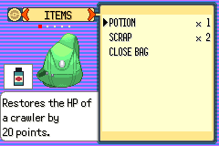
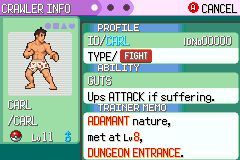
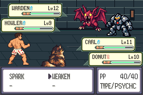

# C01a r4 — native menu route completes; inventory verifier stops

One baseline process4/attempt4, execution
`b222d75708e3eb3e48bd42e2318befce82e762f0`, completed the native route with
**emulator exit0,59 assertions,9095 absolute/7051 visual/5747 battle frames**.
The independent frozen runner then failed its capture inventory: broad
`battle-*.ppm` includes mandatory route command23 `battle-start.ppm` alongside
all7051 correctly numbered frames. **Overall contract remains STOP/PASS=false**;
candidate process5 was never claimed or run, no retry or Save. This is a distinct
post-process verifier phase; startup-slot STOP121, trainer-dialogue STOP122 and
asynchronous menu-readiness STOP122 remain separately preserved.

[Original STOP](STOP.json), [original baseline result](baseline-result.json),
[actual59-assertion log](baseline-safe.log), [exact diagnosis](stop-diagnosis.json),
[contract](contract.md), [frozen identities](freeze-summary.json) and
[exclusive execution claim](baseline-exclusive-claim.json) are retained.
Frozen source and route assertions are unchanged after failure. Published commit
and returned CI/branch metadata are recorded in `publication-receipt.json`.

## Actual baseline verification

[Independent retained-stream checks](retained-complete-stream-verification.json)
validate6883 full2560-byte native B records,7051 F records and complete typed
E+EOF, including native boundary party checksums. The supplemental stream is
exactly7051×2700=19,037,700 bytes with EOF.7051 numbered captures are precisely
0..7050; all16 named route captures exist. These read-only checks do not rewrite
the failed contract receipt or authorize candidate.

27 callback-readiness assertions and14 move assertions cover both Carl/Donut,
all4 moves, target/move cancellation, Bag cancellation, Party/context/Summary/
context/Party/battle return, two earned SPARK uses, zero-SPARK rejection and
WEAKEN return. Native final boss-unset/Potion1/Scrap2 assertions pass. Final
duo11/10,XP748/1058,HP28/24,status clear,uses8/38/0/40,friendship89/81,
count2/counter47; all300 flags match the cold input in every supplemental frame.
Preparation/boss/checkpoint/loop/Warden flags unset. Battle remains active after
two turns; no victory/completion claim. All6 final party checksums validate.
[Decoded safe state](last-frame-safe-state.json). Cold full canonical resources
pass; full post-run canonical resources remain unverified because their native
encryption context was not retained. Final actual item checks are separate.

Original manual Save and both copies remain
`53f62dc2e283d89236d5572f47c3e7449c0bc1c06de738b1427fc9664ae67eb6`.
No memory injection, resources granted, forced bytes or RNG/input search.
Strict candidate full state/RNG/purity/2700-frame/pixel equivalence was not reached.

## Readiness and actual passive input evidence

The actual running scoped callbacks are mandatory in both retained ELFs:
`G:CB2_BagMenuRun`, `L:party_menu.o:CB2_UpdatePartyMenu` and
`L:pokemon_summary_screen.o:MainCB2`. They supplement the unchanged original
16-slot array. Readiness also requires the exact active input task, fade-active
and software-finishing flags clear, and native source queue readiness. Native
ABI gives Link/RFU counts4029/2534 and maximum3. No guessed fade duration.
[Baseline bindings](baseline-bindings-proof.json),
[candidate bindings](candidate-bindings-proof.json),
[ABI](native-edge-layout-proof.json), [2112 guard cases/native ReadKeys/zero-extra-
frame release proof](readiness-proof.json), [compiled passivity check](passivity-compile-proof.json).
60 independently rejected missing/zero/wrong-scope cases across both actual ELFs.

Bounded passive12-point diagnostics contain13,292 records/2,126,736 bytes,
7051 frame-end records,27 readiness returns,329 actual native link-wait returns,
25 ListMenu entries/returns and23 closing-task entries. Bag command53 at
visual3472/epoch5517 records fresh native B, clear fade flags and actual ListMenu
return-2; subsequent native closing and battle readiness occur normally.
[Decoded bounded cancel window](native-cancel-edge-safe.json),
[structural receipt](native-edge-validation.json). Records preserve requested,
hardware, actual raw/remapped held/new/repeat keys, current scoped CB2/task,
active/final-finishing fade, link-source operands and actual native R0. No game
calls/CPU stepping/input delay/writes; all15 old setKeys expressions unchanged.
The existing original CPU comparison remains. Historical missed-B cause is still
unresolved; a successful new edge does not recreate that old missing context.
[9096-record actual timeline hash chain/end0](timeline-validation.json) is distinct
from the external runner STOP.

## Builds, source and offline preparation

Base main `bdff4e1acd117dc92aa6aa66bb687dc52cdfcbb7`; retained baseline active source
`9c83611e8e9b61d55388c18496c361d3362e462e`, engine
`8d8c7761f4878bb9a8d7e2bffe36ed38da08aa6a`. Candidate game source
`807eeea457c973b097be9eab9e1556e20d0204aa`, engine
`3ef0d46368e45c3e4a5b8084eeec2a81b50a688b`, remains compiled/offline-tested only.

| Artifact | Verified SHA256 |
| --- | --- |
| Baseline ROM | `6b7a83f27ede2dac9a124c0e267f34c9d0747db4a68cff05425fb9966f5b2459` |
| Actual baseline ELF | `1bc654d935e262489c3e073225394ebf99732b0452eb311025b9e5fee0059cdc` |
| Candidate ROM | `3e6fa891385e38a900fa307660bc8916f8f0b9776098a76378f27e238d962248` |
| Candidate ELF | `c5f7e26472f61831bf0166086ef86f42ccdedb615044b3a8e7e7bc9bc939d653` |
| r4 observer C | `564c8b04c4ab6e8ef1efb9a5d846ff1934525f9b64e647b0c0db69b23ecf8732` |
| r4 observer binary | `39a6ad526bee8c3550ddfe2566bbdcc9c24b1307aedeeaa8c124593c07e79429` |
| Unchanged156-command r3 route | `f03cae6c47e866b49209f1a78f6fd2ca34e1653084422b5bab7c3c1e7175b3fa` |

Recovered actual baseline ELF1bc654d9 differs from historical active-pose
ELF98fc1accd7516fb54baf15ba76cb954ca24a30051dfea63704a0efcf2882c53d;
actual ROM matches the active-pose6b7a83f2 pin. Neither ELF nor original-tool
identity is assumed from the historical record.

Offline helper `360597335e1c2129d70a5a37b39a54f496bd94f2`, freeze/execution
`b222d75708e3eb3e48bd42e2318befce82e762f0`. One successful observer compile and
one tiny native ABI probe, no game rebuild/reconstruction/completed V01 replay.
Actual GCC14.2.0-19/ARM binutils2.44-3+23+b1, agbcc source
`da598c1d918402c42c0c0d7128ba14567f3175e9`, libmGBA0.10.5
`a1d7713cc89e3a4e4eeaf2bc7a523115356ebe14e057805c06f5e9d4a328be63`
match retained manifests. Recovered compiler binaries differ from historical;
no original-tool claim. Two post-compile assignment-detector assertions falsely
matched read-only comparisons; corrected without recompile. First diagnosis
mistakenly named an unreached comparison-spelling assert; original receipt is
preserved and [diagnosis correction](offline-passivity-diagnosis-correction.json)
supersedes that wording in the original contract/receipt. One offline archive
verification was interrupted before freeze to use sequential compressed reads;
[receipt](offline-freeze-verification-interruption01.json). No runtime retry.

## Actual visual evidence and retention

All images are **baseline PP/TYPE**, tested mainbdff4e1a/retained source9c83611e,
executionb222d757/routef03cae6c. Candidate USES/hints were not executed.

[Actual7051-frame menu-route motion](actual-baseline-menu-route.mp4),
[16 actual transition/action samples](actual-motion-samples.png),
[capture byte identities](capture-retention.json),
[viewing frame/duration check](motion-sample-verification.json).
Every decoded lossless RGB byte matches original captures. Independent viewing
decode confirms7051 frames/240×160/118.052823s. Native frame samples and Summary/
party/depleted/return images inspected; no direct human whole-video playback or
human pacing/comprehension claim. No fabricated panes or candidate pixels.

All57+3472+4788 prior archived entries and existing loose bytes verified exact
before execution. [Immutable PPM deduplication](immutable-capture-dedup-summary.json)
retains every historical path/byte/hash and archive, recovers804,524,032 allocated
bytes via6773 identical hardlinks only; original metadata remains privately
recorded.20GiB reservation and all18000/30000/4096/2GiB/32MiB bounds unchanged.

[Private archive receipt](private-retention-summary.json):114,086,650 bytes,
7520 byte-verified entries, SHA256
`ff751f540a7e38023c0afd39261e602bf3625ef0e6d08da090e4c44889676269`.
Local raw archive/lossless/frame files only, separate build/tooling components;
later receipts/publication metadata separate. Verifier stdout retained separately
after archive creation; all7519 original manifest entries remain exact. Selected
actual PNG/viewing copies are public review evidence. No public ROM/ELF/Save/raw
streams/full symbols. No independently verified backup/attachment transfer.
Supported retention: export archive plus separate builds/tools to a user-controlled
independent private destination, then verify destination byte hashes. Workspace
download availability alone is not a verified backup. Library five upload failures
plus one supported existing-backup download failure, cause unknown/zero original
bytes recovered, remain untouched; no retry.

## Next dependency

Review [unapplied capture-inventory patch](proposed-capture-inventory.patch) and
[eight missing/extra/count/named-start negative checks](proposed-capture-inventory-proof.json).
It counts exact numbered frames and separately preserves mandatory named start;
no bounds/coverage assertions weakened. Retained complete data permit review
without replay. Any reviewed post-processing acceptance/candidate authorization
and separately named freeze/claim are later work. No automatic candidate/retry.

DraftPR115/issue116 remain open/unmerged for review. Main/all other heads preserved;
no CI pass inferred from empty returned results. Historical V01 six baseline/four
candidate/STOP117 atvisual8536 before B8402, completed new V01 pair1/1 and ordinary
five processes remain separate. Current C01a four baseline processes/attempts,
zero candidates. Legacy/original oracle, human comprehension/pacing, prepared/
unprepared opening, both branch orders/optional skips and full-floor completion
remain separate gates. Accepted bounded nine-district plan unchanged.
