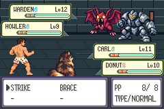
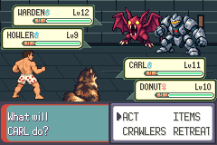

# Actual C01a diagnostic prefix pair — candidate STOP124

The narrow executable-mode correction and exactly one admitted pair are complete.
Baseline claim7/attempt6 (actual baseline run5/emulator6) matched every encountered
ORIGINAL strict reference through command27/first Move-ready, visual3194. Candidate
claim8/attempt2 (actual emulator7) reproduced STOP124 at command26/visual3171/
epoch5216 and stopped immediately. Both recorders retained complete terminal rows.
No retry, full-menu replay, move input, Save, game change/rebuild or merge.

These are partial diagnostics. Baseline3172B/3194F/noE and3194×2700 supplemental
bytes pass against certified full baseline4 reference; full E+EOF was not run.
Candidate has3171 successful physical-frame samples plus the failing frame;
no Move-ready/visible USES-hints/move commitment/full candidate acceptance.
Original full B/F/E+EOF/2700 assertions and bounded Floor1 gates are unchanged.
[Baseline partial result](baseline-partial-result.json),
[candidate partial result](candidate-partial-result.json),
[contract](contract.md), [exact build/observer/freeze identities](build-freeze-summary.json).

## Observed chronology

All times below are actual GBA cycles relative to the common command25 origin.
The first117 recorded point cycles agree. Earliest recorded cycle/text split is
inside the PP/USES selector: BattlePutTextOnWindow enters at527489 baseline versus
527651 candidate,162 cycles later. PP printer entry itself is527315 in both.
This brackets the first observed split; it is not a continuous instruction trace.
Both synchronous printer templates are window7/font7/speed0.

| Actual event | Baseline cycles/state | Candidate cycles/state |
| --- | --- | --- |
| First PP/USES DMA request entry | 551435 | 561086 |
| Same VBlank entry | 561896; unlocked,20 requests/45568 bytes | 561896; locked,17 requests/40960 bytes |
| DMA processing | 569543→655913;40960 bytes serviced,3/4608 remain | 569543→569594; native locked early return,queue unchanged |
| PP/USES return | 558879 | 627218 |
| TYPE/hint return | 945015 | 747293 |
| Move initialization return | 945025 | 747303 |
| Opponent1 command53 bit clear | 945417; exec11→9 | 747695; exec11→9 |
| Failed physical-frame boundary | Still inside Carl init; exec11 | 842692; battler3/command18,exec9 |

The candidate VBlank occurs inside RequestDma3Copy: entry561086, return620618.
The observed lock is1 and native ProcessDma3Requests returns without servicing.
Baseline lock0 allows its native40KiB service budget; exact queue reconstruction
confirms20/45568→3/4608. Candidate later completes the shorter alternate TYPE/hint
path and the same enclosing controller pass197722 cycles earlier. It clears
opponent1's command53 LINKSTANDBYMSG bit, then enters battler3 command18 CHOOSEACTION.
At STOP its instruction is __umodsi3+48, LR GetSubstruct+18, with a validated
32-byte stack slice containing CalculateBoxMonChecksum+42. This is a bounded
return-location observation, not a complete symbolic stack.

[Processed paired chronology](paired-chronology.json) records selected scoped
points, actual actor/command/flags/callbacks/queue/IRQ contexts. Every initial128
DMA slots and subsequent changed slot/aggregate hash were verified:952 baseline
and403 candidate contexts,26 actual DMA acceptances each. This supports the
printer→native lock-window→controller-progress mechanism. It does not establish
DMA corruption, justify lock bypass, prescribe exact padding or prove an optimized
replacement. No game counterfactual was run. Native rotating baseline detail still
ends at3193; the separately retained new sidecar supplies the missing interval.

## State and actual visual evidence

The new2700-byte STOP snapshot is byte-identical to prior candidate STOP124.
Only offsets2533..2536 (Carl scoped callback) and2560 (exec9 versus11) differ from
the strict expected frame; other2695 bytes exact. Actual Carl callback is
HandleChooseMoveAfterDma3 versus PlayerBufferRunCommand. The bit difference is
opponent1, not Carl. All600 party bytes match ordinary input; all6 checksums valid,
count2/counter47,levels11/10,XP748/1058,HP38/30,clear status,uses8/40/2/40,
friendship89/81. Flags/raw resources/RNG match the strict expected snapshot.
Canonical post-STOP resource context was not captured; no additional cold process.
Original and both copied Saves remain byte-exact. [Safe decoded state](candidate-safe-state.json).

All3171 successful candidate frames and terminal image match the original certified
baseline pixels. New actual baseline motion3194 samples/53.476204s and candidate
motion3172 samples/53.107864s use native16777216/280896fps. Every decoded RGB byte
of private lossless clips equals actual captures; public MP4s are lossy viewing
copies. Source/build/execution pins and file hashes:
[capture proof](capture-proof.json). Selected images inspected; no independent
human-playback or hint comprehension/visible candidate-hint acceptance claim.

- [Actual baseline prefix motion](baseline-actual-prefix.mp4)
- [Actual candidate prefix through first STOP124](candidate-actual-prefix.mp4)

## Preparation, limits and review dependency

Eleven inert-file rejections plus0700 acceptance passed without gameplay/compiler
execution. Read-only regular/non-symlink/owner/0700/byte/file-identity/access checks
passed before freeze and immediately before each create-only claim. Newly copied
observer only was set0700; failed original observer remains0600. No recompile:
C08083b64755df760070a7f8b650001e960c21497d090c8992d88305770e364b9,
binaryfd4062351cb34c25f4af00a4137d9de935a7a534625ed95ac1d66db35a2c6d34.
Old46-point/11-object bindings/14 passivity fixtures/ARM ABI proofs reused without
repeating completed tests. CPU driver/scheduling/keys/strict comparators unchanged.
925-frame/4096-row/terminal reserve/storage envelope preserved. Actual diagnostic
files289808 baseline/142608 candidate bytes remain well within frozen caps.
[Mode proof](execmode-offline-proof.json), [wrapper-only diff](wrapper-diff.patch).

Base mainbdff4e1acd117dc92aa6aa66bb687dc52cdfcbb7. Starting checkpoint
9bcda7fba27a32cfdada3c3bebce44985a5eebd0. Tested/frozen/executed helper
656fc902ac6d0a1583e3396372b9da1f126e3844. Retained baseline integrated sourcebdff4e1a/
active engine origin9c83611e/tree8d8c7761; candidate source807eeea4/tree3ef0d463.
Actual ELF/ROM pins are exact in build summary. GCC14.2.0-19, ARM2.44-3+23+b1,
agbcc sourceda598c1d918402c42c0c0d7128ba14567f3175e9 and libmGBA0.10.5 checked
through existing frozen manifests/hashes. Recovered compiler binaries differ from
historical; baseline actual ELF1bc654d9 differs from historical98fc1acc.

Actual emulator runs now5 baselines/2 candidates/7 total; consumed claims6/2/8.
Failed original claim6/attempt5,0600 observer/empty log/STOP and every old byte remain
untouched. Earlier unclaimed candidate consumed no number. All prior C01a failure
phases, historicalV016/4/STOP117,new accepted1/1,ordinary5 and Library5 uploads+1
supported download failures/unknown cause/zero original recovered bytes preserved.
Two offline postprocessing mistakes (callback hash derivation and counter/count
layout offset) were diagnosed/fixed in separate retained attempts; no raw/gameplay
change. Correct final proof uses ELF hash32 and frozen UI_BYTES layout2656/2658.

Private raw claims/streams/recovery inputs/owner metadata/full symbols/lossless
clips and verified archive stay local. No backup upload authorized/performed;
no independent backup/Library retry/public ROM/ELF/Save/raw streams/recovery
payload or private recovery metadata. Private retention receipt kept locally;
public docs only source/build/processed gameplay findings/selected captures.

Next: review the [unapplied native-menu containment proposal](proposed-remedy.md)
and [applicable source patch](proposed-native-menu-containment.patch). It withdraws
the live-pane feature and restores the certified baseline rendering path; no
verified hint-preserving remedy is established. Design another presentation only
under separate review/source/build/freeze/claim authorization. No DMA/scheduler
change, timing search or strict waiver. DraftPR115/open issue116 stop for review;
no merge/full-floor completion claim. Accepted nine-district plan and missing
original oracle/legacy/human/both-orders/optional-skip/prepared-unprepared gates
remain unchanged.
