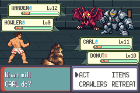

# Corrected baseline4 certification; candidate1 terminal STOP124

Parent review ofccc196473be4615d52d455c7a48afe2f5a208bec accepted the inventory
correction and authorized exactly one candidate-only execution after corrected
offline certification. Certification passed; candidate process5/attempt1 then
stopped at the first strict supplemental mismatch. **No retry or merge.**

## Separately certified original baseline

[Corrected retained acceptance certificate](retained-baseline-acceptance-summary.json)
is a new artifact. Original r4 STOP/PASS=false/freeze/claim and old complete=false
fallback diagnostic receipt remain byte-exact. All7519 original manifest entries
and7520-entry114,086,650-byte archive were verified against original live and
archived bytes. No baseline replay, game build or observer compilation.

Corrected verifier checks actual exit0/unchanged Saves, one UI_FINISH and final
result0/59,6883 full2560 native B/7051 F/typed E+strict EOF,19,037,700 supplemental
bytes/7051×2700+EOF. All27 readiness/14 move events match the reviewed full
baseline sequence: both actors/all4 moves/target+move cancellation/Bag/Party/
context/Summary returns/two earned SPARK uses/zero-use rejection/WEAKEN return.
Complete passive mode independently passes terminal tag11/result0/command156,
7051 ordered frame-end records and verified scoped native points/returns. This
stronger check was performed here; it was not claimed by old complete=false.

Both reference hashes explicitly bound:

| Reference | SHA256 |
| --- | --- |
| Native B/F/E | `aedeac12d3161cd94a137b9a1805bff903616dc055efb5924447e9c9a18f9df9` |
| Supplemental2700 | `b0c21ea31aa7960431be6157c6b4c38f7ef670f777be2aee54c2c8b73fc57a8b` |

Classifier requires exactly battle-00000.ppm..battle-07050.ppm; separately all17
route-named and10 native cue captures. [13 negative cases](capture-classifier-proof.json)
preserve the reviewed eight and add malformed-extra/out-of-range/unexpected
namespace/extension/other-named rejection. Retained battle-start.png is an
explicitly declared derivative pinned to the original manifest hash; no other
battle-prefix exception. Same classifier is frozen in runtime and pixel wrappers;
pixel wrapper separately requires full named-start RGB equality. No renamed,
trimmed or normalized original input/evidence bytes.

## Actual candidate failure

Execution `b0102d46b80e0b476057b1490aa41e7a8811b422`, candidate game source
`807eeea457c973b097be9eab9e1556e20d0204aa`: **STOP124 /15 assertions /3171 completed
numbered frames, plus terminal actual frame3171/input epoch5216**. Route command26
`step24 0 -`, immediately after native Fight A. Only first action readiness passes;
no Move readiness/UI_MOVE assertion or committed move. Bag/Party/Summary/cancels/
depletion/hints/current-max digits and whole candidate EOF/pixel gates not reached.

[Original STOP](STOP.json), [original candidate result](candidate-result.json),
[actual log](candidate-safe.log), [claim](candidate-exclusive-claim.json),
[exact retained-byte/source diagnosis](candidate-stop-diagnosis.json).
Actual and expected2700-byte records differ at exactly2533..2536 and2560:

| Field | Actual candidate | Expected baseline |
| --- | --- | --- |
| Carl controller scoped identity | L:battle_controller_player.o:HandleChooseMoveAfterDma3 | L:battle_controller_player.o:PlayerBufferRunCommand |
| gBattleControllerExecFlags | 9 | 11 |

All other2695 bytes match, including600 party bytes/300 flags/raw resources/RNG/
remaining callbacks/cursors/targets/counter/count. Actual party equals original
cold input: duo11/10,XP748/1058,HP38/30,status clear,uses8/40/2/40,friendship89/81,
count2/counter47,all6 checksums valid; no boss/preparation/checkpoint/loop changes.
[Actual safe state](candidate-stop-safe-state.json). Cold logical resources pass;
full post-STOP canonical resource context is still absent/unverified.

This is an observed transient controller/command phase divergence at the physical
frame snapshot. Source PlayerHandleChooseMove draws names/cursor/PP/type then
installs HandleChooseMoveAfterDma3; the latter waits for native BG-copy DMA before
input callback installation. Changed printing can change CPU work before that
handoff, but precise cycle/path causality is an inference, not proven here. Actual
CPU location is __umodsi3/GetSubstruct; native phase is
HandleTurnActionSelectionState. This is not a missing-symbol/hash-alias mismatch.
No assertion was masked, normalized or bypassed. Full native B/F/E and supplemental
EOF remain incomplete for candidate; expected reference files remain exact.

[5217-record actual timeline/hash chain/terminal124](candidate-timeline-diagnostic.json)
validates STOP. [Partial passive records](candidate-partial-edge-diagnostic.json):
5116 rows/818576 bytes,3171 frame ends/one readiness, last frame3170/epoch5215.
No terminal tag11: existing failure path exits before edge-close/footer and before
the failing frame flush. Retain this diagnostic limitation; no full candidate
edge-mode acceptance. Both original r4 failure receipts and new candidate STOP
are immutable. Normal Save, both r4 copies and new independent candidate copy
remain53f62dc2e283d89236d5572f47c3e7449c0bc1c06de738b1427fc9664ae67eb6.

## Actual pixels and motion

All images below derive from real native captures. Candidate source807eeea4,
executionb0102d46, routef03cae6c. Same-frame baseline uses retained active source
9c83611e/mainbdff4e1a, original executionb222d757. Visible action scene is identical
at the STOP; candidate USES/four hint glyphs were not visibly reached.

[Actual candidate3172-sample53.107865s motion](actual-candidate-first-menu-stop.mp4),
[actual native frame samples](actual-candidate-motion-samples.png),
[lossless byte identities](capture-retention.json),
[decoded viewing frame/duration check](candidate-motion-verification.json).
Every lossless decoded RGB byte equals captures; viewing decode3172 samples/
240×160/native FPS. [Read-only pre-hint prefix diagnosis](candidate-prefix-pixel-diagnostic.json)
proves3171 numbered images plus terminal frame match same baseline pixels in full.
This limited prefix is not full pixel acceptance. Full candidate pixel wrapper
did not run; no fabricated USES/hints, human whole-video playback/pacing or
candidate cursor/depletion coverage claim.

## Exact source/build/freeze and retention

Base `bdff4e1acd117dc92aa6aa66bb687dc52cdfcbb7`; original retained baseline build
`9c83611e8e9b61d55388c18496c361d3362e462e`/engine
`8d8c7761f4878bb9a8d7e2bffe36ed38da08aa6a`. Candidate actual tested source
`807eeea457c973b097be9eab9e1556e20d0204aa`/engine
`3ef0d46368e45c3e4a5b8084eeec2a81b50a688b`. Offline certificate helpers
`1eac08cc637a13e8f22468c744954c52445ac032`; freeze/execution
`b0102d46b80e0b476057b1490aa41e7a8811b422`. Published identities in
publication-receipt.json. [Exact candidate-only freeze](freeze-summary.json),
[contract](contract.md). Observer C564c8b04c4ab6e8ef1efb9a5d846ff1934525f9b64e647b0c0db69b23ecf8732/
binary39a6ad526bee8c3550ddfe2566bbdcc9c24b1307aedeeaa8c124593c07e79429 unchanged.
ROM3e6fa891385e38a900fa307660bc8916f8f0b9776098a76378f27e238d962248/
ELFc5f7e26472f61831bf0166086ef86f42ccdedb615044b3a8e7e7bc9bc939d653 verified;
both actual ELFs/scoped readiness/native diagnostic bindings revalidated.

GCC14.2.0/ARM binutils2.44-3+23+b1/agbcc
da598c1d918402c42c0c0d7128ba14567f3175e9/libmGBA0.10.5 and dependency hashes
reverified against retained manifests. Recovered compilers differ from historical;
no original-tool identity claim. One read-only preparation command initially ran
from the parent workspace without origin; corrected cwd, [record retained](offline-preparation-read-error00.json).
No compiler call/game rebuild/baseline or V01 replay/Save reconstruction.
All original bounds and20GiB pair reservation accounting retained.

[New private archive](private-retention-summary.json):35,083,643 bytes/3590
byte-verified entries, SHA256b6717232003a23e8991040c1b6467274acbd8c2ca69e6928d99a13189f047e01.
Original r4 archive/bytes and original Saves intact. Local only; builds/tools,
original r4 archive and later metadata separate. No independently verified backup
or attachment transfer. Supported retention remains export all components to a
user-controlled independent private destination and verify destination hashes.
Library5 uploads+1 supported existing-backup download failures/unknown cause/zero
original bytes recovered unchanged; no attempt. No public ROM/ELF/Save/raw/full symbols.

## Review dependency

Review the controller/command-phase divergence at move rendering/DMA handoff and
audit exact compiled handler/rendering timing before prescribing any remedy.
Preserve strict assertions, certified original baseline, partial diagnostic gap
and first STOP. Any game change/build/new execution contract is a later separately
reviewed increment; no automatic retry or frame-field exclusions.

DraftPR115/issue116 remain open/unmerged. Current counts four baselines/one
candidate, five C01a processes; old startup121/dialogue122/menu-readiness122/
inventory STOP and current supplemental124 stay distinct. Historical V01 six/
four/STOP117 atvisual8536 beforeB8402, new completed pair1/1, ordinary5 unchanged.
Returned CI is reported without assuming a pass. Main/all other heads preserved.
Human comprehension/pacing/legacy/original oracle/prepared-unprepared opening/
both branch orders/optional skips/full-floor acceptance and bounded nine-district
plan remain separate. This is a blocked scoped result, not candidate acceptance.
