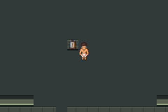
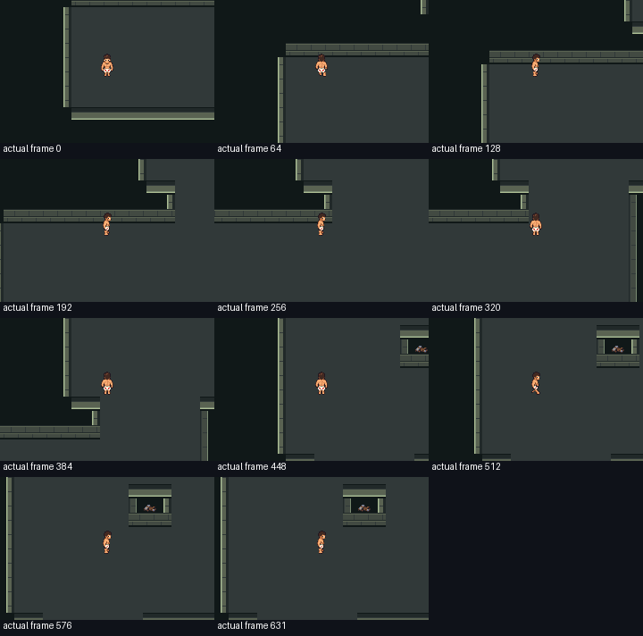

# F1-G01a opening-field preview — runtime checked, travel revision required

Base/rollback production commit: `cee81f8f5dd5cce93990007f06491c8d607a7161`.
Issue61 / PR62 merged535b0809703f53a86dfd9e2cea1f751c4e6585f1; reviewed head96d4e83. Production engine and shared harness are byte-identical to that base;
this change adds a geometry contract, isolated exporters/tests and evidence.
The existing six-room game and its ordinary saves remain available unchanged.
No new production ROM build, live relocation, new battle/reward/flag, save ABI,
art replacement or full G01 completion is claimed.

## Exact identities and checks

Diagnostic game/test source: `4718908806057d245546cc65cf1f43105ea01b01`.
Read-only observer source: `26fc7ab057fcc878359b9972789fb0483ae6e8d5`.
Full scene-measurement source: `327eda53bdd04858c9131396d6689a11fef020aa`.
Observer map composition was factored into a shared pure function; both complete
map byte hashes were checked against the original compiled diagnostic inputs.

| Build | SHA256 |
|---|---|
| Closed diagnostic | `a59959f323a815c3fe62a9e3c5b4772153cb3fa262247a3b1c247c56d5881466` |
| Open diagnostic | `28ecfe94b3792bc96a9b3df303b0c80d55fbab2dbea945b3bb10048d11ff3b43` |
| Retained A01 production | `5c4f865a95c0b9e4c65f13d86c8ba44c9082599432b387f6fc350c0bd99b7230` |

mGBA0.10.5 passed **13 diagnostic sessions /7066 assertions**, with13 empty
emulator error logs. Counts are9/708 preview,3/6203 observer and1/155 scene.
Every input is an ordinary controller action; assertions only read game memory.
All3072 actual field cells match their exact exported values after each closed
and open ordinary save cold-load. Loaded padded map extent is79×62 (4898cells,
below10240). Both preview bay orders, every sampled width in both directions,
wall/pillar/actor collision, loop closed/open collision, north/secret bounds,
unchanged17 crawler flags and5 trainer-clear flags, party/PP, saving and four
cold reloads pass. Preview bays contain markers, not new combat encounters.

Full ordinary walk samples22354 frames with loaded79×62 extent: peak5 active
objects and9 used sprites. This is a measurement of this candidate route, not a
whole-floor, VRAM or hardware performance guarantee. Pinned compiler footprint
remains EWRAM249700/262144B, IWRAM30892/32768B. ROM linker region14931704B stays
fixed by upstream layout; it is not a measurement of new map data size.
Native art allocation stays180 secondary tiles/180 metatiles and existingbank6.
Existing save structures and16 active objects/64 saved templates are unchanged.

## Actual rendered evidence

These are actual unscaled240×160 emulator captures, diagnostic source4718908.
The plain native floor/wall graybox is deliberate. Markers/doors/loop variants
are previews. No finished light, architecture, patrol behavior or authored new
animation is claimed. The broken pillar remains blocked scenery.





[Continuous actual-frame silent walk](observer/continuous-motion/walking.webm):
632 actual consecutive frames at59.7275005696Hz,10.5814seconds. Includes stationary
segment waits; no interpolation or omitted waits. The earlier main preview
motion capture omitted idle frames and is retained as a trace, not this timing
proof. Actual selected frame contact sheet reviewed:



Representative junction, bay, far-junction, workshop, north-wall, dialogue,
save and cold frames were visually checked. This establishes native camera
scale and collision feasibility; it does not establish human comprehension,
active playtime or final art quality.

## Travel gate — live adoption rejected

[Exact travel review](travel-review.json). The revised candidate improves the
open-loop far-junction-to-hub-door path from35 to27steps; Warden-door to hub-door
is16steps open,36 closed. However Guard and Howler marker-to-hub-door paths are
24 and37steps before any interior movement. Verified old outbound routes to the
actual guide are14 and19steps. This violates the provisional recovery travel
direction. **Do not relocate gameplay to these anchors or begin V01 art rollout.**

Existing local defeat recovery has zero walking before retry and must remain
local during D1 relocation. Historical routes return from the guide to the next
encounter; same-starting-encounter roundtrip and measured walking-frame ceilings
still need explicit baseline and live routes. Do not substitute the field-only
BFS numbers for those runtime checks.

Next G01 increment must compact/reposition hub, encounter bays and interiors,
then retest widths, both orders and actual recovery distances before migration.
Keep finalT null. The1155 open field cells exclude all interiors and therefore
are notT, and64×48 is merely the3072-cell bounding envelope. Door anchors,
interiors, persistent far-side loop opening, scene migration and save/cold
idempotence are still pending.

## Reproduction and preserved attempts

Use docs/testing.md pinned toolchain. Production is retained from accepted A01;
diagnostic builds now use a fresh committed archive with zero engine cache inputs,
following the [parent-reviewed provenance repair](provenance/README.md). The
historical main run used a whole-engine cache; a fresh clean rebuild produced
both exact same ROM identities and708 passing assertions. Export requires an
explicit disposable-snapshot marker.

```sh
DCC_A01_BASE_RUN=/absolute/path/to/accepted/a01/run-I7PJq0 \
  python3 scripts/test-f1-g01.py
DCC_G01_BASE_RUN=/absolute/path/to/accepted/preview-b_ekukga \
  python3 scripts/test-f1-g01-observe.py
DCC_G01_BASE_RUN=/absolute/path/to/accepted/preview-b_ekukga \
DCC_G01_OBSERVER_RUN=/absolute/path/to/accepted/observe-14u_5hmo \
  python3 scripts/test-f1-g01-scene.py
```

Actual successful local artifacts: `artifacts/floor1/g01/preview-b_ekukga`,
`observe-14u_5hmo`, `scene-7gjljta_`. Complete raw build logs, diagnostic ROMs,
ELFs, symbols and ordinary saves remain ignored there. Selected full runtime
logs/routes, identities, geometry data and actual images are committed here.
No ROM/save/build binary is committed or publicly released.

Preserved setup/test corrections, without production modifications:

1. preview-r7k5ejct /07b0e31: exporter safety guard treated the disposable snapshot
   as live. Required an explicit snapshot marker (6a538e7).
2. preview-3i_gm9e2 /6a538e7: build succeeded; harness rejected underscore capture
   filenames. Normalize labels to hyphens (56ef7df).
3. preview-hyt89hur /56ef7df: build succeeded;17 assertions passed before the test
   driver's extra turn frames advanced an already-facing Carl one tile too far.
   Track facing and widen the independently reviewed main fork (4718908).
4. observe-qkxk5xx4 /ea4c322: incomplete reconstruction of closed-state neighbor
   wall cells failed byte-identity guard before runtime. Use shared complete
   composer with original input hashes (aeea7e9).
5. observe-nuhot_1v /aeea7e9: missing shutil import prevented copying an ordinary
   save. Add import (26fc7ab), then both cold buffers and motion pass.

Each distinct setup/driver blocker was corrected on its next attempt; no
production engine defect or abandoned evidence is hidden. Candidate travel is
an unresolved design gate, not an emulator or build capability blocker.
