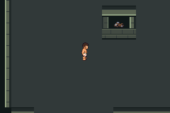
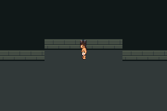

# G01a fresh-source provenance repair

Parent's independent review found that the original optional whole-engine cache
could retain untracked Make wildcard inputs. PR62 was already merged; this is
issue64 / PR65's scoped tooling follow-up, mergedabb77feb339e67b2ced92531985c49bb4731684d; reviewed head03b869d. It does not establish that the original run
was contaminated and does not unblock the rejected live geometry.

Build driver now extracts only a fresh committed Git archive. It copies zero
external engine sources, objects, linker inputs, dependency files or assets.
DCC_G01_CACHE is rejected before source creation/make. The separate pinned
DCC_CACHE supplies clean upstream/compiler source under setup-foundation.sh,
including the three explicit hash-verified upstream multiboot inputs.

Negative test seeded `engine/src/untracked_cache_contaminant.c` with a compile
error. The optional engine cache was rejected and the seed preserved; no source
snapshot/make was started. Fresh archive11687files/312C sources all match their
Git blob hashes. [Negative result](negative-test.json). Original retained cache
had1386Make wildcard inputs and no unexpected source beyond the explicitly
exported diagnostic map: [limited read-only audit](original-cache-audit.json).

Fresh compiled/negative-test source `0901022dacd2adbaa90b49c6d12f7ddb91ed0281`.
Nine ordinary mGBA0.10.5 preview sessions/708assertions and9empty errors passed
on freshly built closed/open diagnostics. **Both ROM SHA256 hashes exactly match
original4718908 diagnostics**. All rendered captures match exact original pixels;
[complete results and capture inventory](reproduction.json). This reproduces the
published run through a clean source path; original observer/scene coverage is
retained against the same identical ROM binaries and is not claimed rerun here.

Actual unscaled240×160 fresh-build captures at0901022:




```sh
python3 scripts/test-f1-g01-provenance.py
DCC_CACHE=/workspace/dcc-toolchain-cache \
DCC_A01_BASE_RUN=/absolute/path/to/accepted/a01/run-I7PJq0 \
  python3 scripts/test-f1-g01.py
```

Use pinned build environment from docs/testing.md. Actual local runs:
`artifacts/floor1/g01/provenance-maf6qfp8`,
`artifacts/floor1/g01/preview-4i7mu6bx`; setup/full build logs, all raw runtime
logs/routes, ROMs/symbols/ELFs and ordinary saves are preserved and ignored there.
Selected full raw routes/logs and actual captures are committed here. No production
engine/shared harness changes, gameplay work, new scheduler/task or playable
release. No new failure attempts. Next issue63 still requires shorter recovery
travel and compact interiors before migration/V01/finalT.
