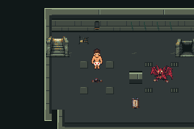
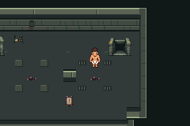
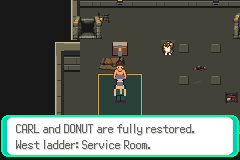

# G01b ordinary production recovery baseline

Issue63; narrow travel audit only. Base `abb77feb339e67b2ced92531985c49bb4731684d`.
No engine/shared harness/map/save-layout changes. Retained production compiled at
`c5d0f1e0c3fa45063f66375c39ccf50b3b0e1175`; ROM SHA256
`5c4f865a95c0b9e4c65f13d86c8ba44c9082599432b387f6fc350c0bd99b7230`.
This audit replays that ROM; it does not claim a new clean production build.

Four mGBA0.10.5 sessions/44 assertions use measurement source
`fa458cb601ce482b1e8a8b78364d43145989d5cd`. Additional pre-boss session/13
assertions uses runner `ab6b04d238862663d5a04ce809d93e3bf852956e` with the
same measurement harness and unchanged production sources. **Total5/57, all5
empty emulator error logs.** All actual captures/positions reviewed. Ordinary
input saves were copied and their original hashes checked unchanged. Howler
seed was made through ordinary navigation and manual save, not RAM/save editing.

| Complete route | Walking steps | Active frames | Active seconds |
|---|---:|---:|---:|
| Guard→guide→same Guard approach |28|448|7.500732|
| Howler→guide→same Howler approach |38|608|10.179565|
| Howler→guide→Warden approach |46|735|12.305889|

[Machine comparison contract](../../../../../scripts/contracts/f1-g01b-recovery.json)
freezes both steps and active-frame ceilings, including interiors. Guide approach
is4,7; same starting encounter means Guard5,5 or Howler10,5. Both return routes
check party health/PP and unchanged patrol flags. Pre-boss route also checks
Warden8,5 and unclaimed reward/boss flags. Production local defeat retry remains
zero-walk, already runtime verified in A01; defeat was not rerun in this audit.

Read-only sampler counts actual movement latched from tile changes while in
CB2_Overworld, MOVING, nonforced and outside palette fades. It excludes loaded
center state, idle, menus/dialogue and warp transitions. North/south one-tile
calibration each measures16frames; the Warden return measures27steps/431frames,
so total time is observed, not inferred as16×tiles. At59.7275005696Hz these numbers
measure emulator walking only, not human session duration or balance.

Actual native240×160 captures, source/route identities above:





Reproduce on clean committed source using pinned environment from docs/testing.md:

```sh
DCC_A01_BASE_RUN=/absolute/path/to/a01/run-I7PJq0 python3 scripts/test-f1-g01b-baseline.py
DCC_A01_BASE_RUN=/absolute/path/to/a01/run-I7PJq0 \
DCC_G01B_BASELINE=/absolute/path/to/new/baseline-run python3 scripts/test-f1-g01b-preboss.py
```

Raw accepted runs `artifacts/floor1/g01b/baseline-kr_10gh9` and
`artifacts/floor1/g01b/preboss-u3t54ju3` retain host binary/source, full logs,
ordinary saves and PPMs locally. Selected complete routes/logs and PNGs committed
here; no ROM/build/save binaries committed. [Attempts](attempts.json) preserves
measurement corrections and earlier runs. The two rejected G01a layouts remain
unchanged. Third coordinated field+interior design has not started; if it fails,
stop dependent migration/art, preserve evidence and take independent ready work.
FullG01, finalT and nine-district floor remain incomplete. No workflow/scheduler.
