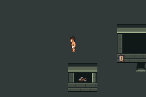
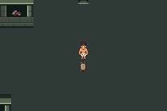
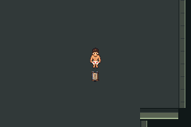
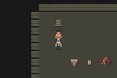
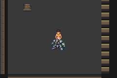
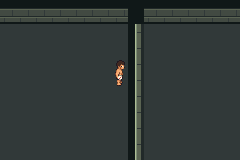
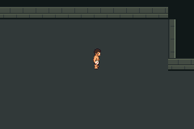

# Third coordinated opening geometry — diagnostic acceptance

Issue63 / PR69. Baseed592e7cee7a9976579b040720a6195c54ec2268.
Production engine/shared harness/maps/save layout are unchanged. This is a
field+two compact-interior diagnostic gate, not live content adoption or fullG01.
The two rejected earlier layouts remain in G01a evidence. No third geometry
redesign was needed; the coordinated third layout passes its measured gate.

Closed compiled source `d71a5d9d52b427925705f6da12d8b38007da9ffb`, SHA256
`a634b9129763fc9b896c6b455d0dee79566f7510eadc7aacc9d6cc608eaa0d1a`.
Open compiled source `01042e461ba533015e238f32db48732a5a3a1eab`, SHA256
`efa1b963ff968b772e1fe330310a17590c5c7c7be5afcdea25aa0e127a0305bc`.
Both builds use fresh committed snapshots/pinned setup. No whole-engine cache.
Original failed/retry build logs preserved locally; identical ROMs replayed after
host-only driver corrections. Current replay source
`cb887e50294aba9d9da8a13e31ab789b4ee0cc4a`:13sessions/8397assertions.
[Scene observer](scenes/result.json) adds2sessions/519; **total15/8916,15empty
emulator error logs,74exact capture pixel matches**. No repeated tests counted twice.

[Strict measurement validation](measurement-gate.json), source
`87b44ba41b1d6a5097297351ef120b4dc4d8d62a`, audits all13 actual logs and rejects
41negative cases. Every travel route requires its exact expected names; missing
both entries, duplicates, unexpected names and excessive walking are rejected.
The validation-only change does not claim a new compile/emulator run.

| Complete trip | Candidate steps / active frames | Production ceiling |
|---|---:|---:|
| Guard→guide→same Guard |14 /224|28 /448|
| Howler→guide→same Howler |34 /544|38 /608|
| Howler→guide→Warden |44 /703|46 /735|

These results pass in both loop variants and both patrol-approach orders.
Guide is two interior steps from arrival; Warden approach eight. Both protagonist
health/PP and all17story+5trainer flags checked. Free guide interaction works;
these healthy diagnostic parties do not prove damaged/live battle recovery.
Production zero-walk defeat retry remains unchanged, previously verified inA01.
No resource/balance changes used to shorten trips.

Static warp-safe far-junction→central landmark31closed/25open:6step shortcut.
Actual wall collision/open traversal verified; this is two fixed variants,
**not persistent live loop state**. Field64×48, interiors16×14; main sampled
lanes5–7, pillar east9, optional lanes4, after actor occupancy. Width crosssections
are traversed both ways, every anchor visited; pillar/trial/Warden collisions,
all four warp ends, optional branches and actual camera views checked. All3072
field words and both224-cell interior arrays match loaded buffers after ordinary
manual-save/cold loads in both variants:7040cell checks. Buffer dimensions79×62
and31×28 fit existing10240cells. Preview legal counts974closed/983open field,
115Quiet/119Warden are **not finalT**; remaining live interiors/content pending.

Actual scene peaks: field6objects/10sprites closed,5/9open; Quiet6/10; Warden2/6.
Limits16objects/64sprites. Stable overworld samples per map are in scene results.
Open linker: EWRAM249700/262144;IWRAM30892/32768;SaveBlock1 15752 and2 3884,
unchanged. No save ABI or palette/tile allocation expansion. These are emulator
allocation observations, not hardware performance or human pacing claims.

[Source audit](source-review.json):11687tracked engine inputs,312C sources, no
extra C; only the four declared fixture core inputs changed. Other canonical Git
blob hashes match. Existing .gitattributes normalises palette/PowerShell text
line endings; this is not a raw-byte identity claim for those text files.

Actual native240×160 camera evidence; tested identities above:









[Continuous actual-frame motion](open/continuous-motion/walking.webm):752frames
at59.7275005696Hz,12.59052seconds, includes every stationary segment wait.
No interpolation, skipped frames or human pacing inference. Native stills are
included for selected exact frames. Prototype markers/native reused tile banks
are placeholders; no V01 art-quality/animation acceptance is claimed.

Reproduce from clean committed source with the full pinned environment in
docs/testing.md, including PKG_CONFIG_SYSROOT_DIR/PATH:

```sh
DCC_CACHE=/workspace/dcc-toolchain-cache \
DCC_A01_BASE_RUN=/absolute/path/to/a01/run-I7PJq0 \
  python3 scripts/test-f1-g01b-coordinated.py
DCC_G01B_ACCEPTED_RUN=/absolute/path/to/accepted/third-run \
  python3 scripts/test-f1-g01b-measurements.py
DCC_G01B_ACCEPTED_RUN=/absolute/path/to/accepted/third-run \
  python3 scripts/test-f1-g01b-scenes.py
```

Optional DCC_G01B_CLOSED_RUN replays an exact earlier compiled closed ROM;
DCC_G01B_REPLAY_RUN replays both exact binaries with new fresh committed export
identities. These copy ROM/symbols only, zero engine/cache inputs. FINISH_RUN
finishes only a failed open build in its original committed snapshot and preserves
closed sessions/failure log; one successful environment correction documented.
[Attempts](attempts.json) and raw local third/scene runs remain intact. No ROM,
save, ELF or tool binary committed; full logs/source products retained locally.

Implemented/compiled/runtime verified: this scoped diagnostic gate. Merged:
see authoritativePR69. FullG01, live identities/relocation, numeric state audit,
legal idempotent save migration, persistent loop, finalT and art rollout remain
pending. Next focused task audits and proves migration before production adoption.
No scheduler/new Cloud task/public playable release.
