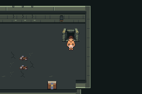
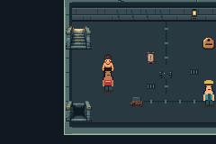
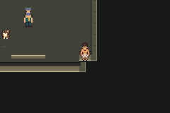
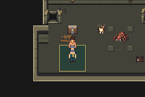

# Live identity/migration preimplementation audit

Issue70, related63; base `ef5c012aba10b61cbcdbbc3313d7e25c5f448473`.
Audit/runtime runner `d0a20ab2fd9f13d1f64a778da860aa30d9809620`.
Production C5 source `c5d0f1e0c3fa45063f66375c39ccf50b3b0e1175`, unchanged
ROM SHA256 `5c4f865a95c0b9e4c65f13d86c8ba44c9082599432b387f6fc350c0bd99b7230`.
No new production compilation or live migration is claimed.

**18 real mGBA0.10.5 sessions/78 assertions pass;18 empty errors logs.**
16 copied ordinary production files cover all six map identities34/0..5 and
layouts442..447. Each cold route checks proposed version16462=0, proposed loop49=0,
full legacy membership and exact saved layout identity. Two additional sessions
navigate from an unchanged production save and use the normal Save/overwrite
flow to create Entrance and Service seeds. Those generated seeds also cold-load
and pass the same checks. All16 cold source/copy hashes remain identical; both
seed source hashes remain unchanged. No bus writes or save-file patching.

The observer retains all five WarpData records, player/save position, current
active objects/localIDs/graphics/facing and byte snapshots of mapView, party+
inventory, saved active objects, templates, flags and vars. See complete routes/
logs and [compact states/hashes](summary.json), [persistent outcomes](legacy-outcomes.json),
[seed provenance](seeds.json), [exact runtime identity](identity.json) and
[source alias/range audit](source-audit.json). This establishes old-state fixtures
for a later migration comparison; reading these bytes does not prove preservation
by a future implementation.

All observed cold map-view caches are zero after the existing crawler cache guard.
Four noncurrent saved warps in these files are0/0/0/0/0, **stock** values rather
than -1 dummy records. Do not rewrite them merely because they look uninitialized.
Controlled owned/dummy/stale/alternate-continue warp cases are still required.
Current saved location warp coordinates can differ from player pos; migration
must handle both meanings. The corner file actually contains Exit13,9; fixture
names alone cannot define a mapping matrix.

Actual native240×160 frames on the C5 ROM, source/runner identities above:






Reproduce from a clean committed branch, with existing accepted C5 evidence and
the local mGBA toolchain described in docs/testing.md:

```sh
python3 scripts/floor1/audit-migration-state.py > source-audit.json
DCC_A01_BASE_RUN=/absolute/path/to/a01/run-I7PJq0 \
DCC_TEST_CFLAGS=-I/workspace/toolchain/root/usr/include \
DCC_TEST_LDFLAGS='-L/workspace/toolchain/root/usr/lib/x86_64-linux-gnu -Wl,-rpath,/workspace/toolchain/root/usr/lib/x86_64-linux-gnu' \
PYTHONDONTWRITEBYTECODE=1 python3 scripts/test-f1-g01c-state.py
```

Raw accepted run `artifacts/floor1/g01c/state-v866mr6r` retains compiled host
observer/source, source saves copied only, controller-produced seeds and PPMs.
No ROM/save/build binaries in source commits. The public review evidence contains
full logs/routes/PNG captures and summaries. Host observer compiled with
`-std=gnu11 -Wall -Wextra -Werror`; [build log](host-build.log) is empty/success.
The source audit's isolated C preprocessor executable likewise passes warnings
as errors, resolves all aliases, reports only candidate declarations, no typed
raw/JSON owners,18 saved-array references and351 raw flag literals for review.
Dynamic indirect APIs remain a source-review limitation, not a proof claim.

Preserved attempts (host/test setup only, no material geometry/migration attempt):

- b3f2830, `state-pde1k_0s`: host compiler rejects hex404E-minus token without
  spaces; exact source preserved, compiler failure replay retained. Corrected at
  245f482 (full source obtainable in Git).
- 245f482, `state-t_3x7vx8`:14 slot-check sessions pass, but six-map coverage
  correctly rejects missing Entrance/Service. Complete14 logs/errors retained.
- aaff857, `state-p7f7yuey`: ordinary seed incorrectly expected note flag7;
  actual before-trial seed has5. Corrected to preserve actual state atd0a20ab;
  successful navigation/save and full18-session run follow. No engine change.

Full actual hashes for these source commits are in Git; short IDs above are
human labels, not new ROM identities. No failed input/source/log was deleted.
The two historical failed geometry attempts and third accepted diagnostic remain
unchanged; diagnostic15/8916 is not rerun or relabeled here.

[Migration policy/field and content matrix](../../../floor1/g01/migration-audit.md)
documents proposed full map IDs/layout append, audited state slots, pre-header
hook, player/object rebuild, all warp/cache fields, idempotence, future-version
rejection and remaining exact interior anchors. Audit implemented and host/runtime
verified. Production compile retained; engine migration/runtime/merge pending.
FinalT, persistent live loop, live relocation, native motion and fullFloor1 remain
pending. No workflow, schedule, task duplication or public playable release.
