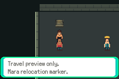
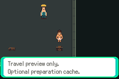
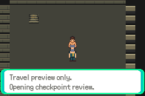
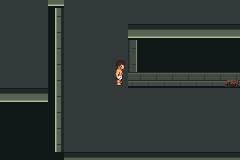

# Five-map relocation contract — diagnostic verified

Issue72, related63; base `0cb6674a38f67579d5e7480ef884681a66a8b609`.
Closed clean build `478f4bd6791b64365ac87aeff0f195cd9c30a939`:
`824069ff38a9f156f6b6dc2dabadea64a3f0e20c943ff59da70d3e82a963acc4`.
Open clean build/full replay runner `a2a42cdf4db7cd3fe81387e7d3c37b8dd67635b4`:
`e0745ee61a3262c73a8a7b8a62fbe29ec5707a8325645f224f5945998dd4c5fa`.
Scene observer `a2b24f6a2e7092d274fde6768eb89edbffc508e5`.
These are disposable nonmember diagnostic ROMs, not production or delivered saves.
Production engine/maps/art/resources/save ABI remain unchanged.

**23 actual mGBA0.10.5 sessions/10,541 assertions;23 empty errors logs.**
Main21/9910 includes both approach orders in both variants; full five-map width/
actor-collision/controller transitions; guide recovery; Workshop Mara/Lev/bench/
cache markers; BG-script stairs to checkpoint; checkpoint interactions and return;
ordinary saves and ten cold/full-buffer sessions. All7936 source map words are
read back after cold loads (field3072 plus4×224 cells, in each variant); actual
buffer extents79×62 and31×28 match. No party, old reward/quest/achievement/trainer
flag or proposed loop49 changes. Placeholder interactions deliberately award
nothing and exercise no production boss/crafting gate.

| Measured route, both variants/orders | Steps | Active walking frames | Frozen production ceiling |
|---|---:|---:|---|
|Guard→guide→same Guard|14|224|28/448|
|Howler→guide→same Howler|34|544|38/608|
|Howler→guide→Warden|44|703|46/735|

The existing strict measurement gate remains unchanged; exact required names,
legs and ceilings apply to all six travel routes. Four explicitly named new
interior/cold routes must have zero measurements; unknown route names still fail.
No absent-measurement fallback or weakened acceptance. Field/Quiet/arena travel
anchors, original rectangles/width probes/barrier and third attempt number stay
fixed. New stairs is one blocked BG interaction cell at12,11, approached from the
already accepted stairs anchor12,10. Two old rubble objects now sit on the edges
of the same blocked pillar, where each has a legal adjacent interaction cell.

Workshop and checkpoint are16×14, with5–7 clear approaches after actor occupancy.
All21 legacy objects have one semantic destination and an explicit actor position
and proposed production localID. Quiet production keeps1wrap/2trial/3guide/4rack/
5Donut; its diagnostic array order differs intentionally. Six old map-position
rules choose safe declared anchors; Workshop/checkpoint fallbacks4,4 exclude the
arrival warp4,3. Field migration maps old corridor x>=8 to Howler51,27 and the
other valid side to Guard37,31; invalid positions use Guard. These rules are a
contract, **not an implemented migration**.

| Candidate map | Reachable cells closed/open | Declared objects incl player | Observed peak objects/sprites closed;open |
|---|---|---|---|
|Field64×48|973/982|15|9/13;8/12|
|Quiet16×14|115/115|6|6/10;6/10|
|Workshop16×14|116/116|5|5/9;5/9|
|Warden16×14|118/118|2|2/6;2/6|
|Checkpoint16×14|118/118|3|3/7;3/7|

Candidate unique total1440closed/1449open is **not final liveT**; production
membership, event state, persistent far-side loop and migration must pass first.
All reachable cells connect; actor occupancy and untargeted warp shortcuts are
excluded from paths. No floor-area rebase or human duration claim.

Scene2/631 replays exact accepted guard-first routes on both binaries, samples
every stable overworld frame on all5maps, checks16 object/64 sprite limits and
matches all94 native captures pixel-for-pixel. No RAM writes, interpolation or
hardware timing claim. [Full scene results](scenes/result.json).
Open ELF: EWRAM249700/262144; IWRAM30892/32768; SaveBlock1=15752/15872;
SaveBlock2=3884/3968, unchanged. [Exact sections](open/elf-sections.log).

Actual native240×160 captures, diagnostic identities above:






[Continuous actual752 frames](open/continuous-motion/walking.webm) at
59.7275005696Hz,12.59052seconds, includes segment waits and has no interpolation.
Six exact representative frames accompany the clip; all752 PNGs remain locally.
This measures emulator movement, not a human session or comprehension.

Each variant comes from a fresh committed archive. Source audit verifies11687
tracked canonical Git blob inputs,312 game C files/327 total C files, no extra C;
only new_game.c, map_groups.json, layouts.json and event_scripts.s change in the
fixture. New diagnostic map/script/layout files are produced from the committed
contract. `.gitattributes` text normalization is explicit, not a raw-byte claim.
Pinned compiler/toolchain and three verified multiboot inputs alone are hydrated;
no engine/cache authority. Closed retry reuses its exact original binary and
symbols only after source diff, ROM hash and freshly regenerated export identity
match; it does not copy compiled inputs into the new engine tree. Open compiles
cleanly from that new committed tree.

Reproduce with the pinned environment in docs/testing.md:

```sh
python3 scripts/test-f1-g01d-contract.py
DCC_G01D_ACCEPTED_RUN=/absolute/path/to/accepted/complete-run \
python3 scripts/test-f1-g01d-scenes.py
```

Required environment: PATH includes `/workspace/toolchain/root/usr/bin`;
PKG_CONFIG_SYSROOT_DIR=/workspace/toolchain/root;
PKG_CONFIG_PATH=/workspace/toolchain/root/usr/lib/x86_64-linux-gnu/pkgconfig;
LIBRARY_PATH=/workspace/toolchain/root/usr/lib/x86_64-linux-gnu;
DCC_CACHE=/workspace/dcc-toolchain-cache;
DCC_TEST_CFLAGS=-I/workspace/toolchain/root/usr/include;
DCC_TEST_LDFLAGS='-L/workspace/toolchain/root/usr/lib/x86_64-linux-gnu -Wl,-rpath,/workspace/toolchain/root/usr/lib/x86_64-linux-gnu';
PYTHONDONTWRITEBYTECODE=1. The optional DCC_G01D_CLOSED_RUN path can replay a
retained original closed binary under the strict source/export checks above.

Accepted raw runs: `artifacts/floor1/g01d/complete-ghsxbx3q` and
`artifacts/floor1/g01d/scene-uxewf1jg`. The original clean closed build/failed
route is retained at `artifacts/floor1/g01d/complete-xsl2b717` (267 assertions
then expectedBoss4,3 rejected because player remained Field45,17). The host had
requested a warp while already standing on its arrival cell; normal leave/re-enter
controls fixed it at a2a42cd. [Original trace](attempts/doorway-reentry/replay.log).
No geometry, engine or resource fix was made; no new material layout/migration
attempt. No old failed trace, source, binary or save was deleted.

Full logs/routes/selected captures and source identities are committed here;
ROMs, saves, host/build binaries and complete raw build logs stay local. This
contract is implemented/compiled/runtime verified as a **diagnostic**. DraftPR73; reviewedc138bd56ee6febe61f4ef07b91b0f168295519c5. Verified
PR integration pending. Actual production version allocation/migration, unknown-
version rejection, player/objects/templates/all5warps/cache rebuild, ordinary
migrated interactions/transitions and second save/cold idempotence remain next.
No native art rollout, live loop, finalT, fullG01 or fullFloor1 completion claim.
No scheduler, duplicate writer/task or public playable release.
