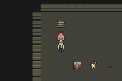
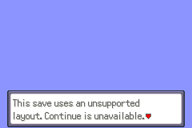
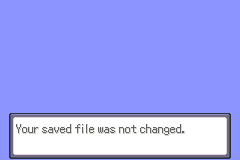
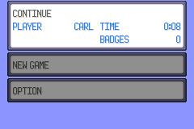
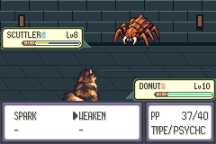

# Live migration — implemented and compiled; gameplay acceptance blocked

Issue74 / **draftPR75**, branch task/floor1-g01e-live-migration, base
`b694da17928b93ea579f55d905017aa9f7619422`. Same sole Cloud task
`01a10f4b-596b-700b-b8ba-241e3ca2c000`; handoff2026-10-07. No merge/fullG01/finalT
or fullFloor1 completion claim. No new workflow, scheduler or task.

Five production identities35/0..4/layouts448..452 append after unchanged legacy
maps/layouts442..447. Migration precedes header lookup, normalizes all5owned
remembered warps, preserves stock/dummy records and gameplay/resources, rebuilds
legal player/NPC/template/cache state, and is idempotent after manual Save.
Current ordinary pos takes precedence over stale current-location coordinates.
Unknown schemas/full IDs reject Continue without changing the saved file. Fresh
initialization stamps version1 after event reset. Optional far-side loop is authored
but its live persistence gate remains pending. No save ABI/trainer/balance change.

## Exact tested identities

Clean production compile `99243073ebead4ecd4fa9e4f4362d9e0d70c86df`:
ROM SHA256 `6c447159ae6d3cf62b5c8860d1fd0ff62e0cb93a0a603553c3d2a0ca14bce7cb`.
Current controller runner `1e556a257cd50744ca59f9e7cc63d1f0e7c3703c`; engine Git diff
from compiled source is empty. Fresh Git archive, pinned documented compiler/inputs,
regenerated products; [complete build/setup logs](verified-state/build/build.log).
mGBA0.10.5, GCC14.2 host. [Identity register](verified-state/identity.json).

## Verified checks, kept separate

- **48 ordinary emulator sessions /471 assertions**,16 preserved original saves:
  cold migration, meaningful original NPC/transition interaction, actual manual
  Save, second cold idempotence. All6old maps, mandatoryI01 and actual corner.
  All48 error logs empty; original hashes unchanged. Live duo, decoded inventory/
  money, old flags32..48/trainer2135..2139, unowned persistent vars and warps
  preserved; player/camera/objects/localIDs/templates/cache inspected read-only.
  [Full ordinary routes/logs/states](verified-state/ordinary/summary.json).
- **21 controlled copied-input emulator sessions /72 assertions**;21 empty errors.
  Future versions/unknown full IDs, all owned warps, dummy/stock remembered records,
  active Continue warp, stale layouts and invalid legacy positions. Clearly
  synthetic checksum-valid inputs; no substitute for ordinary controller checks.
  Rejected original/copy hashes unchanged; actual readable error, acknowledgement,
  second page and return to menu captured.
  [Boundary routes/logs/states](verified-state/boundaries/summary.json).
- **3 accepted partial live sessions /3162 assertions**: fresh arrival, note/supply
  once/repeat, guide, duo trial win and first Save; actual Guard-first two patrol
  wins, meaningful recovery/travel/manual Save, then cold full3072field words.
  [Partial live routes/logs](verified-partial-live/guard-first/input.route).
  Guard→guide→sameGuard14steps/224walkingframes; Howler34/544. Strict exact-name,
  both-leg, missing-measurement rejection and original ceilings unchanged.
- Host-only supplement: **8694 exact-C legacy relocation vectors +5dummy/nonmember
  records +15schema vectors**, actual old collision/actor/warp data and generated
  map-group counts, ASan/UBSan. Not ARM ABI, emulator, stock-save or spawn proof.
  [Source/results](verified-state/cells/result.log).
- **25 generated source files** exactly reproduce and remain identical on a second
  generation. All6legacy map/layout source trees unchanged from base.
  [Output hashes](verified-state/generation/result.json).
- [ELF sections](verified-state/build/elf-sections.log): EWRAM249704/262144,
  IWRAM30892/32768; SaveBlock1=15752/15872 and SaveBlock2=3884/3968 unchanged.

Actual native240×160 current production/runner captures, identities above:








## Acceptance blocker and bounded attempts

**The complete Howler-first route has not passed. Three materially different
normal-controller strategies were attempted; further blind strategy trials stop.**

| Attempt | Actual result | Preserved evidence |
|---|---|---|
| Immediate offence | Howler lost with remaining enemy2HP; local recovery returned healthy | [route/log](attempts/patrol-offensive/replay.log) |
| Three-turn BRACE/WEAKEN, then offence | Howler lost with remaining enemy19HP; local recovery worked | [route/log](attempts/patrol-three-turn-fortify/replay.log) |
| One WEAKEN, Carl keeps attacking, then SPARK | **Howler won** in9220pilotframes with no incapacitation. Guide restores HP/uses; later Guard offence lost with remaining enemy7HP. Carl16→3HP before fainting; exact critical-hit text was not captured. | [route/log](attempts/patrol-single-weaken/replay.log) |

The third failure is **Guard after Howler**, not a third Howler loss. It does not
prove the game is unwinnable or identify a new engine regression. Layout changes
alter timing/RNG; unchanged battle/resource definitions and accessible retries
remain. No health/PP/stat inflation, optional-item prerequisite or false winning
flag is introduced to satisfy the route. Failed assertions remain active and
nonempty failure logs are separate from accepted sessions. First2layout failures
are still historical; this is no new geometry redesign or attempt-count reset.



Fresh Save originally succeeded but an extra overwrite confirmation reopened the
nearby NPC; [failed capture](attempts/fresh-save-extra-input/saved.png) retained.
Fresh empty files now receive only their2actual confirmations. Existing files
require the warning paragraph to advance before overwrite confirmation;
[earlier prompt/timing failure](attempts/overwrite-warning/saved.png) retained.
The ordinary matrix and fresh/manual Save acceptance pass with corrected inputs.
The observer now checks true script shutdown as well as field lock/callback;
this stronger check remains, but was not the cause of that extra-input failure.

Earlier logical-state passing evidence and blank rejection UI are preserved in
[initial state review](initial-state-review.md), `ordinary`,
`boundaries-before-ui-fix` and the original failed captures/attempts. The UI defect
is now fixed and runtime verified. No prior raw build/input/save was deleted.

## Commands and next action

Use the pinned toolchain environment from [testing](../../../testing.md), including
DCC_TEST_CFLAGS and DCC_TEST_LDFLAGS. Current raw paths are local ignored artifacts:

```sh
DCC_G01E_BUILD=artifacts/floor1/g01e/live-oy70wecu python3 scripts/test-f1-g01e-migration.py
DCC_G01E_ORDINARY_RUN=artifacts/floor1/g01e/ordinary-24wjwxed python3 scripts/test-f1-g01e-boundaries.py
DCC_G01E_ORDINARY_RUN=artifacts/floor1/g01e/ordinary-24wjwxed python3 scripts/test-f1-g01e-live.py
python3 scripts/test-f1-g01e-relocation-cells.py
```

Last command for live routes intentionally fails the Guard assertion in
Howler-first; no complete live summary is produced. All5clean build attempts,
ordinary/control matrices, `gameplay-8gfum35y`, `gameplay-o33yiddl`,
`gameplay-xtgzgi9h`, all earlier input failures and original saves remain local.
No ROM/save/ELF/executable products are in source commits. Full raw build/setup
logs retain upstream command trailing whitespace and ELF section blank terminator;
source/docs whitespace review excludes these immutable log files. Completed fresh
and Guard-first flash files independently decode to expected map/position/version1
and trial flag, with valid sector checksums; [read-only results](verified-state/manual-flash-check.json).
This is not an additional emulator session or fresh cold-Quiet check.

Keep PR75 draft/unmerged and dependent V01 rollout stopped. Preserve these traces
for an evidence-led resource/AI/timing diagnosis under the accepted C01 scope;
**do not launch a fourth blind strategy or silently change balance**. Pending live
loop persistence, pre-boss travel, quest/trap/craft/repeat/boss/recovery/stairs/all5
cold-word matrix were not reached by the stopped driver and are not claimed.
Independent original navigation/dialogue preparation is recorded in
[navigation copy audit](../../../floor1/g01/navigation-copy-audit.md); old direction
and full-floor completion text must be corrected before adoption acceptance.
FinalT and all nine districts, native-art/motion/human pacing remain pending.
Donut correction source remains pending approval; no retry/workaround.
