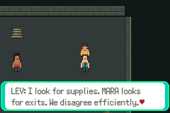
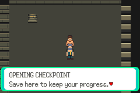

# Live migration — acceptance in progress

Issue74, branch task/floor1-g01e-live-migration; base
`b694da17928b93ea579f55d905017aa9f7619422` (PR73). Sole Cloud task
`01a10f4b-596b-700b-b8ba-241e3ca2c000`. No PR integration or fullG01 claim yet.

Implemented: five production full identities35/0..4/layouts448..452 append after
the unchanged six legacy maps/layouts442..447. All21 legacy actors retain their
scripts/outcomes at explicit semantic positions/localIDs; new markers are signs.
VersionVAR0x404E and loopFLAG49 passed the [pre-allocation source audit](pre-allocation-audit.json).
Version0 migration runs before header/layout lookup, normalizes owned remembered
warp indices, remaps all five saved records independently and rebuilds player,
NPCs/templates/cache through local map loading. Current ordinary pos overrides
stale location coords/indices. Stock/dummy warp records stay unchanged. Existing
party, inventory, outcomes/trainer flags and unowned persistent vars stay intact.
Version1 repairs its saved layout identity without repeating relocation/resetting
outcomes. Fresh event initialization stamps1. Optional return loop requires its
far-side36,16 interaction and changes only the nine declared barrier words.

Current tested production source `f7cb7f421b033dca84fb91de633452401d377e4f`:
ROM SHA256 `b4e15f83331b2b29710bfe7eed399d676d9b9d59f7a9c8b7d45283f5a31d876a`.
Ordinary/controller and boundary runner `9acf8003627bb636ec026a30b2dfacae45c6eb68`.
Actual mGBA0.10.5 evidence: **48 ordinary sessions/471 assertions** and
**21 controlled-state sessions/54 assertions**,69 empty emulator error logs.

All16 ordinary originals include the five I01 files, actual N02 corner, eight
current guide/patrol/boss/prepared/checkpoint saves, and controller-authored old
Entrance/Service seeds. Each has cold migration + meaningful original NPC/stairs
interaction + normal transitions/manual Save + second cold idempotence. Original
hashes unchanged; first/cold copies unchanged until explicit ordinary Save.
Decoded inventory/money comparison uses each actual encryption key; raw encrypted
bytes legitimately differ across heap relocation. Live duo, flags, vars and
second-load positions/warps remain identical. Player/camera/active object/localID/
initial/current/previous coordinates and cleared cache are sampled, never written.

Controlled inputs are clearly separate: checksum-valid copied inputs for future
versions2/65535, version0/2 diagnostic-number identities, unknown full map IDs,
stale0/65535 layouts, every owned return record, stock/dummy returns, active
continue-warp targets, invalid continue targets, Corridor wall/object/negative/
oversized/legal cells, and version1 stale layout. No API-only substitute for the
48 ordinary controller sessions. No original or controlled cold copy is saved.

Actual migrated captures, exact production/runner identities above:





**Important unresolved UI gate:** screenshot review found that logical rejected
saves remained in the menu but the error message was hidden by initial GPU window
masks. [Actual failed before capture](unsupported-blank-before.png). This prevents
acceptance despite the69 state sessions passing. Fixed source
`99243073ebead4ecd4fa9e4f4362d9e0d70c86df` moves the message after standard GPU
window initialization. A fresh committed build/replay and actual readable error/
acknowledgement/return-to-menu captures are pending. Do not infer readability from
the callback assertion or claim current full migration/runtime integration.

Preserved attempts: first6e654d0 build omitted documented libpng pkgconfig vars;
correct environment then exposed missing Continue-warp prototype.51c6a8e exposed
menu callback declaration/C89 ordering.2e810f6 clean compile passed. First host
ordinary run compared encrypted bytes; decoded quantities were identical. Second
ordinary runner's forced-south ladder-facing assumption failed only the Entrance
seed route; retaining real incoming ladder direction passes all48. A controlled
old Corridor wall14,0 found bounds-only side classification: actual old collision/
actor legality check in f7cb7f4 fixes that boundary. This is material migration
correction1; original trace retained under attempts. No failed original/build/save
was deleted or assertion disabled. The hidden UI message is a separate rendering
defect with its first fix pending, not a geometry redesign.

Raw complete inputs/builds/ROMs/saves stay local:
`artifacts/floor1/g01e/live-fm58wq6q`, `live-bz05bmdx`, `live-2danu7iw`,
`live-gyxzglx6`, `ordinary-7rpxkcz1`, `ordinary-lt5iqs3s`, `ordinary-8zhk2qkw`,
`boundaries-4kkbaypz`, `boundary-attempt1-corridor-wall`.
Public source evidence contains logs/routes/state snapshots/captures only.

Commands, using the pinned environment in docs/testing.md:

```sh
DCC_G01E_BUILD=/absolute/path/to/fresh-committed-build \
python3 scripts/test-f1-g01e-migration.py
DCC_G01E_ORDINARY_RUN=/absolute/path/to/accepted-ordinary-run \
python3 scripts/test-f1-g01e-boundaries.py
python3 scripts/test-f1-g01e-relocation-cells.py
```

Next: fresh9924307 build; repeat ordinary and readable rejection matrix; exact-C
all-old-cell support check; stock nonmember boundary; fresh start, both patrol
orders/travel, actual duo win/one-down/both-down/zero-walk retry, live loop in both
directions with Save/cold reload, reward/quest/craft/stairs repeats and full-cell
loads before review/merge. No native art rollout, human pacing, finalT/fullFloor1
completion, scheduler/duplicate task or public playable release.
