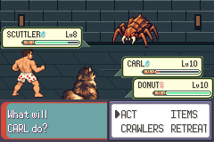
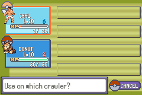
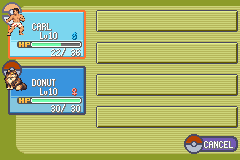
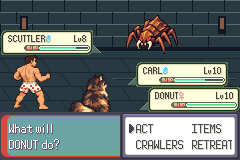
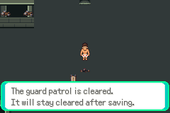
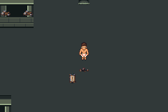

# Current-candidate patrols — scoped runtime verified

F1-G01e-CP, 2026-10-08 Australia/Brisbane. Branch
`task/floor1-g01e-current-patrol`, base`f8178113b42cdf14f5540ecd50268df5da8a947f`
(draft PR89). Parent reviewed the historical claim and authorised this focused
current-ROM validation. [Contract](../../../../floor1/g01e-current-patrol-contract.md)
committed atda2f9cd records source/save differences and route before execution.
No gameplay change, broad merge, full-route or V01 acceptance.

## Exact current identity

Game compiled `c643f01c11ec68119b0347b107ee20115131debc`; actual tested runner
`c7c5ca5d68ece7ce8aaebf2cfcad002368da0ce4`. ROM SHA256
`b0251d46f4d102cfbd91df961bb7aa98bd3e711d8598e9f690ec45abc5e64b1a`.
The retained isolated compile is reused, not newly built. Rehashed archive
`2dd7aa66942a3d13604ae4ce81a1a3d978a2c73551c23a3ed83d7208c3b051b7`
contains its ROM/ELF/map/player-controller object. Only those four were recovered,
ROM compared against retained production bytes, addresses freshly resolved from
current ELF/object. Candidate engine source equals the task branch. Original
archives/build/error logs stay intact; no full extraction or artifact removal.

Historical99243073/6c447 differs in eight source files: live event-script include,
four map event bindings, navigation scripts, secret pickup feedback and Journal.
Battle/species/move/party/item/save structures and geometry are unchanged. Guide
uses current live north-exit text. Narration/RNG timing was treated as potentially
different, not assumed equal. Same ordinary original pending saveea719ffb…abc8;
no save differences, synthetic fixture, resource injection or retained symbol reuse.

The separate current runner deliberately pins c643/b025, verifies its engine diff,
loads current symbols and keeps the historical59-input comparison descriptive.
It requires the prespecified semantic Guard turn4 state, captures it before any
mismatch stop and aborts if Carl's required action becomes unavailable. It never
uses historical frame24673 as a current timing condition. Accepted actual menu
fade/task readiness and observed context/Carl acknowledgement are preserved.
All route/reward/repeat/manual Save/cold assertions are retained; one extra
zero-frame initial Potion ownership assertion accounts for81 versus80 checks.

## Checks and actual result

Shared29 compiled readiness/negative/ack checks pass before emulator. Two
prepare-only hosts compile without emulator/save-copy execution; the finalc7c5ca5
host passes `-Wall -Wextra -Werror` on GNU14.2.0. One exclusive actual current
execution plus cold Continue, actual mGBA0.10.5:

| Current controller session | Assertions | Result |
|---|---:|---|
| Howler→guide→Guard/Potion→guide/re-entry→resolved repeat→manual Save |63|Pass |
| Cold Continue, state/rewards/position and resolved repeat |18|Pass |
| **2 sessions** |**81**|**Both error logs empty** |

The current ROM independently reaches the semantic decision at24673: Carl3/36HP,
Donut30/30HP, PP4/40 and0/38, foes0/18, one owned Potion, Carl action cursor0.
Actual59 preceding battle input pulses match historical timestamps and choices.
This is measured agreement, not transferred acceptance. Bag fade/task readiness
at24745, real context acknowledgement24757 and Carl recipient24829 precede use.
Real3→23HP healing, exactly1→0Potion and unchanged four action PP pass. Battle
return at25105 independently checks the same healing/consumption/PP state before
normal offensive choices resume. Guard wins after Howler, outcome1/no incapacity;
2136 sets after2137. Actual map/guide recovery/re-entry and resolved repeat pass.
The repeat starts no battle under a latch covering every host-issued frame.

Manual Save at37,31 persists both wins, zero Potions, XP, levels and equipment.
Actual cold Continue restores those values and position; repeated Guard dialogue
starts no battle or duplicate XP. Original ordinary save and read-only cold copy
stay byte-identical. Only the owned copy changes through actual manual Save.

Read-only reward check matches pinned rules:121 Howler XP +132 Guard XP per
crawler,253 total; money360+320=680. Two SCRAP remain, only the one Potion is
consumed; no extra repeat payout or item reward. No XP duplication after guide,
repeat, Save or cold. The evidence checker rejects a deliberately wrong runner
identifier before reading rewards; the exact tested runner passes. This offline
negative check did not execute or retry the emulator.

[Bounded verdicts](summary.json), [capture identity](captures.json). Complete
runtime logs/routes/symbols/host/saves remain local at
`artifacts/floor1/current-patrol/runtime-n12mxgz8`; build inputs
`build-selected-w3yhnr9w`; prepare hosts`prepare-z2il9lrj` and`prepare-edviuq03`.
The exclusive current claim remains. Prior failed controller execution/claim,
corrected historical80 checks, three original failed strategies and denied
private datasets/keys/dumps/ancestry remain preserved locally. No raw dataset,
ROM/save/build products or private key uploaded.

## Current versus historical coverage

| Evidence | Historical PR89 | This current check |
|---|---|---|
| Compiled source / ROM |99243073 /6c447159 |**c643f01c /b0251d46** |
| Actual tested runner |db085577 |**c7c5ca5** |
| Readiness checks / runtime assertions |29 /80 |**29 /81** |
| Owned-Potion patrol survival and persistence |Verified historical only |**Verified current scoped route** |
| First-clear Warden/staircase, fresh full route, finalT, V01 |Pending |**Still pending** |

## Actual current native captures

Untouched240×160 frames are freshly captured on currentc643/b025 with runnerc7c5ca5.
Some match historical pixels; they were not copied from that evidence. Immediate
HP animation renders22/36; readback23 is proved separately. Screenshots support,
rather than replace, behavioral assertions.












## Commands and safe continuation

```sh
PATH=/workspace/toolchain/root/usr/bin:$PATH \
DCC_TEST_CFLAGS=-I/workspace/toolchain/root/usr/include \
DCC_TEST_LDFLAGS='-L/workspace/toolchain/root/usr/lib/x86_64-linux-gnu -Wl,-rpath,/workspace/toolchain/root/usr/lib/x86_64-linux-gnu' \
python3 scripts/test-f1-g01e-current-patrol.py \
  --build artifacts/floor1/current-patrol/build-selected-w3yhnr9w \
  --retained /workspace/DungeonCrawlerCarlemon/artifacts/floor1/g01e \
  --original-save /workspace/DungeonCrawlerCarlemon/artifacts/floor1/a01/run-I7PJq0/both-pending.sav
python3 scripts/check-current-patrol-evidence.py \
  --run artifacts/floor1/current-patrol/runtime-n12mxgz8 \
  --original-save /workspace/DungeonCrawlerCarlemon/artifacts/floor1/a01/run-I7PJq0/both-pending.sav \
  --runner-commit c7c5ca5d68ece7ce8aaebf2cfcad002368da0ce4
```

Historical execution command: **do not repeat** this exclusive current check.
Prepare-only with the same args passed before runtime. No failed current emulator
attempt, retiming, alternative policy or game/balance/stat/PP changes. All outputs
and failure counters stay preserved. No active build/emulator, workflow/scheduler,
new writer or usage-meter calls; parent owns continuation.

Next dependency-ready check: prescribe current first-clear Warden→staircase with
rewards/Save/cold from this newly controller-authored ordinary patrol-complete
save (both alive, restored, Potion0/two SCRAP). Fix its input contract before
execution; no inherited boss/full-route acceptance. Optional prepared and
unprepared outcomes, reverse patrol order, full fresh route/finalT/human pacing and broader G01/V01
remain gated. No broad merge, V01 rollout, later district or public release.
