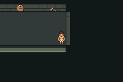

# Relocated floor-panel feedback — runtime verified, not merged

Continuation authorised 2026-10-08, Australia/Brisbane. F1-G01e-SF is a focused
follow-up to draft PR75, based directly on remote16d7012. The unpublished diagnostic
branch/archive is preserved separately and is not part of this branch's ancestry.
One writer; no new Cloud task, scheduler, strategy or gameplay expansion.

## Result

The live Field panel previously granted its once-only medicine but looked unchanged.
A single live presentation entry now reconstructs an available floor panel and a
resolved floor scuff from the existing reward flag. Immediate refresh, map re-entry
and cold load all select the correct state. The cell remains walkable at elevation3
with its original MB_CAVE behavior; ordinary movement across it passes both ways.

Only one engine data row changes. The generator reproduces it. No source map,
geometry, object, reward script, save field, flag ID, combat rule or legacy content
changes. Available/resolved art reuses the accepted native `floor_repair.png` and
`floor_scuff.png` masters: reconstructed indexed pixels match both source masters
exactly. No new graphics allocation or placeholder asset is introduced.

## Exact evidence

| Check | Result |
|---|---|
| Old unchanged ROM: pickup/repeat/re-entry/Save/cold |2 ordinary sessions,72 assertions; reward persists but pixels do not resolve|
| Fresh candidate: same ordinary checks and two-way traversal |2 ordinary sessions,72 assertions; empty emulator error logs|
| Original fixture and cold repeat file |Unchanged SHA256 after their respective read-only routes|
| Immediate / re-entry / cold resolved panel pixels |Exact match in unobscured native16×16 crop|
| Available versus resolved panel pixels |Different|
| Generator reproduction |2076 source files checked; all bytes identical after regeneration|
| Legacy maps/scripts/layouts, save structures, assets and reward logic |No diff from task base|

Baseline engine source `99243073ebead4ecd4fa9e4f4362d9e0d70c86df`, exact ROM SHA256
`6c447159ae6d3cf62b5c8860d1fd0ff62e0cb93a0a603553c3d2a0ca14bce7cb`.
Baseline driver `6f8bf3a`; candidate compiled source
`a52de748f89e82c39f97361b2295d72c88b69856`, driver `821e073`.
Candidate ROM SHA256 `baf67ceb9b39e151673af2fed480651d1d2ce799a050e2a8df5ee2f06c276b82`.
mGBA0.10.5; pinned agbcc compiler from [provenance](../../../../upstream/provenance.md).
[Baseline results](baseline-summary.json), [candidate results](candidate-summary.json),
[pixel checks](pixels.json), [source reproduction](source-audit.json).
These are narrow ordinary gameplay checks, not complete PR75 or full-floor acceptance.

Actual native240×160 captures; no overlays, retouching or fabricated frames:





Issue #76 / [draft PR77](https://github.com/12nuskek/DungeonCrawlerCarlemon/pull/77),
targeting the existing draft migration branch. Main and PR75 remain unchanged.

## Commands and retained attempts

Build uses a `git archive` of the committed candidate, setup-foundation.sh and
`make -C source/engine -j2`, without an old ROM/build cache. On this saved environment,
PATH includes `/workspace/toolchain/root/usr/bin`, LD_LIBRARY_PATH points to its
library directory, PKG_CONFIG_SYSROOT_DIR points to that root, and PKG_CONFIG_LIBDIR
includes both its pkgconfig directory and `/usr/lib/x86_64-linux-gnu/pkgconfig`.
The latter is required for the system zlib development package. Host cc is Debian14.2.0.
Normal clean-checkout setup/build instructions remain in [testing](../../../../testing.md).

```sh
PATH=/workspace/toolchain/root/usr/bin:$PATH \
DCC_TEST_CFLAGS=-I/workspace/toolchain/root/usr/include \
DCC_TEST_LDFLAGS='-L/workspace/toolchain/root/usr/lib/x86_64-linux-gnu -Wl,-rpath,/workspace/toolchain/root/usr/lib/x86_64-linux-gnu' \
PYTHONDONTWRITEBYTECODE=1 python3 scripts/test-f1-g01e-feedback.py \
  --build artifacts/floor1/feedback/build-jpbb593l \
  --original /workspace/DungeonCrawlerCarlemon/artifacts/floor1/a01/run-I7PJq0/both-pending.sav
```

The candidate source/build snapshot is now packed losslessly as
`artifacts/floor1/feedback/build-jpbb593l/source.tar.gz`. TAR comparison passed before
removing only that duplicate extracted snapshot. Its SHA256 is retained beside it;
private `production.gba` retains the exact tested ROM hash. No earlier work was removed.
Restore the snapshot before the candidate command above:

```sh
tar -xzf artifacts/floor1/feedback/build-jpbb593l/source.tar.gz \
  -C artifacts/floor1/feedback/build-jpbb593l
```

The automated route requires that retained ordinary Cloud fixture; no save is
committed or distributed. Add `--baseline` and select the recorded old build to
reproduce the unchanged old pixels. Full logs, inputs, saves, native captures,
observer source and failed attempts remain local under `artifacts/floor1/feedback`.
No ROM, save, executable, full save dump or game-save key is committed.

Retained attempts: initial runner lacked the target-bin PATH; two route attempts
exposed a controller bug when pressing the already-facing direction on a walkable
BG event (it started a step instead of repeating interaction). The corrected driver
interacts in place and asserts each crossing. Initial candidate build lacked libpng
paths; the next attempt found libpng but omitted system zlib pkgconfig. Both dependency
issues were resolved. The subsequent build exhausted filesystem inodes. Only this
run's duplicate worktree was thinned using reversible sparse checkout; earlier work,
source history and evidence remain intact. Sixteen newly generated reproducible
palette products were regenerated. The following build passed. A transient command
transport failure launched no build, confirmed by process inspection. All actual
failure logs remain retained; no gameplay assertion, battle strategy or retry count
was disabled/reset. An initial pixel check included player occlusion; the final
captures stand two cells below the panel and verify its full unobscured pixels.

## Remaining work

Implemented, compiled and runtime verified for this scoped fix; integration/PR state
is recorded in the checkpoint and final callback. PR75 remains draft: complete
patrol/loop/quest/trap/craft/boss/retry/stairs/cold-map acceptance is still pending.
The Guard diagnosis and three failed strategy attempts are unchanged. Next ready
focused task: correct live navigation/Journal copy while preserving archived scripts
and reward/state logic. No V01, main merge, full-floor or human-playtest claim.
