# Live navigation and Journal — runtime verified, draft/unmerged

F1-G01e-NC, 2026-10-08 Australia/Brisbane. Issue [78](https://github.com/12nuskek/DungeonCrawlerCarlemon/issues/78), stacked follow-up to draft PR77/75. Base `ce43420b1c76210f0fa4aaee18c0e195b9354b2d`; sole writer on `task/floor1-g01e-navigation`. Same Cloud task `01a10f4b-596b-700b-b8ba-241e3ca2c000`. Parent owns the existing continuation and quota; last supplied sample 00:05:01UTC:15% used/85% remaining. No new workflow, schedule or Cloud task.

## Result and scope

Live Guide, Mara, Lev, tag pickup, Warden and Journal instructions now match Field↔Quiet/Workshop/Warden↔Checkpoint. Quiet and Workshop exit north; the workshop is southeast of the warm guide door, the tag is outside east of the workshop, and the warden stairs are southeast. The Journal calls flag48 an **opening checkpoint**, with the remainder of Floor1 in progress.

The generated live script closure preserves all38 control blocks and22 unchanged text blocks byte-for-byte after namespace normalization. Only21 text labels change. Actor script roots bind explicitly to live labels. The menu chooses the new Journal for all five exact live map identities and retains the old script for every other identity. Unsigned-byte casts avoid shifting signed map fields. All six archived sources, geometry, collision, palettes, save ABI, state/reward ownership, recovery and combat have no diff. No new asset or book quotation; the existing compressed opening adaptation and placeholders remain documented.

## Exact evidence

Compiled game and final runner source: `c643f01c11ec68119b0347b107ee20115131debc`. ROM SHA256 `b0251d46f4d102cfbd91df961bb7aa98bd3e711d8598e9f690ec45abc5e64b1a`.

| Check | Result |
|---|---|
| Actual unchanged before ROM |3 ordinary sessions /118 assertions; stale directions and next-floor message visible|
| Candidate ordinary copied inputs/controllers |5 sessions /147 assertions|
| Explicit controlled save-input branches on the real candidate |12 sessions /89 assertions|
| Candidate total |17 sessions /236 assertions;86 expanded messages /116 actual native pages; empty emulator error logs|
| Original input identities and read-only cold files |Unchanged; manual Save writes only owned copies|
| Source reproduction |All11711 tracked engine files identical after generator reproduction|
| Legacy controls / unchanged text |38 /22 blocks identical after label normalization|
| Changed lines / bounds |53 physical lines; maximum202px in engine's216px normal-font window|
| Complete map identity negatives |65536 verbatim-C host UBSan vectors; supplementary, not emulator fallback proof|

[Candidate verdicts](candidate-summary.json), [before verdicts](before-summary.json), [source checks](source-checks.json), [capture provenance](captures.json). No raw state, saves, keys, ROM or rejected diagnostic payload/history is published here.

Ordinary routes verify first/repeat pretrial guide recovery, repeat posttrial advice and already-cleared trial text; Mara offer/decline/reoffer/accept/wait/tag pickup/return/complete/repeat; Lev; all quest Journal hints; manual Save/cold completion; checkpoint Journal and already-cleared warden page. Existing two SCRAP become four after hand-in, remain four on repeat and cold load; the tag is consumed exactly once. Both protagonists' health/actions recover.

Controlled inputs explicitly test first posttrial guide, locked/cleared warden, all seven objective priorities, and full bag hand-in refusal with98 SCRAP/tag preserved before, after and on cold load. These use the actual legacy migration/spawn path and ordinary buttons on the unchanged production ROM, not an injected RAM state or patched battle policy. Journal is opened through actual menus in all five live contexts. Legacy Continue remaps to live maps; the fallback itself is checked by preserved source and exhaustive host C, **not claimed as actual legacy runtime**.

The Warden/trial resolved text is checked from already-cleared state. There is no new battle strategy, new warden victory/defeat, actual staircase transition, fresh complete route or whole-floor acceptance claim. PR75's three-strategy stop, full gameplay/finalT and V01 gates remain pending.

## Actual native windows

All images are untouched240×160 emulator captures, labelled with source/route in the manifest. Screenshot evidence supplements assertions.

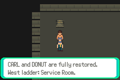
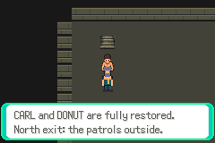
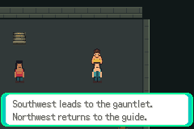
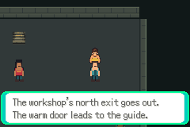
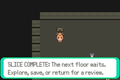
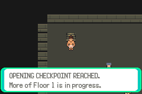
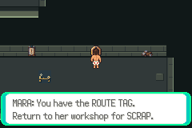
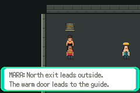
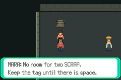
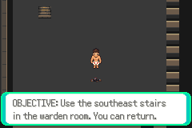
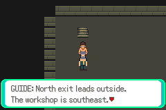
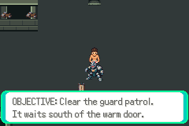
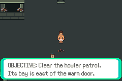

## Reproduce and retained attempts

Stock pret/pokeemerald pin `731ad5bfd6e6f265508d0efcca0ba42f9dcf5881`, agbcc `da598c1d918402c42c0c0d7128ba14567f3175e9`: [provenance](../../../../upstream/provenance.md). Host cc Debian14.2.0, actual mGBA0.10.5. Use [setup/testing](../../../../testing.md). Snapshot from `git archive c643f01`, `bash source/scripts/setup-foundation.sh`, then `make -C source/engine -j2`. Saved environment PATH/LD_LIBRARY_PATH point to `/workspace/toolchain/root`; PKG_CONFIG_SYSROOT_DIR points there, PKG_CONFIG_LIBDIR includes both its libpng metadata and system zlib pkgconfig.

```sh
PYTHONDONTWRITEBYTECODE=1 python3 scripts/check-f1-g01e-navigation.py \
  --build artifacts/floor1/navigation/build-0lj52td4
PATH=/workspace/toolchain/root/usr/bin:$PATH \
DCC_TEST_CFLAGS=-I/workspace/toolchain/root/usr/include \
DCC_TEST_LDFLAGS='-L/workspace/toolchain/root/usr/lib/x86_64-linux-gnu -Wl,-rpath,/workspace/toolchain/root/usr/lib/x86_64-linux-gnu' \
PYTHONDONTWRITEBYTECODE=1 python3 scripts/test-f1-g01e-navigation.py \
  --build artifacts/floor1/navigation/build-0lj52td4 \
  --originals /workspace/DungeonCrawlerCarlemon/artifacts/floor1/a01/run-I7PJq0
```

The exact final snapshot is packed losslessly at
`artifacts/floor1/navigation/build-0lj52td4/source.tar.gz` after successful TAR
comparison. Its archive hash and exact private `production.gba` remain beside it.
Restore before replaying commands above (check available inodes first):

```sh
tar -xzf artifacts/floor1/navigation/build-0lj52td4/source.tar.gz \
  -C artifacts/floor1/navigation/build-0lj52td4
```

Before comparison: `scripts/test-f1-g01e-navigation-before.py`, candidate run `runtime-8hy011jx`, retained SF `production.gba` and `candidate-wnbkc52i/game.sym`, same ordinary originals. Before engine `a52de748f89e82c39f97361b2295d72c88b69856` is engine-identical to task base; ROM SHA256 `baf67ceb9b39e151673af2fed480651d1d2ce799a050e2a8df5ee2f06c276b82`. Observer source `9179945`.

All complete build/host/emulator logs, route files, saves, pages and failed attempts remain local under `artifacts/floor1/navigation`. Initial compile4dc40b1 passed; final whitespace-clean c643f01 produces the identical b0251d46 ROM. The final fresh snapshot initially failed opening one generated asset for writing (errno was not recorded). A smaller reversible sparse checkout freed workspace resources; resumed make passed. No game assertion was bypassed. The older owned build is losslessly archived after successful TAR comparison; no original work was deleted.

Retained harness corrections: use actual static `sTextPrinters`; select Journal at position4 of six entries; MSGBOX_YESNO presents its choice automatically after the last page; account for original two SCRAP; use legacy migration to spawn controlled inputs instead of inventing a live save with blank objects. Each failure remains local. These are test construction faults, not claimed gameplay fixes or resets of the three combat attempts. The initial closure assertion also caught intentional fallthrough edges, now preserved. Environment restart was reconciled before creating issue78, avoiding a duplicate.

Implemented/compiled/runtime verified for this scoped task; draft and unmerged. Exact next action: reconcile the stacked review, then verify remaining optional loop/trap/craft/re-entry/cold checks using existing ordinary saves. Keep blocked combat, finalT, broader V01 and whole-floor gates pending.
