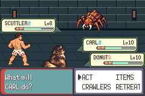
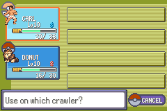
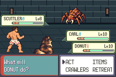
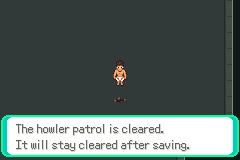

# New ordinary-save recovery — patrol target verified

[Issue #92](https://github.com/12nuskek/DungeonCrawlerCarlemon/issues/92) / [draft PR #93](https://github.com/12nuskek/DungeonCrawlerCarlemon/pull/93), open/unmerged, stacked on unchanged PR91.
Evidence publication `68784e6b5400bf703cce52e25bbb4be95bd495b0`; tested host/runner remains `cc3845767959820ce6d4c2693a927fc1a24dd197`.

Parent review of PR91 authorised one separate fresh-save contract before replay.
Base `b36f750c689029e4fcc9f0a43b73c0c3dca7dccf`, branch
`task/floor1-g01e-new-save-recovery`. The inherited historical-fixture HP gate
did not establish Guard defeat, failed healing or a game regression. Both prior
recovery failures/STOPs and all historical contracts/results remain unchanged.
This new contract does not revise their outcomes or restore legacy acceptance.

## Exact build, source and input

Contract, runner and host committed **before execution**:
`cc3845767959820ce6d4c2693a927fc1a24dd197`.
[Prespecified separate contract](../../../../floor1/g01e-new-save-recovery-contract.md).
Retained isolated game `c643f01c11ec68119b0347b107ee20115131debc`, exact loaded
ROM SHA256 `b0251d46f4d102cfbd91df961bb7aa98bd3e711d8598e9f690ec45abc5e64b1a`.
Engine diff is empty. Existing complete clean-build logs/pins remain in the
prior private recovery bundle; no game/asset/map/balance/save ABI changes.
Tooling image SHA256 `4aafe586a8b5c8e5ec720843a42e3afd63f03e62663965d06c1492702c579a54`,
libmGBA0.10.5. New generated host SHA256
`a3af0f882d95912304e5c3c8d537449f8b335930bf6a806244358fa395af2a12` compiles
with `-Wall -Wextra -Werror`. 13 exact-C capped-healing/precondition checks plus
29 original Potion-readiness and seven field-readiness checks pass (**49**).

Input is the new ordinary pending Save SHA256
`c11c64559f38680dd21afe693327e703fd4b452776ace69f8e7f1e0b1f3bc67f`:
healthy Field37,31, levels9/9, XP495/805, PP8/40/2/40, Potion1/SCRAP2,
trial won, both patrols/preparation/boss/checkpoint unset. It remains unchanged.
The host starts from the exact repaired recovery observer `743ee603…4163f`.
Historical runners/contracts/evidence and all64 files in the earlier private
archive (63 retained inputs/records plus manifest) were compared unchanged.
All53 pre-existing remote branch heads remain unchanged; only this branch added.
PR91 and drafts75–89 remain open/unmerged. Main stays `b694da17928b93ea579f55d905017aa9f7619422`.

## Actual executions

| Session | Result | Actual source |
| --- | --- | --- |
| Pinned pending cold → Howler → guide → Guard/Potion → guide → repeat → manual Save | 121 assertions, exit0, empty errors | `cc3845767959820ce6d4c2693a927fc1a24dd197` |
| Separate cold → full target → resolved Guard/Howler repeats → Field37,31 | 78 assertions, exit0, empty errors | same committed source |

**Two sessions, 199 assertions, one combat replay.** No failed new execution,
combat retry, timing/RNG search, resource injection or new battle strategy.
[Bounded verdicts and exact identities](summary.json), [native capture register](captures.json).
No mGBA errors. Fifteen actual native captures retained privately, ten selected
unchanged240×160 images published here. Screenshots supplement assertions.

All59 pre-intervention ordinary input records, including their frame numbers,
equal the prior stopped recovery trace. The full patrol route's ordinary
step/pilot/engage/dialog/measurement commands are identical. Added assertion,
reward and read-only telemetry commands introduce no gameplay frame or input.
No missing historical save/RNG state is recreated or inferred.

Howler single-WEAKEN policy wins at9,220 pilot frames, outcome1/no incapacitation.
Guide restores the duo/PP. Guard turn4 is observed at24,553: Carl20/36, Donut16/30,
PP4/40/0/38, foes0/14, owned Potion1, action cursor0. Separate fresh-save
preconditions require correct actor/trainer/turn, living injured Carl, living
Donut, proper menu/controller readiness and the owned item, rather than old
current-HP equality. Exact maxHP/PP/foe-alive conditions remain required.

Actual Bag task/fade readiness at24,625, item-context acknowledgement24,637,
Carl-recipient acknowledgement24,709. Potion restores **20→36, exactly16HP**,
matching `min(20, missingHP)`; quantity1→0, Donut16HP and all four PP unchanged.
Returned battle at24,973 also verifies party/battle Carl36HP and unchanged PP.
Original offence then wins Guard at9,784 pilot frames, outcome1/no incapacitation.
The private healed-party capture is taken while its final bar animation still
renders35/36; actual HP assertions and the returned battle capture verify36/36.

New read-only per-hit HP telemetry records a Howler foe3 TACKLE on Donut with
critical multiplier2/damage12, and Guard Donut SPARK on foe3 with multiplier2/
damage7. This explains observed events in the new replay, not the unavailable
original trajectory. HP increases during levels/healing are separately visible;
attacker/target/damage globals on increases are context, not damage claims.
Complete detailed logs remain private.

XP is exactly121+132 per crawler:495→616→748 and805→926→1058. Money3320→3680→4000,
reward360+320. Exactly one Potion consumed; SCRAP stays2. Howler flag2137 precedes
Guard2136; trial2135 remains won; preparation/boss/checkpoint unset. Guide restores
HP38/38 and30/30, status0/0, PP8/40/2/40. Guard repeat before Save and both cold
resolved encounters start no battle and change no XP, money, equipment or resources.

Manual Save and separate-process cold verify **Field37,31, levels11/10,
XP748/1058, restored permanent duo, PP8/40/2/40, Potion0, SCRAP2, both patrols won,
preparation/boss/checkpoint unset**. New patrol-complete Save SHA256
`026c16feccd0a1741ff0c3ec077e7272fc6ee43bf0e4fa12ab8953c50523220a`.
Cold copy remains byte-identical after both repeats and ordinary return37,31.

## Actual native captures

All belong to `cc384576` host/runner and exact `c643f01`/`b0251d46` game/ROM.
The register binds every full source, host, route and PNG hash.









## Private durability and next dependency

New saves, complete logs/routes/claims/observer source/captures and source/check/ref
records saved in private Library `DungeonCrawlerCarlemon-new-save-recovery-20261008.zip`,
170,041 bytes, SHA256 `c6772875b922b8af990654133ead0b4ebd6ce8e679599917156a227f73a4d005`.
Its whitelist manifest contains57 files and points to the earlier retained complete
build bundle. No ROM, savestate, old denied dataset/key/ancestry or missing original
included. [Exact supported retention identity](private-retention.json).
Raw runtime outputs also remain under `artifacts/floor1/new-save-recovery/runtime`.

Implemented and compiled; this fresh-save contract runtime verified; draft/unmerged.
Original legacy saves, old pending/patrol-complete inputs, old raw logs/claim files
and denied ancestry remain unavailable. Their original acceptance gate is not
restored or satisfied by fresh inputs. All three original strategy failures and
both earlier replacement failures remain historical results, unchanged.

**Warden has not been started.** Next dependency is parent review of this recovered
new input and draft PR, then a separate prespecified trainer858 unprepared fortify
attempt bounded30,000 frames and actual first-clear staircase/reward/manual Save/
cold checks. No broad merge, full/finalT/V01/Floor1 or visual rollout acceptance.

## Completed commands — do not replay

```sh
python3 scripts/test-new-save-potion-state.py
python3 scripts/test-recovery-field-readiness.py
python3 scripts/test-f1-g01e-new-save-recovery.py --build artifacts/floor1/recovery/current-build --output artifacts/floor1/new-save-recovery/runtime --seed artifacts/floor1/recovery/runtime-menu-repair/seed.sav --stage prepare
python3 scripts/test-f1-g01e-new-save-recovery.py --build artifacts/floor1/recovery/current-build --output artifacts/floor1/new-save-recovery/runtime --seed artifacts/floor1/recovery/runtime-menu-repair/seed.sav --stage patrol
python3 scripts/test-f1-g01e-new-save-recovery.py --build artifacts/floor1/recovery/current-build --output artifacts/floor1/new-save-recovery/runtime --seed artifacts/floor1/recovery/runtime-menu-repair/seed.sav --stage cold
```

Host/runtime commands used the pinned `dcc-recovery-tooling` container, bind
`/workspace`, user1000 and repository working directory. Existing execution
claims/directories prevent repetitions; preserve them.
