# Ordinary optional routes — runtime verified, draft/unmerged

F1-G01e-OP, 2026-10-08 Australia/Brisbane. [Issue80](https://github.com/12nuskek/DungeonCrawlerCarlemon/issues/80), focused follow-up to draft PR79/77/75. Base `91a4b79bfe7041060de560cd65b037322233047a`; branch `task/floor1-g01e-optional`. This adds verification and instruction/checkpoint updates; **no game source change** was needed.

The user's02:01:39UTC update withdrew the usage-meter prerequisite and20%-remaining pause. Current instructions supersede the historical guard. No meter read or login request; bounded nine-district Floor1 work continues until the review package or user stop. Parent owns the sole continuation. Same Cloud task `01a10f4b-596b-700b-b8ba-241e3ca2c000`; no new writer, scheduler or task.

## Exact identity and result

Game source `c643f01c11ec68119b0347b107ee20115131debc`, runner `2ae9d14854e1b3fbc58f612450c8399ac251f461`. ROM SHA256 `b0251d46f4d102cfbd91df961bb7aa98bd3e711d8598e9f690ec45abc5e64b1a`. The exact isolated compiled snapshot was restored, engine diff checked against the current commit, and loaded-ROM identity asserted. The host observer compiled with GNU14.2.0 and `-Wall -Wextra -Werror`, running actual mGBA0.10.5. This **reuses the prior verified compile**; it does not claim a new game build.

| Ordinary route | Assertions |
|---|---:|
| Loop closed/wrong-side/open/two-way/re-entry/Save |6,239|
| Loop cold/two-way/repeat |3,099|
| Trap first/repeat/Save |44|
| Wounded cold crossing/sign |3,085|
| Guide recovery/re-entry/Save |3,109|
| Recovered cold crossing |8|
| Recipe/cache cancellation/success/repeat/re-entry/Save |91|
| Recipe/cache cold/repeat/missing materials |26|
| **Total:8 sessions** |**15,701**|

Five complete3,072-word Field comparisons contribute15,360 assertions;341 additional readiness, collision/movement, health/status/actions, item, flag and native-message assertions verify behavior.26 expanded messages /33 actual native pages match compiled labels. Every emulator error log is empty. The one preserved ordinary original (`both-pending.sav`) and all four read-only cold copies remain byte-identical. Owned controller-created copies are the only saved files written.

[Bounded verdicts](summary.json), [actual capture provenance](captures.json). Raw logs, route matrices and saves remain local. No full state dump, key, rejected diagnostic payload/history or ROM is published.

## Observed behavior

- Wrong-side interaction leaves flag49 false and all nine closed gate words unchanged; walking into it is blocked. Far-side interaction opens it, repeated use is harmless, both directions work, and re-entry/manual Save/cold restore every Field word. Items, quest state, patrol victory flags, boss and checkpoint access do not advance.
- Wire warning precedes the first trigger. CARL goes33→29HP with paralysis; DONUT remains28HP, and action uses remain unchanged. Repeated crossing and wounded cold reload cause no second damage. The guide restores both to33/28HP, clears status and restores8/40 and2/40 action uses. Re-entry and recovered cold crossing remain safe. Spent presentation is reconstructed with the same walkability/elevation.
- No-charge cache use leaves items/flags unchanged. Recipe decline retains two SCRAP; successful crafting consumes exactly two for one CHARGE. Another craft fails for missing materials and retains the existing CHARGE. Cache decline retains it; actual use consumes one, sets flag46 and awards one SUPER POTION. Repeat, re-entry and cold use award/consume nothing extra; the cold recipe still fails cleanly for missing SCRAP.

All runs use original ordinary inputs and real manual saves. No synthetic boundary input, RAM/ROM writes, policy, pilot, battle trigger or timing reset. Recipe/cache capacity fixtures are outside this ordinary-route increment. A new full progression route, first boss victory/defeat, first stairs-clear transition, finalT, human pacing/comprehension and V01 remain pending. PR75's three-strategy combat stop is unchanged.

## Actual emulator captures

All images are unretouched native240×160 frames from the exact game/runner above. Closed/open screenshots are before/after **the normal interaction on the same candidate**, not a gameplay patch.

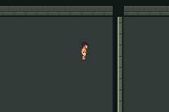
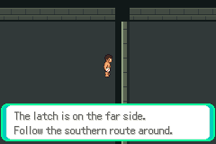

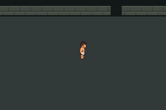

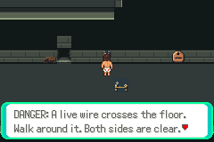
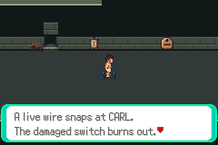
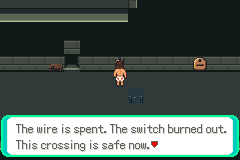

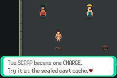
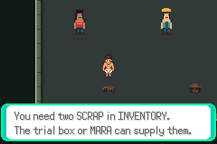
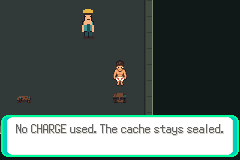
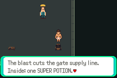
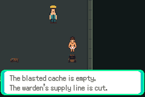

## Reproduce and preserved failures

```sh
PATH=/workspace/toolchain/root/usr/bin:$PATH \
DCC_TEST_CFLAGS=-I/workspace/toolchain/root/usr/include \
DCC_TEST_LDFLAGS='-L/workspace/toolchain/root/usr/lib/x86_64-linux-gnu -Wl,-rpath,/workspace/toolchain/root/usr/lib/x86_64-linux-gnu' \
PYTHONDONTWRITEBYTECODE=1 python3 scripts/test-f1-g01e-optional.py \
  --build artifacts/floor1/navigation/build-0lj52td4 \
  --originals /workspace/DungeonCrawlerCarlemon/artifacts/floor1/a01/run-I7PJq0
```

Restore `source.tar.gz` at that build path before replay; the exact source/build and private ROM are retained losslessly. [Build/archive details](../navigation/README.md). Optional `--case loop`, `trap` or `craft` isolates an independent route family without changing assertions. The retained ordinary fixture is not distributed.

Complete runtime evidence: `artifacts/floor1/optional/runtime-2ktytnkb`. An initial unmatched-parenthesis syntax check failed before emulator execution; history and the local `syntax-9109e75` diagnostic preserve it. Corrected runner2ae9d14 passed all eight emulator sessions on the first runtime attempt. No game assertion was weakened, game defect fabricated or combat retry count reset.

Implemented verifier/instruction updates; existing exact compile reused; scoped runtime verified; pushed PR state recorded in the checkpoint, **not merged**. Next: non-combat resolved-staircase refusal/return/re-entry/Save/cold and remaining map-buffer checks from already-completed ordinary saves. First-clear/full-combat/finalT/V01 remain gated.
