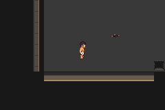

# Native-context correction — legitimate new walking delta, strict stop preserved

[Issue #102](https://github.com/12nuskek/DungeonCrawlerCarlemon/issues/102) / [draft PR #103](https://github.com/12nuskek/DungeonCrawlerCarlemon/pull/103), open/unmerged, stacked on unchanged PR101. Evidence commit `030e753d8e64eb417a79ccda5a6657c0007686f7`.

Corrected host implemented/compiled and tested. **One separately claimed
noncombat probe passed actual staircaseNO and12 stable canonical resource checks,
then stopped at the natural127→0 boundary on strict reason53.** New buffers prove
Carl friendship92→93 and its derived checksum/ciphertext change; every other
party/resource field is exact. No gate relaxation, retry, further frame, battle,
Save, prepared replay, extra walking or RNG search. This demonstrates a new
mechanism; **the original prepared changed field remains unidentified.**

[Prespecified correction contract](../../../../floor1/g01e-party-resource-correction-contract.md),
[frozen pre-execution identities](pre-execution.md), [398 focused host cases](host-cases.log),
[safe exact field findings](findings.json), [actual strict stop](STOP.json),
[offline native validation](offline-analysis.log), [scoped review](review.md),
[private retention receipt](private-retention.json). Base draftPR101
531276ae7ee4e238ed804cff4c5d970d32d63ff0 remains unchanged/unmerged.

## Minimal correction and focused cases

Historical observers/controllers, original200-byte block, original prepared
failure and PR101's raw-resource stop are unchanged. Separate corrected generator
pins the exact PR101 generated host and replaces only its additional resource
observer. Money uses the actual native full32-bit SaveBlock2 context; coins and
all186 bag quantities use its low16 bits, including empty slots. All item IDs,
PC items, registered item and unencoded owned bytes remain exact. Context and raw
snapshots are captured privately from the native pointers; no value is inferred
from assumed balances. No actual context/identity/raw buffer is published.

Resource comparison runs only at the frozen route's existing stable ready/
preservation checkpoints. Native field-ready conditions are required; no resource
comparison during map rekey. Every armed frame still protects strict first200
duo bytes, remaining400 party bytes, count, flags and natural counter progression.
Duo mismatch wins reason53 priority. Original historical gate remains verbatim.
Every frame goes through the existing noncombat24,000 bound; no24,001st frame.
Read-only instrumentation adds no emulator frames, inputs or game RNG calls.

398 exact-header C host cases passed before runtime: relocated/rekeyed snapshots,
high-half-only context change, full money/coin and every one-unit quantity
corruption, every bag item ID including empty slots, representative unencoded
bytes, wrong context including high half, zero context/empty slots, strict53
priority with simultaneous resource/count/flag failures, remaining party/count/
flags. Independent native typed-value fixture encoding verifies the canonical
decoder. Fixtures never enter emulator RAM or a Save. Native capacities verified
against pinned source. Host compile Wall/Wextra/Werror, exit0; no compile failure
in this increment. Game is unchanged; only host was freshly compiled.

## Exact ordinary execution and new field proof

Same completed offensive unprepared Save
`6ab1357be75bcf4f41fe8064e8df590876348e28fe78e557f28ff90648246386`;
same145-line route/cadence/hash asPR101:
`efad1580ea49f49bd215868aec53f4f9313face05ef6d563bf32856d779a0f69`.
Cold checkpoint35.4/8,6, Carl12/Donut10, XP974/1284, HP18/24, PP3/40/0/37,
status/equipment0, money4360, coins0, Potion0/SCRAP2, boss/checkpoint/patrols won,
preparation unset; natural friendship counter66. Exact Save/native checksum
verification and state assertions precede the private anchor at frame2044.

Ordinary return warp rekeys resources; corrected comparisons pass. Actual native
staircaseNO acknowledged0, stays35.3/12,10, existing checkpoint48 retained and
rewards/resources unchanged. Four prespecified short row round trips begin;
strict first mismatch stops during the existing route at35.3/6,10/frame4702.
Exit53,72 completed emulator assertions,2,658 armed per-frame comparisons,
12 stable resource comparisons, zero battle frames/attempts. Last stable party
frame4701/counter127; stop counter0. The log records61 unchanged-party counter
increments, then metadata captures the terminal127→0 step (party53 priority).
Last stable resource checkpoint4677; fresh stop snapshot also validates offline.
No subsequent frame, route extension or new input. Whole route is intentionally
unfinished after the strict stop. Disk input copy remains byte-identical; no Save.

| New observed field | Exact bounded finding |
| --- | --- |
| Carl friendship | 92→93, delta+1 |
| Carl native checksum | 70→326, delta256 expected for friendship byte9 |
| Carl raw changed offsets | 29 (checksum high byte),65 (encoded growth friendship) |
| Canonical changes | Checksum high byte and growth friendship only |
| Carl/Donut checksum and re-encoding | Valid and exact before/last stable/after |
| Donut / remaining400 party bytes | Exact; friendship delta0 |
| Every other canonical party field/padding | Exact, including identity, species, XP, equipment, moves/PP, EVs/IVs/origin/ribbons, status/level/HP/stats |
| Native counter / party count / flags | 127→0 at first mismatch; count2/flags exact |
| Money / coins | 4360/0, exact using each actual privately captured context |
| All186 bag IDs/quantities, empty slots, PC/unencoded bytes | Exact across12 stable checks and at stop |

Independent offline decoding uses each captured actual context; it agrees with
the host for every snapshot. Raw encoded resources differ after warp, but their
entire1272 canonical logical bytes equal the anchor. No inferred keys or assumed
balance acceptance. Private full decoding/raw buffers remain available for review.

Pinned `UpdateFriendshipStepCounter` calls ordinary walking friendship at counter0.
The native walking base modifier is1; Carl has no held-item/luxury-ball/current-map
met-location bonus, so its actual+1 agrees exactly. Checksums are native sum-u16;
the high friendship byte contributes256. Re-encoding preserves identity/OT XOR
inputs and all other secure bytes. Donut's zero delta is consistent with the
native optional walking skip; no RNG result is claimed, searched or replayed.
This proves a legitimate **new** walking delta, not the absent original buffers.

## Actual native evidence and precise source/build

Frozen host source `8a3f598c55f3d3f4bceb707b955d7b18a448e564`;
actual execution `eed04fae769756605418bcbc3f335c99027e50f8`.
Generated host SHA256
`34b0ed879ae3bfcd02da3842c6ae3f45ff4232be10c6f4218df183e5241f9de0`.
Same approved game source `5084a1814904f1a43fd999fddf770b221bb53653` and
ROM SHA256`23c77a0c3eb86bac74aee25b189c147f172601d29403cbd485f665aec705b167`.
Original isolated build/log/pins remainPR99 evidence; no new game-build claim.

Actual staircase cancellation in this frozen noncombat route, acknowledged0:

Actual first strict mismatch frame4702 while walking the fixed row;72 assertions:

These screenshots are native route evidence; raw bytes/decoded findings prove
the field change. [All seven actual PNG identities](captures.json). No image
editing, generated concepts, new art or visual/Floor1 rollout acceptance.

## Preserved history, private retention and next dependency

All58 earlier remote heads/mainb694 and accepted plan preserved. PR101 diagnostic
stop1, original prepared stop1, original Warden loss1/1 and three historical patrol
strategy/two initial recovery failures remain separate. Parent-accepted unprepared
pairs and candidate three combat victories are unchanged. This increment adds
one authorised noncombat strict53 stop, zero battles, no prepared acceptance.
Complete new raw buffers, actual contexts, full decoded fields, compile/runtime/
analysis logs, unchanged normal input copy, route/claim/STOP and captures retained
privately in Library. Git receives safe bounded findings/hashes/captures only;
no contexts/raw buffers/decoded identities/saves/ROMs/executables/credentials.
Private upload excludes ROMs/executables/credentials/old denied raw datasets;
the actual game encoding contexts are specifically authorised private data.

Next is parent review. This evidence supports considering a **separate narrowly
defined preservation contract** allowing only source-valid ordinary walking
friendship deltas and their exactly derived native checksum/ciphertext changes;
every other canonical party byte, count/flag and logical resource must remain
exact, using actual contexts and valid checksums/re-encoding. Bonuses/clamping
must be source-accounted, never arbitrary friendship tolerance. Keep all historical
strict failures; do not reinterpret them as passed. No such exception is implemented
or authorised here, and no prepared replay/battle follows this result. Original
prepared changed field and legacy inputs remain missing/unidentified; no broader
Floor1/finalT/human-pacing/V01, CI pass or merge claim.
