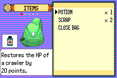

# Corrected Potion readiness — historical intervention verified

F1-G01e-PR, 2026-10-08 Australia/Brisbane. Branch
`task/floor1-g01e-potion-ready`, base `00a31be5d1622308a6d02c4fcce165e1d581b710`
(draft PR87). Parent explicitly authorised one corrected controller replay after
PR87 never delivered a Potion. [Pre-execution repair contract](../../../../floor1/g01e-potion-ready-contract.md)
committed at9890144 preserves the same hypothesis, ROM/save/route and stop rule.
No game or balance changes, merge, full-route or newer-candidate acceptance.

## Identity and readiness checks

Game compiled source `99243073ebead4ecd4fa9e4f4362d9e0d70c86df`; actual tested
runner `db085577a8866fa272f31ea2ab5869f00fbd7bd2`. Historical ROM SHA256
`6c447159ae6d3cf62b5c8860d1fd0ff62e0cb93a0a603553c3d2a0ca14bce7cb`.
The retained game compile was reused, not newly built. Fresh host GNU14.2.0,
`-Wall -Wextra -Werror`, actual mGBA0.10.5. Save/ROM/route/observer identities
match the original fixed contract. The original failed run/claim and all three
original strategy failures are preserved; no attempt counter was reset.

Shared read-only readiness code requires both the correct active task and actual
`gPaletteFade.active==0` before selection. The pinned ROM disassembly confirms
Bag tests bit0x80 at palette-fade byte7. Pending selection waits with zero input;
stage advances only after observing the correct item context or Carl recipient.
The original12-frame input cadence and battle policies remain unchanged. No
arbitrary delay or timing/policy/RNG search.

Before emulator use,29 compiled host checks passed for active fades, wrong/inactive
or missing tasks, Thumb callback normalization, final task slot, wrong item/
recipient, missing pending selection and delayed acknowledgements. Prepare-only
host compilation passed without emulator/save-copy execution. The one corrected
execution is protected by a separate retained exclusive claim.

## Actual runtime result

| Controller session | Assertions | Result |
|---|---:|---|
| Preserved Howler-first route, owned Potion, Guard, guide/re-entry, resolved NPC and Save |62|Pass |
| Cold Continue, flags/items/XP, resolved NPC and no duplicate award |18|Pass |
| **2 sessions** |**80**|**Both error logs empty** |

All59 battle input pulses before the intervention exactly match the retained
failure. The native frame at24673 is byte-identical to PR87's pre-intervention
capture. Carl turn4/3HP, Donut30HP, PP4/40 and0/38, foes0/18 and one Potion match.
Bag opens at24685, but corrected A waits until24745: fade complete, expected task
and first owned Potion verified. Context acknowledged at24757; Carl recipient
acknowledged at24829. The host verifies an actual20HP heal,3→23, quantity1→0,
and unchanged four action PP. Battle return at25105 independently verifies HP23,
quantity0 and PP4/40/0/38 before the original offensive choices resume.

Howler victory occurs first; Guard then wins with outcome1 and no incapacitation.
Trainer flag2136 becomes set after2137. Ordinary field return at37,31, actual guide
recovery and measured travel pass. Both flags, zero remaining Potions and unchanged
XP/levels/equipment survive guide return, resolved Guard interaction and Save.
Repeat interaction is monitored on every host-issued frame and starts no battle.
Manual Save completes at37,31; cold Continue restores it, both wins and the consumed
Potion. Cold resolved interaction starts no battle and changes no XP.

A separate read-only evidence check validates rewards against pinned engine rules:
Howler gives121 XP per crawler; Guard gives132. Both gain253 total, with no repeat
or cold duplication. Double-battle money payouts360+320 equal680 in the actual
controller-authored save, with no extra repeat payout. Original inventory held
one Potion and two SCRAP; saved inventory has only the same two SCRAP. No other
items are gained/lost. No raw save regions, keys or inventory dataset are emitted.
Both ordinary original and read-only cold copy remain byte-identical; only the
owned run copy was changed by actual manual Save.

[Bounded verdicts](summary.json), [actual capture provenance](captures.json).
Full raw runtime/host/symbols/input/save artifacts remain local at
`artifacts/floor1/potion-ready/runtime-k5b3n5vy`; prepare-only at`prepare-wieate4m`.
Prior failure `artifacts/floor1/potion/runtime-_16gl_zj` and its exclusive claim
are retained unchanged. Denied diagnostic datasets/keys/dumps/ancestry remain
local and outside this branch. No ROM, save or build products are published.

## Untouched native captures

All240×160 images are from this actual run on the exact game source/runner/ROM
above. The immediate healed-party capture renders the HP animation at22/36;
readback23 is verified separately. It is not labelled as a visual23HP proof.
Screenshots support the assertions rather than substituting for them.





## Commands and limits

```sh
python3 scripts/test-potion-menu-readiness.py
PATH=/workspace/toolchain/root/usr/bin:$PATH \
DCC_TEST_CFLAGS=-I/workspace/toolchain/root/usr/include \
DCC_TEST_LDFLAGS='-L/workspace/toolchain/root/usr/lib/x86_64-linux-gnu -Wl,-rpath,/workspace/toolchain/root/usr/lib/x86_64-linux-gnu' \
python3 scripts/test-f1-g01e-potion.py \
  --retained /workspace/DungeonCrawlerCarlemon/artifacts/floor1/g01e \
  --original-save /workspace/DungeonCrawlerCarlemon/artifacts/floor1/a01/run-I7PJq0/both-pending.sav
python3 scripts/check-potion-ready-evidence.py \
  --run artifacts/floor1/potion-ready/runtime-k5b3n5vy \
  --original-save /workspace/DungeonCrawlerCarlemon/artifacts/floor1/a01/run-I7PJq0/both-pending.sav
```

The emulator command is historical; **do not rerun** the exclusive corrected
execution. A prepare-only invocation with the same arguments and`--prepare-only`
passed first. The static/evidence checks do not invoke an emulator. Route/Save/
cold code after construction of `lines` compares exactly with PR87 by text and AST;
all original assertions remain. Runtime-sensitive host changes are only readiness
and observed acknowledgements. This historical pass supports the specific owned-
Potion survival decision; it does not establish fresh-player discoverability.

Newerc643/b025 combat is still unverified. FullG01, first-clear boss/staircase,
full fresh route, finalT, human pacing, V01 and full Floor1 remain pending. No
merge or rollout. Parent should review this exact checkpoint before authorising
any current-candidate combat validation; do not infer a gate pass across ROMs.
Independent no-collection source/menu audits remain ready. No new writer/task/
workflow/scheduler, quota call, public playable release or expanded platform.
