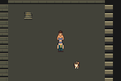
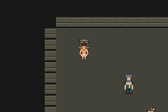

# Dependent prepared cold route closed — exact native phase/clock proof

[Issue #106](https://github.com/12nuskek/DungeonCrawlerCarlemon/issues/106) / [draft PR #107](https://github.com/12nuskek/DungeonCrawlerCarlemon/pull/107), open/unmerged, stacked on unchanged PR105. Evidence commit `00e91c459a40107a9f4098d99dcf242eb413a4a9`.

ONE separately claimed cold-only process passes **132 assertions/6,258 absolute
frames**, empty errors, zero battle frames/attempts and byte-identical normal Save.
Actual boot, arena return, resolved repeat, staircaseNO/YES, checkpoint re-entry
and final resources pass. This closes only the dependent cold gate accepted for
PR105's new prepared victory/manual Save. It adds no battle/Save/route/search and
does not pass any historical failed claim or unavailable legacy input.

[Separate frozen contract](../../../../floor1/g01e-prepared-cold-phase-contract.md),
[pre-execution/frozen identities](pre-execution.md), [4225 host cases](host-cases.log),
[actual result](summary.json), [independent findings](findings.json),
[offline native validation](offline-analysis.log), [scoped review](review.md),
[private retention receipt](private-retention.json), [remote reconciliation](reconciliation.json).

## Minimal source-defined architecture

The new adapter uses one native phase predicate before any actual SaveBlock-backed
counter/map/flag/resource read: CB1_Overworld, CB2_Overworld and VBlankCB_Field,
no battle, using gMain callbacks only. Pinned source restores these field callbacks
after map loading and clears VBlank during copying. Gate/clock wrappers also
protect old telemetry and receiving-menu map checks; unused battle/measure/
inventory commands are rejected. Ordinary route inputs/cadence remain identical.

Invalid phases perform no snapshot read or acceptance. Last accepted and expected
state are retained, with only host accounting updated. Valid re-entry compares
all600 party bytes under unchanged source-valid walking reconstruction, count2,
exact natural counter progression, full300 prescribed flags and all1272 canonical
resource bytes using each actual native context. No re-anchoring, broad mask,
counter tolerance, balance/key inference or original failed CPU-phase inference.
Native checksums/re-encoding and every unrelated party byte remain exact.
Checkpoint48 already set remains set through NO/YES. Resource checks also run
at the existing explicit native stable ready/preservation checkpoints.

A dedicated absolute clock increments immediately after the sole runFrame call.
Before/after every frame, unconditional zero-battle checks and24000 whole-process
bound remain active through boot and transitions. No24001st frame. Old battle
bound code remains; no battle route can run. All new sample/event/stop/telemetry
labels use this clock; valid per-frame, deferred, explicit checkpoint and re-entry
counts are separate. Historical PR105 labels/STOP are preserved without rewriting.

Focused exact-header tests:2872 unchanged narrow native walking cases plus1353
phase/clock cases, including spy reads proving deferral cannot read or update
snapshots/expectations, valid-phase corruption rejection, exact rekey, strict
off-boundary/+1/excess friendship, battle guards while deferred/unarmed, per-frame
batch labels and bounds. Fresh host Wall/Wextra/Werror compile exit0, no compile
failures. Source verifies native callback/offset/restoration contract. Host only
fixtures; no synthetic game inputs or writes/RNG calls. Game build reused unchanged.

## Actual complete cold evidence

Frozen180-line route is byte-identical to PR105 failed cold route:
`b3e46bacbbd903d674a8329dafc78a6ccb1ceee3ed6d34508613a3fc0c572427`.
Input/output Save SHA256:
`dbaaf7312ed6100b780811cd9b71c627ba42c6100bf318071b8cd1616a62ccd7`.
Native latest14 sector checksums validate; first-final snapshots remain read-only
host expectations. Exact boot35.4/8,6 at frame2044: all600 party bytes/count2,
counter8, all flags/resources; Carl/Donut11/10, XP940/1250, HP26/24, status0/0,
PP4/40/0/38, held0, friendship88/84, money4320, SuperPotion1/Potion0/SCRAP0/Charge0,
patrol/preparation46/boss47/checkpoint48/trainer2139 set, trainer2138 unset.

| Accounting or transition | Actual exact result |
| --- | --- |
| Absolute frames / armed frame | 6258 /2044 |
| Valid per-frame samples | 4195 |
| Deferred frames | 19 |
| Explicit stable checkpoints | 9 |
| Complete re-entry comparisons | 2 |
| Arena return transition | deferred3076..3085; prior accepted3075; re-entry3086 |
| YES checkpoint transition | deferred5618..5626; prior accepted5617; re-entry5627 |
| Native counter | 8→35 through27 ordinary increments, each exactly timestamped |
| Friendship boundary events | 0; both88/84 unchanged |
| State snapshots decoded offline | 13 valid snapshots (anchor/9checkpoints/2re-entries/final) |
| Live600 party/count/flags/logical resources | Exact in every snapshot; context captured per snapshot |
| Battle/Save/extra route | Zero |

4195+19=6258−2044 exactly. Snapshot/source/test proof shows no state accepted in
either deferred interval; re-entry counters remain14 and29 respectively, with full
party/flags/canonical resources exact. Ordinary resolved Warden repeat starts no
battle and grants no reward. Actual NO acknowledges0 and remains35.3/12,10;
actual YES acknowledges1, returns35.4/4,4, checkpoint48 stays1. Return to review8,6
retains HP/status/PP/XP/money/flags/items and all other party fields. Runtime counter
is35 from ordinary walking; the unchanged disk Save still contains its stored8.

Independent native decoding of all13 snapshots agrees with host: valid member
checksums/exact re-encoding, full600 party bytes identical to normal saved party,
300 flags and1272 logical resource bytes exact, all186 bag IDs/quantities including
empty slots/PC/unencoded bytes. No inferred context or allowed-field drift.
[Six actual native240×160 PNG identities](captures.json); images prove route views,
native logs/byte assertions prove state. No generated art or visual rollout claim.

## Precise source/build, preserved history and next dependency

Frozen host/runner `514187f69d1cd0d84536d66071da988ece0c337a`;
execution `8896e1f2e8b203bb90c224a864f26266bce60200`.
Generated host SHA2565350ef885723e249a68b23061a3a9b16799ecfdbe6089d630a38fe0721bbf4fd.
Unchanged approved game5084a1814904f1a43fd999fddf770b221bb53653,
ROM23c77a0c3eb86bac74aee25b189c147f172601d29403cbd485f665aec705b167.
Only the host was freshly compiled; original isolated game build/pins remainPR99.

Complete new private logs/raw snapshots/actual contexts/full decoding/input copy/
claim/captures retained in Library. Public Git gets safe bounded findings/hashes/
native images only, no saves/contexts/raw buffers/decoded identities. Private
upload excludes ROMs/executables/credentials/old denied datasets. Mainb694 and
all60 prior heads/accepted plan remain unchanged. Prior failed cold claim/STOP
and original prepared/diagnostic/patrol/recovery/Warden failure records remain
separate; no original CPU phase or missing original field is inferred.

The separate prepared acceptance pair is PR105's270 first-route assertions plus
this132 cold assertions =402. The historical failed cold25 assertions remain
failure evidence, not accepted-pair counts. No new combat; accepted unprepared
pairs unchanged. Original legacy-input acceptance remains unavailable.

Implemented/compiled/scoped cold runtime verified; unmerged, no CI-pass claim.
Next parent review of this bounded prepared closure, then a read-only remaining
F1-G01e acceptance inventory: current reverse-order/optional matrix, measured
openingT, native geometry/headroom and normal-speed pacing claims versus actual
evidence, with missing legacy inputs retained as a limitation. Reconcile those
dependencies before F1-V01 visual proof or F1-G02 nine-district graybox. No new
execution or broad merge/full-route/V01/Floor1 acceptance follows this checkpoint.
