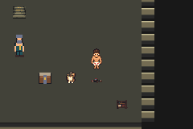
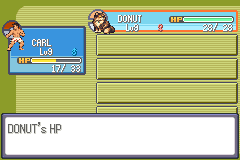
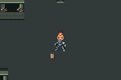

# Replacement-workspace recovery — target blocked

[Issue #90](https://github.com/12nuskek/DungeonCrawlerCarlemon/issues/90) /
[draft PR #91](https://github.com/12nuskek/DungeonCrawlerCarlemon/pull/91), open,
unmerged. Reviewed evidence publication commit
`291800f9f47918de671efed92650add0b3372344`; actual tested hosts remain those below.

Kurt authorised recovery through ordinary gameplay on 8 October 2026 at 20:35 UTC.
This replacement did not resume the deleted terminal task or create a task/schedule.
Base `72e08ed17afc69e28ef545bbbff383a434e90df5`; all previous remote refs and
main `b694da17928b93ea579f55d905017aa9f7619422` were compared unchanged.
[Reconciliation](reconciliation.json) records all eight stacked drafts #75–89,
their heads/bases, zero returned patrol PR-triggered CI runs and missing inputs.
No prior current-patrol issue/PR existed; recovery is a separate increment.

## Build and host

Fresh isolated archive of game `c643f01c11ec68119b0347b107ee20115131debc`,
pret Emerald `731ad5bfd6e6f265508d0efcca0ba42f9dcf5881`, agbcc
`da598c1d918402c42c0c0d7128ba14567f3175e9`. Rebuilt ROM SHA256 exactly
`b0251d46f4d102cfbd91df961bb7aa98bd3e711d8598e9f690ec45abc5e64b1a`.
Existing digest-pinned Debian 13.6 Dockerfile reused. GNU 14.2.0,
ARM binutils 2.44, mGBA 0.10.5. Complete setup/build/package logs remain private
under `artifacts/floor1/recovery/current-build`. Initial tooling-image build failed
container DNS before game compilation; the existing proxy mapping fixed it.
Both tooling attempts remain separately retained; no platform/game change.

The private base observer was reconstructed from published committed generators;
its SHA256 equals recorded `897d1d69…c5e1c`, but its old raw input was not recovered.
Only host transformations from `c7c5ca5d68ece7ce8aaebf2cfcad002368da0ce4`
are reused, without executing that exclusive historical runner. Snapshot/key/raw
dump support is removed. Engine diff against the pinned source is empty.
The published battle policy, semantic intervention and readiness helper stay exact.
29 published gate checks plus seven field setup/callback regression checks pass.
Fresh hosts compile with `-Wall -Wextra -Werror`.

## Actual recovery executions

| Session | Actual source | Assertions/result |
| --- | --- | --- |
| Fresh game, note/supply, guide, trial, manual Save | `3f604ade37f84745f4a9f7a2831c90add4f42540` | 52 pass, empty errors |
| First field reconstruction | `84541097c4bd923ab938736feebb1c237e311dba` | 10 completed; exit 46, host readiness error |
| Diagnosed field-menu repair, item/recovery, manual Save | `7d89fcddadc6032e27f339859fc0dabdf995dae5` | 44 pass, empty errors |
| Cold pending input, Howler, guide, Guard decision | `a349825d19c4fa3ba1bf1c65c3063ea62cf20f22` | 34 completed; exit 44, semantic mismatch stop |

There are **two successful sessions/96 assertions** and two retained failed
sessions. Failed-session checks do not constitute route acceptance. No logged
mGBA error; both nonempty logs are explicit host stop messages. No trial replay
or new battle policy. [Bounded verdicts](summary.json), [capture identities](captures.json).

The successful fresh trial reproduces the published fresh-trial PP 3/40/0/37,
levels 9/9 and XP 495/805. An unexecuted field assertion incorrectly borrowed
4/40/0/38 from a different S03 manual trial; corrected to the exact published
fresh result before field execution. No runtime check was weakened.

First field reconstruction acknowledged the Bag task before setup completed,
then failed waiting for the item context. Read-only source diagnosis established
`SetupBagMenu` state 14 creates the task before state 20 starts the fade and the
callback switches to `CB2_BagMenuRun`. The separate repaired host additionally
requires the correct running Bag/party callback. Both original failure and STOP
remain intact. It resumes the unchanged successful fresh Save, without another
battle. Actual two-SCRAP claim, one of two owned Potions used on Donut, unchanged
depleted PP, guide restoration and completed manual Save then pass.

The new pending Save is SHA256
`c11c64559f38680dd21afe693327e703fd4b452776ace69f8e7f1e0b1f3bc67f`:
Field 37,31, levels 9/9, XP 495/805, healthy duo/status clear, PP 8/40/2/40,
Potion 1, SCRAP 2, trial won, both patrols/preparation/boss/checkpoint unset.
Its separate-process cold Continue is observed at the beginning of the failed
patrol session. That copied input remains byte-identical; there is no later Save.

Howler wins using the same single-WEAKEN policy in 9,220 pilot frames, with no
incapacitation. Guide recovery passes. Offline comparison proves all 59 ordinary
pre-intervention button choices equal the published historical strategy prefix
after removing descriptive frame numbers. At Guard turn 4, however, the exact
semantic gate fails at frame 24,553: Carl 20/36 and Donut 16/30, remaining foe HP
14. The recorded intervention expected Carl 3/36, Donut 30/30 and remaining foe
HP 18. PP/owned Potion/cursor conditions match. The native decision is captured
before the stop. **No Potion intervention, Guard victory, target Save/cold or
Warden combat occurred.** Do not replace those assertions or search timing/RNG.

This is a new input trajectory. Identical ROM/source and equal choices do not
establish the original save/RNG execution. The exact cause of the trajectory
difference is not established; no game regression is inferred. Original raw
initial state is unavailable. Howler victory exists only in the stopped process;
it was not persisted. Latest durable input is still the safe pending file above.

## Recovery limitations and next dependency

Published commits, accepted plan, routes, verdicts, captures and the three original
strategy failures/controller records remain in Git. Original I01/corner/A01
legacy saves, `ea719ffb…abc8`, original patrol-complete file, private full raw logs,
build archives, exclusive claim files and denied local ancestry are not recovered.
Never describe old claims as recovered inputs or substitute these fresh files for
the original legacy-input acceptance gate. Historical old prose about locally
preserved artifacts describes the deleted workspace and is superseded here.

Implemented recovery tooling/host/contract; exact game and hosts compiled;
runtime verification is partial; unmerged. **Target levels 11/10, Potion 0,
both patrols won at Field 37,31 has not been reconstructed.** Warden remains
blocked on parent review of this recovery divergence. Its future contract remains
one unprepared trainer 858 fortify attempt, 30,000 frames, then actual first-clear
stair/reward/Save/cold checks; it was not executed. No broad merge/full-route/
finalT/V01/Floor 1 or human-pacing acceptance.

Raw outputs reside in `artifacts/floor1/recovery/runtime` (fresh and field failure)
and `runtime-menu-repair` (diagnosed resume, field pass, patrol stop). No further
emulator execution follows the patrol failure. Saves/logs are eligible only for
supported private retention; ROMs, keys and denied old datasets stay out of uploads.

Private retention succeeded: `DungeonCrawlerCarlemon-recovery-20261008.zip`,
306,372 bytes, SHA256 `5c6d07c81bd71d91718e7fd3105a69a6684feba1771a0f1c0f24f664982eaaea`,
saved to the user's Library. The 63-file manifest binds new saves and complete new
logs/claims/routes/captures/build records. It contains no ROM, savestate, old denied
dataset/key file or missing original. [Exact private retention identity](private-retention.json)
lets the parent recover these new inputs through supported storage. No sharing or
visibility changes occurred.

## Actual reconstructed captures

These untouched native frames belong to the new executions, not the original
exclusive checks. Exact game/host/route hashes are in the capture register.







## Commands

Build used the existing Dockerfile and fresh archive with `setup-foundation.sh`
then `make -C engine -j2`. Runtime commands inside that tooling image:

```sh
python3 scripts/test-potion-menu-readiness.py
python3 scripts/test-recovery-field-readiness.py
python3 scripts/test-f1-g01e-recovery.py --build artifacts/floor1/recovery/current-build --output artifacts/floor1/recovery/runtime --stage prepare
python3 scripts/test-f1-g01e-recovery.py --build artifacts/floor1/recovery/current-build --output artifacts/floor1/recovery/runtime --stage fresh
python3 scripts/test-f1-g01e-recovery.py --build artifacts/floor1/recovery/current-build --output artifacts/floor1/recovery/runtime --stage seed
# After the documented source diagnosis and committed callback fix only:
python3 scripts/test-f1-g01e-recovery.py --build artifacts/floor1/recovery/current-build --output artifacts/floor1/recovery/runtime-menu-repair --stage prepare --resume-from artifacts/floor1/recovery/runtime
python3 scripts/test-f1-g01e-recovery.py --build artifacts/floor1/recovery/current-build --output artifacts/floor1/recovery/runtime-menu-repair --stage seed
python3 scripts/test-f1-g01e-recovery.py --build artifacts/floor1/recovery/current-build --output artifacts/floor1/recovery/runtime-menu-repair --stage patrol
```

These describe completed executions. STOP/claim files prevent replay; do not
delete them or repeat these commands to manufacture acceptance.
