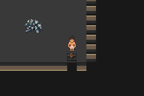
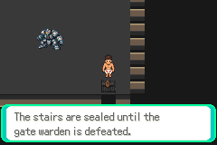
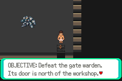
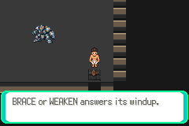

# Sealed staircase — ordinary runtime verified

F1-G01e-LK, 2026-10-08 Australia/Brisbane. Branch `task/floor1-g01e-sealed`,
base `a9658676a53d519e9769494c52bf57b28d54473a` (draft PR83 on81/79/77/75).
Task issue/draft PR are recorded in the checkpoint. This is a focused verification
increment; no game source change or new combat attempt.

## Exact identity and checks

Game compiled source `c643f01c11ec68119b0347b107ee20115131debc`; actual tested
runner `0317dc8c7405dc9d6acb02fc284579703f717fcb`. ROM SHA256
`b0251d46f4d102cfbd91df961bb7aa98bd3e711d8598e9f690ec45abc5e64b1a`.
The prior isolated build was restored from its checked archive; engine diff and
loaded/private ROM identity matched. The game compile is reused, not newly run.
Fresh read-only observer compiled with GNU14.2.0, `-Wall -Wextra -Werror`, and ran
actual mGBA0.10.5. Every host-issued emulator frame latches an unexpected battle;
20 bounded verdicts confirm none across17,407 observed frames.

| Ordinary controller route | Assertions | Map-word assertions | Guarded frames |
|---|---:|---:|---:|
| First/repeat refusal, Field return, arena re-entry, Journal and Save |7,231|7,043|10,226|
| Cold refusal/repeat, Field return, re-entry and Journal |4,151|3,971|7,181|
| **2 sessions** |**11,382**|**11,014**|**17,407**|

Eleven full-buffer comparisons contribute11,008 words: three complete3,072-word
Field buffers and eight complete224-word arena buffers. Six targeted stair-word
checks plus368 other assertions verify actual position/readiness, boss/checkpoint/
trainer/reward flags, items, full flags/live-duo/decrypted-inventory equality,
no-battle history and native messages.12 expanded messages /16 real native pages
match compiled labels. Every emulator error log is empty.

[Bounded verdicts](summary.json), [actual capture provenance](captures.json).
The one preserved ordinary original `boss-pending.sav` remains byte-identical.
Only an owned copy is written via actual manual Save; its read-only cold copy is
unchanged and matches that controller-authored save. Private fixture hashes,
complete logs/routes and extra pages remain local at
`artifacts/floor1/sealed/runtime-o0evy71o`. No raw state/key/saves/ROM, denied dataset
or denied ancestry is published.

## Observed behavior and limits

The ordinary input migrates from the old corridor to live Field51,27. Trial and
both patrol victories remain set; boss victories, boss clearance and checkpoint
completion remain unset. The route walks through the north warden door and
interacts only with the southeast staircase, never with the Warden actor.

First and repeated interaction show the sealed message without YES/NO or a warp.
Field controls return at arena12,10. Southward walking remains blocked, and the
full stair entry stays0x3618. Leaving through the north ladder and re-entering
preserves all Field/arena words and repeats the same refusal. Journal retains
the pending Warden objective and correct door/preparation guidance.

Actual manual Save at12,10 survives cold Continue. Cold first/repeat refusal,
physical blocking, Field return and arena re-entry still preserve the seal. Full
flags, inventory and both live crawler records remain unchanged throughout each
session; the two patrols stay won and neither boss variant nor checkpoint becomes
complete. No items/rewards are consumed, awarded or duplicated. No new game defect
was found and no engine, art, geometry, collision, save ABI or resource rule changed.

All prior top-level SR helper functions and all three SR route blocks compare
identically by Python AST, including their assertions. The added `--case sealed`
is explicit; the existing default/three case families are preserved and not rerun.

An initial insertion assertion caught two host declarations at runnerf8a0b21
before host compilation or emulator/save-copy execution. Anchoring after the
unique main counter declaration fixed it. The failed runner/symbols/diagnostic
remain local at `runtime-tmz_n7mc`; corrected0317dc8 passed both sessions on the
first actual emulator attempt. No combat attempt count or game assertion was reset.

No synthetic save input, RAM/ROM write, snapshot command, policy/pilot/engage,
new battle, timing fishing or relaxed check. First-clear boss/stairs, full fresh
route, finalT, human pacing, V01 and whole-floor acceptance remain pending under
the preserved three-strategy stop. PR83/81/79/77/75 remain draft/unmerged; no
integration or dependent art/district rollout is claimed.

## Actual native captures

Untouched240×160 frames use the exact source/runner/ROM above. First/re-entry/Save/
cold views show ordinary states on the same candidate, not before/after a patch.









## Reproduce and continue

Restore the retained snapshot after checking disk/inode space:

```sh
tar -xzf artifacts/floor1/navigation/build-0lj52td4/source.tar.gz \
  -C artifacts/floor1/navigation/build-0lj52td4
PATH=/workspace/toolchain/root/usr/bin:$PATH \
DCC_TEST_CFLAGS=-I/workspace/toolchain/root/usr/include \
DCC_TEST_LDFLAGS='-L/workspace/toolchain/root/usr/lib/x86_64-linux-gnu -Wl,-rpath,/workspace/toolchain/root/usr/lib/x86_64-linux-gnu' \
PYTHONDONTWRITEBYTECODE=1 python3 scripts/test-f1-g01e-staircase.py \
  --case sealed \
  --build artifacts/floor1/navigation/build-0lj52td4 \
  --originals /workspace/DungeonCrawlerCarlemon/artifacts/floor1/a01/run-I7PJq0
```

The original ordinary fixture is not distributed. The restored source/build
compared identically against its retained TAR after this run; private ROM equality
passed and only the verified duplicate extraction was removed. [Build/archive evidence](../navigation/README.md).
Implemented verifier; prior exact compile reused; scoped runtime verified; PR/merge
state recorded separately. Parent owns the sole continuation and same Cloud task
`01a10f4b-596b-700b-b8ba-241e3ca2c000`. No quota checks, new scheduler/task/writer,
public ROM or later floor.

Next ready task: independent read-only audit of live no-collection entry points
and ordinary Crawlers/Inventory/Stats/Options menu return paths using preserved
saves; keep the exact ROM and boss state, with no battle or new strategy. Record
actual UI evidence separately from already-proven battle-rule source checks.
