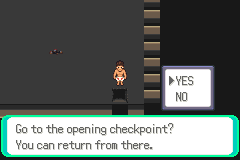
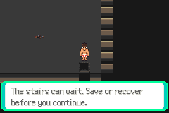
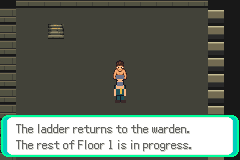
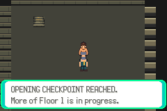
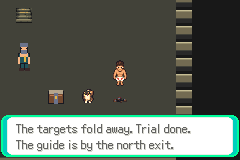
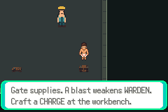

# Resolved staircase and interior buffers — runtime verified

F1-G01e-SR, 2026-10-08 Australia/Brisbane. Branch `task/floor1-g01e-staircase`,
base `7866c8730fbef0f6570e269aa247b90a2e9a3c23` (draft PR81 on79 on77 on75).
The task issue/draft PR are recorded in the checkpoint. No game source change;
this completes an independent verification increment while full progression is gated.

## Exact source and result

Game compiled source `c643f01c11ec68119b0347b107ee20115131debc`; actual tested
runner `477e50551229311efabad367902302e175355a02`. ROM SHA256
`b0251d46f4d102cfbd91df961bb7aa98bd3e711d8598e9f690ec45abc5e64b1a`.
The exact prior isolated build was restored from its verified archive, the engine
diff against the runner was empty, and the loaded ROM identity matched. This is
reuse of the existing verified game compile, not a new game build. Fresh observer
compiled with GNU14.2.0, `-Wall -Wextra -Werror`; actual mGBA0.10.5 executes it.

| Ordinary controller route | Assertions | Full map words |
|---|---:|---:|
| Resolved checkpoint return / staircase refusal / Save |745|672|
| Arena cold / refusal / repeat transition / Save |746|672|
| Checkpoint cold / return / re-entry |752|672|
| Quiet entry / re-entry / Save |500|448|
| Quiet cold |248|224|
| Workshop entry / re-entry / Save |513|448|
| Workshop cold |246|224|
| **7 sessions** |**3,750**|**3,360**|

Fifteen complete224-word comparisons cover all four compact interiors.390
additional behavioral assertions check field readiness, actual location, flags,
items, progression, native messages, plus full persistent-flag/live-duo/decrypted-
inventory equality.26 expanded messages /34 actual native pages match compiled
labels. All emulator error logs are empty. Two preserved ordinary originals
(`continuous.sav`, `both-pending.sav`) and three read-only cold copies are unchanged.
Four owned copies are written solely by the actual manual Save flow; the arena
cold copy is deliberately writable for its subsequent checkpoint Save.

[Bounded verdicts](summary.json), [capture identity/route/assertion](captures.json).
Complete raw routes, logs, originals' hashes, saves and extra pages remain local
at `artifacts/floor1/staircase/runtime-5regoi5l`. No private state/key dump, ROM,
rejected dataset or rejected ancestry is published.

## Observed behavior and limits

The existing completed legacy save migrates to checkpoint4,4. The review and
Journal identify an **opening checkpoint**, explicitly saying more Floor1 is in
progress. Its ladder returns to Warden4,3. Warden resolved dialogue starts no
battle. The southeast stairs ask an explicit YES/NO question; NO restores field
control at12,10 and leaves all flags, inventory and both crawler records unchanged.
The resolved stairs word remains0x362A through refusal, re-entry and cold load.

A real manual Save at the stairs survives cold Continue. A second NO again leaves
state unchanged; YES returns to checkpoint4,4 without duplicated items or flags.
Save at review8,6 survives cold Continue, return and a further repeat transition.
The checkpoint, Warden, Quiet and Workshop full buffers agree with immutable
source words plus the existing resolved Warden entry. Pending patrols stay pending
through the independent Quiet/Workshop tours and cold loads. The already-won trial
returns its resolved text; no-charge cache interaction consumes/awards nothing.

No synthetic save inputs, RAM/ROM writes, snapshot command, policy, pilot, engage,
new battle, timing reset, game patch or lowered assertion. Every emulator session
passed on the first runtime attempt; no new defect was found. This verifies only
**already-resolved** staircase behavior, never a new boss victory or first clear.
The three-strategy combat stop, fresh full route, first-clear boss/stairs, finalT,
human pacing and V01/full-floor acceptance remain pending. No dependent art/district
rollout or integration is claimed. PR75/77/79/81 remain draft/unmerged.

## Actual native captures

Untouched240×160 production-ROM frames, game/runner/checksum above. The prompt,
refusal, arrival and cold images show successive ordinary interactions on the same
candidate, not before/after a gameplay patch.










## Reproduce

Restore the exact retained build snapshot after checking disk/inode space:

```sh
tar -xzf artifacts/floor1/navigation/build-0lj52td4/source.tar.gz \
  -C artifacts/floor1/navigation/build-0lj52td4
PATH=/workspace/toolchain/root/usr/bin:$PATH \
DCC_TEST_CFLAGS=-I/workspace/toolchain/root/usr/include \
DCC_TEST_LDFLAGS='-L/workspace/toolchain/root/usr/lib/x86_64-linux-gnu -Wl,-rpath,/workspace/toolchain/root/usr/lib/x86_64-linux-gnu' \
PYTHONDONTWRITEBYTECODE=1 python3 scripts/test-f1-g01e-staircase.py \
  --build artifacts/floor1/navigation/build-0lj52td4 \
  --originals /workspace/DungeonCrawlerCarlemon/artifacts/floor1/a01/run-I7PJq0
```

Optional `--case stairs`, `quiet` or `workshop` selects an independent family.
Ordinary retained fixtures are not distributed. [Existing build/archive evidence](../navigation/README.md).
Implemented verifier; prior exact compile reused; scoped runtime verified;
push/PR/merge state is recorded separately. User02:01:39UTC withdrew the quota
prerequisite/pause; no meter read/login request. Same Cloud task
`01a10f4b-596b-700b-b8ba-241e3ca2c000`, sole writer; parent owns continuation.
Next independent task: verify sealed-staircase refusal and re-entry/Save/cold from
an ordinary boss-pending save, preserving the three-strategy stop and broader gates.
