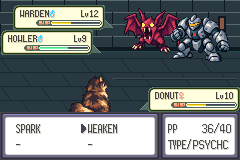

# Unprepared Warden first-clear — single attempt lost, stopped

[Issue #94](https://github.com/12nuskek/DungeonCrawlerCarlemon/issues/94) / [draft PR #95](https://github.com/12nuskek/DungeonCrawlerCarlemon/pull/95), open/unmerged, stacked on PR93 at `1263d8b915f37d70bdcb04167c9088cd107666bc`. Evidence publication `d5d505c57bddc26b899d78bb033a6b2e41b3affe`; tested contract/runner remains `7197e785a704e216c9f4a5429ae6cb4fb9302703`.

Parent review passed PR93's bounded recovered-input claim and authorised one
unprepared trainer858 fortify attempt plus dependent first-clear checks.
Base `1263d8b915f37d70bdcb04167c9088cd107666bc`, branch
`task/floor1-g01e-warden-first-clear`. This single execution lost. No combat retry,
changed policy, timing/RNG search, balance/resource edit or later emulator run.
First-clear acceptance is **blocked**; no staircase/Save/cold completion claim.

## Frozen inputs, committed contract and compilation

Actual contract, runner and host source committed before execution:
`7197e785a704e216c9f4a5429ae6cb4fb9302703`.
[Separate prespecified contract](../../../../floor1/g01e-warden-first-clear-contract.md).
Unchanged game `c643f01c11ec68119b0347b107ee20115131debc`, exact loaded ROM SHA256
`b0251d46f4d102cfbd91df961bb7aa98bd3e711d8598e9f690ec45abc5e64b1a`.
Existing freshly reproduced isolated build/ELF and full privately retained build
logs reused; engine and accepted-plan diffs empty. Tooling image4aafe586…a54,
libmGBA0.10.5. New read-only host SHA256
`a2f44379112d4fd06107b13862f403ddb6fd9f8566ffac39a33c944e05f5aee0` compiles
with `-Wall -Wextra -Werror`. Eleven boundary checks and the30,000-frame
entry/interior/exit vector pass; these are host supplements, not gameplay passes.

Input is the reviewed reconstructed patrol-complete manual Save SHA256
`026c16feccd0a1741ff0c3ec077e7272fc6ee43bf0e4fa12ab8953c50523220a`.
Cold Field37,31 and arena8,7 checks require restored Carl/Donut11/10,
XP748/1058, HP38/38 and30/30, status0/0, PP8/40/2/40, Potion0/SCRAP2,
trial2135 and patrol2136/2137 set, preparation46/boss47/checkpoint48/loop49 and
both boss-trainer2138/2139 unset. Normal approach introduces no battle/resource
change. Actual trainer858, enemy levels12/9, HP42/30, turn0/outcome0/four battlers
confirmed before the fortify pilot. The prepared859 branch was not selected.

Route frozen before emulator execution, SHA256
`c8ea6bfaca164c9c082df57716e5c907726debd3c915a32cc82e126d7010e526`.
Existing battle-choice block is byte-identical: three initial Carl BRACE/Donut
WEAKEN turns, then offence and the existing PP-aware fallback. No new strategy.
Every runFrame site, including introduction/engagement/native pages, is wrapped;
whole-battle30,000 bound stops before a30,001st battle frame. Native text and
staircase readiness checks were prescribed, compiled and **not reached**.

## Actual failed execution and bounded diagnosis

| Execution | Result |
| --- | --- |
| One cold input/ordinary approach/trainer858/fortify attempt | **LOSS**, outcome2; exit44; 50 completed assertions; 12,875 whole-battle frames; one attempt |
| Policy window | 11,674 frames; incapacitation mask5 (Carl down, then both down) |
| Errors | 46 bytes: explicit host `Warden victory/no-incapacity assertion failed`; no mGBA error messages |
| Dependent first-clear checks | Not executed: rewards/boss-clear/repeat/stairsNO/YES/manual Save/post-Warden cold |

There are **zero successful runtime sessions** in this increment. The50 completed
checks establish the observed setup/selection; they do not constitute acceptance
of the failed route. [Exact bounded verdicts and identity](summary.json).

Turn5's decisive event is observed at frame13,923: Warden battler1 targets Carl0
with SLAM360, critical multiplier2, pending damage28, Carl23→0. Remaining foes
have17/18HP. Donut's SPARK is exhausted and the unchanged controller uses WEAKEN.
Sidekick TACKLE chips Donut15→12→9; at16,620 Warden SLAM targets Donut2 with
multiplier1/damage11, HP9→0. Genuine battle outcome2 then returns, and the inherited
victory gate stops. This was a combat loss, not a historical-fixture mismatch or
a bound/route/trainer-selection failure.

Read-only source diagnosis: SLAM is normal/physical, power65, ordinary hit effect;
BRACE raises Defense and WEAKEN reduces both enemy Attack stages. In pinned
[CalculateBaseDamage](https://github.com/12nuskek/DungeonCrawlerCarlemon/blob/c643f01c11ec68119b0347b107ee20115131debc/engine/src/pokemon.c#L3239),
critical physical damage ignores negative attacker Attack stages and positive
defender Defense stages. [Damage calculation](https://github.com/12nuskek/DungeonCrawlerCarlemon/blob/c643f01c11ec68119b0347b107ee20115131debc/engine/src/battle_script_commands.c#L1292)
then applies the critical multiplier. This explains how the observed critical
can bypass the support-stat protection. No counterfactual damage roll or alternate
execution was computed. One failed policy/input does not establish impossible
unprepared combat, a universal balance verdict or a game regression.

The next600-frame post-battle command and all first-clear assertions are after
the stop and were not executed. Current loss recovery/map/flags/money were not
asserted after the stop; do not infer their runtime acceptance from historical
recovery evidence. No new save was manually written. Failed copy and original
remain byte-identical at the input hash above. Latest durable usable checkpoint
is still PR93's restored patrol-complete file, boss/preparation/checkpoint unset.

## Actual native captures

All three unmodified240×160 captures are from source7197e785 and exactc643/b025.
[Capture register](captures.json) binds full source/host/route/PNG hashes. The
pre-attempt cold image is not post-Warden persistence evidence. No concepts,
new native art candidates or visual rollout are created by this increment.




## Reconciliation, durability and remaining gates

[Reconciliation](reconciliation.json) records all ten open/draft/unmerged PRs
#75–93, exact stack identities and zero returned PR-triggered CI runs at their
current heads. PR75's full-diff transport failed twice; a successful REST
metadata read resolved its state without a write. All54 prior remote branch
heads, mainb694da1, game/accepted plan, historical controllers/contracts/results,
three original strategy failures and both previous recovery failures unchanged.
121 prior privately retained records were compared byte-identical.

Complete new failure logs/routes/claim/STOP/counts/observer/captures/bound checks,
unchanged copied input save and source/ref records are saved privately in Library:
`DungeonCrawlerCarlemon-warden-first-clear-20261008.zip`,79,045 bytes, SHA256
`8b2df8db0aeb1aa37a95ccfae963a2ef136d12cbfc49739b4c2346ebc642e8ea`.
Its29-file whitelist excludes ROMs/savestates, keys, old denied datasets/ancestry
and missing original inputs. [Exact retention identity](private-retention.json).
Local complete outputs remain under `artifacts/floor1/warden-first-clear/runtime`.
STOP/claim files forbid replay/cold; preserve them.

Implemented contract/read-only tooling, compiled exact unchanged game/new host;
actual bounded attempt verified **failed**; first-clear unverified; draft/unmerged.
No prepared, reverse patrol order, uninterrupted/full fresh route, finalT,
human-pacing, V01, completeFloor1 or later-floor claim. Original legacy inputs
and acceptance gate remain unavailable; fresh inputs never substitute for them.

Next dependency: parent review of this preserved critical-hit loss and support
mechanics diagnosis before any separately scoped combat/fix direction. First-clear
rewards/boss flag, resolved boss repeat, actual staircaseNO/YES/checkpoint entry,
manual Save/post-Warden cold remain blocked. No automatic retry or alternative
policy; independent noncombat work requires its own focused scope.

## Completed commands — do not replay

```sh
python3 scripts/test-warden-attempt-bound.py
python3 scripts/test-f1-g01e-warden-first-clear.py --build artifacts/floor1/recovery/current-build --output artifacts/floor1/warden-first-clear/runtime --seed artifacts/floor1/new-save-recovery/runtime/patrol.sav --stage prepare
python3 scripts/test-f1-g01e-warden-first-clear.py --build artifacts/floor1/recovery/current-build --output artifacts/floor1/warden-first-clear/runtime --seed artifacts/floor1/new-save-recovery/runtime/patrol.sav --stage first-clear
```

Compilation/runtime used the pinned `dcc-recovery-tooling` container, user1000,
`/workspace` bind and repository working directory. No cold command was run.
