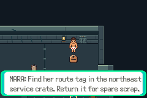
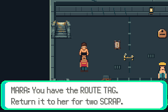

# F1-T01 persistent-state guidance

Base: `984f89351fe273f4ba6813aaffd7b0e3f2721504` (P01 PR54).
Compiled/full-regression source: `50bf6d99fdfc4cb3d1ce6799a327a9974e8b786f`.
Recovery test-source: `6c16fdc6be2d5787fd4ae1325fc0a79061256bd1`; its engine and
harness are verified identical to that compiled source. Production ROM SHA256:
`b27d1da7368cd22bc3aa8217c4003b84cd37389fd91f123f07f427fc4c39f719`.
Issue55 / PR56. Reference-only PR58 integrated into the task branch separately;
no reference file changes the engine or runtime identity.

The Journal now distinguishes finding the north-wall tag bag, carrying the tag,
and completing Mara's job. Completed remains highest priority. A refused pickup
keeps the find objective; a refused hand-in keeps the return objective. The spent
wire sign describes the safe crossing and retains the free-recovery reminder.
No flags, rewards, geometry, balance or save layout changed.

| State | Before | After |
|---|---|---|
| Carrying tag |  |  |
| Spent wire |  |  |





Actual mGBA0.10.5 clean committed-source replay passes **96 sessions /1609 assertions**:
84/1393 full regression (1173 production,220 explicitly labeled fixture checks),
plus12/216 production recovered-victory/cold sessions. Combined1389 production and
220 fixture checks. All96 error logs empty. All1315 original main-run assertions
and the216 recovery-extension assertions retained. Full regression additionally
passes38 exact rendered comparisons (9 opponents,18 props,11 backgrounds).

```sh
DCC_LEGACY_RUN=/path/to/accepted/I01/run \
DCC_CORNER_SAVE=/path/to/ordinary/N01-corner.sav bash scripts/test-f1-t01.sh
DCC_RECOVERY_BASE_RUN=/path/to/completed/T01/run python3 scripts/test-n04.py
```

Use the pinned environment in [testing](../../../testing.md). The second command
rejects engine/harness differences before reusing the exact clean production ROM;
it does not claim another build. Ordinary input saves are copied unchanged and
identified in recovery input hashes. Diagnostic fixture ROMs remain clearly
separate. Normal controller inputs and read-only assertions; no save/RAM edits.
Full build/replay logs, routes, raw-check summaries and selected actual captures
are in final/ and recovery/. Complete source images stay in local run artifacts.
No ROM, save, executable or diagnostic binary is committed.

Native text reviewed immediately, after re-entry and cold load, including capacity
failures, completed priority and both spent-sign pages. Recovery victory and cold
captures for all six routes reviewed. Walking sequence remains actual240×160
framebuffers,6.36 seconds at normal playback timing, no interpolation; sampled
frames reviewed for facing, camera and clipping. This text-only change adds no
animation. Prepared uninterrupted completion and segmented unprepared/recovered
victories remain separate evidence; human reading/decision time is unmeasured.

Old slice placeholders and source-kit omissions remain historical. New full-floor
source references pass231 package checks and are available for native cleanup.
No new district or full-floor completion is claimed by T01. Next: F1-A01 explicit
map/encounter membership and full map identity before wider map production.
