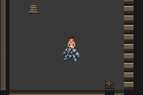
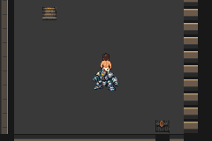

Current native-ready result: draft PR114; tested host/route source8ee0595461cff3bc5da6b5ea353067308e087076, hostee16cfe1/unchanged routeafbd80b0 and gameengine32199a3. Native readiness passed3155/all4 registered buffers/first copies; fixed ordinary baseline ran turns0–8/all6 moves, foes defeated. FIRST STOP105/27 partial/14988 visual/17032 absolute, actor0 sprite9, verified FreeResetData_ReturnToOvOrDoEvolutions retirement, empty copy queue. Live ownership predicate remains enforced after native graphics retirement; all3 actual VRAM blocks still exact known baseline art. Actual partial peaks49sprites/654tiles/7palettes/91212heap/22660free. Save030b unchanged, candidate prepared only/no execution claim. No further emulator execution/host fix/retry/game change. Retain original STOP35 and cf726350 STOP107 unchanged/distinct. Parent retirement-phase diagnosis review next; candidate poses/HUD/matched controls/complete budget/exit/postreward/save/legacy/C01/full-floor gates pending. Evidence docs/evidence/floor1/v01/battle/observer-phase/README.md. Prior checkpoint below historical.

Current corrected-entry result: draft [PR114](https://github.com/12nuskek/DungeonCrawlerCarlemon/pull/114), tested source `cf7263503f74bf70bcad1a9d3212a4ca181b96f4`. Only north64→south128 route correction (generator mirrors it); host and game unchanged. Baseline entered trainer858, then STOP107/27 partial assertions at visual2675, 2676 recorded/4720 absolute frames, one claimed attempt/no executed move. Save030b unchanged. Candidate prepared only, unexecuted. Likely premature intro/send-out sprite/copy-phase pose enforcement; exact offending sprite/VRAM/queue was not retained. Offline audit also finds `.gcc2_compiled.` callback identity ambiguity. No further execution or host fix: parent diagnosis/observer review next. Private Library1 ordinary Save/safe logs/2692 original PPMs/actual2676-frame clip retained, denied .bin/raw traces/keys local only. Original STOP35/22/5685/zero combat/Save/source intact and distinct; all pending runtime/legacy/C01/full-floor gates remain. Evidence: `docs/evidence/floor1/v01/battle/entry-south/README.md`. Prior checkpoint below is historical.

Published blocked battle checkpoint: [draft PR114](https://github.com/12nuskek/DungeonCrawlerCarlemon/pull/114), initial head `9db157e7dbd1cf2f7e7386261bd5f7d3b0c38cdf`; base/main `c6d647a815ffce44a2419a2cf83b6c2c094359f0`. Candidate compiled only; first baseline stopped before combat. Original route and STOP remain intact, proposed south-facing correction unapplied/unexecuted. Parent diagnosis review is the next dependency; no further emulator execution or merge authorised here. All 67 previous heads preserved; CI absent. Publication details: `docs/evidence/floor1/v01/battle/publication.json`.

# V01 battle bindings — blocked entry checkpoint

**Implemented and compiled; actual battle visuals are unverified.** PR113 was accepted by the parent and normally merged at `c6d647a815ffce44a2419a2cf83b6c2c094359f0`, exact reviewed tree and both parents, all66 previous non-main heads preserved. CI absent, not success. The executor reconnected and the accepted ac2d87eb checkpoint was clean before any further writes. [Merge identities](overworld-merge.json).

The new visual module copies17 verified native64×64 pose frames exactly into the existing battler picture buffers and native sprite-copy queue. Carl STRIKE/BRACE and Donut SPARK/WEAKEN use their staged keyposes; Warden WIND UP keeps its warning through other actors until SLAM. The native HP-update command starts SLAM recovery. Native allocation/free, faint and absence paths clear ephemeral pose state. Existing actions/scripts/controllers/damage/resources/rewards/palettes/save ABI and environment are unchanged. Warden lift8 PNGs are already shifted and copied byte-for-byte without a second lift. [Static source/native-asset review](static-review.json).

The staged handoff passed250 native and180 staged checks. Actual pose PNGs were inspected; the smaller/narrower Warden silhouette remains a live-review risk. Missing corrected Donut source master remains a source-regeneration limitation; verified WEAKEN PNGs were reused. Generated concepts, staged native candidates and runtime evidence remain distinct. No new concept or image-generation batch was made.

## Exact source/build identities

| Identity | Value |
| --- | --- |
| Main/base/PR113 merge | `c6d647a815ffce44a2419a2cf83b6c2c094359f0` |
| Frozen host/route/actual baseline execution | `d1dc479212fbe1421f0b55c38ec374e34f5ed964` |
| Candidate game build (compiled, unexecuted) | `dbcc859c0ef15fc6d94b1f43052fb9e7b51803bf` |
| Candidate ROM SHA256 | `830fbb45861e2c20c32c2a68862cabc9800972c4243b9f9cf65726fef7e656f9` |
| Candidate ELF SHA256 | `0bbce8cce6485cf6860ac19ce3b75b580ca8b2d5735909b40906f64c056eb98f` |
| Executed baseline game | `4938927da512543ca9aeea9527c103c84955e632` |
| Executed baseline ROM SHA256 | `ae1e9d36a94ed2eaa9d8fc79d790a2dc47173b932551891d889c657e12ca8461` |
| Ordinary input/output Save SHA256 | `030b12fd3516351b0935b9298f24d0a2078fb33afecbccb6ba3a9b4c2db6b73c` |

Full engine trees, host/binary/route/fixture hashes: [executed baseline identity](baseline-identity.json), [unexecuted candidate identity](unexecuted-candidate-identity.json). [Fresh build setup](build-setup.json) retains pinned Emerald731ad5/agbccda598/image4aafe5; no ROM/ELF is published.

The first native compile at4ce5b3e3 failed on two missing trainer/bit-table declaration headers. A fresh committed snapshot atdbcc859c with battle_setup.h/util.h compiled exit0. Failed build/log and original source remain intact. Linked candidate EWRAM249728 (+16), IWRAM30892 unchanged, ROM14969864 (+36116 versus accepted overworld build). Existing SaveBlock1/2/storage sizes unchanged. Those linked sizes are not runtime allocation acceptance.

[Completed actual-source offline lifecycle/negative result](offline-hook-result.json) covers all six actions, repeated/interrupted swaps, warning through other actors, real-impact recovery, faint/absence/reset and invalid trainer/species/buffer/sprite with no mechanical writes. Host compilations use-Wall/-Wextra/-Werror. All17 observed pose fixtures independently match real native asset build products. Preparation-only roots before symbolic callback comparison/capacity/readiness corrections have no execution claims; they are retained separately. Controller callback comparison uses all four exact native symbol identities because link addresses differ. Heap checks use stable native field/battle CB2 phases; full frames/controls/state remain recorded through transitions. Existing native policy/foe/mitigation/victory/no-incapacity/bounds gates remain unchanged.

## First and only actual execution: STOP before battle

The frozen48-command route turns Carl north with `step 1 64 -` at position8,7. The authored Warden actor is at8,8, directly south. The published existing approach uses south input128. Native boot/full600 party/count300 flags1272 logical resources/counter/readiness and preboss level/HP/PP/flags/items checks passed. The engagement A pulses reached their3600-frame bound while Carl faced away. This is the implementation writer's route-entry error, not a strategy failure or RNG/timing problem. [Exact diagnosis and source comparison](diagnosis.json).

Actual exit35 after22 partial assertions and5685 absolute frames. Recorded3641 native frames (one turn frame +40 settle +3600 engagement) at262144/4389fps. Warden battle_frames0/attempts0; fortify policy never ran. Save unchanged. [Original STOP](STOP.json), [actual partial summary](baseline-summary.json). No final BV_FINISH/peak/pose footer exists; no dynamic budget, HUD overlap, warning/SLAM, repeated action swap or actual faint/exit acceptance is claimed. Candidate was prepared only, with no execution claim. No further emulator execution occurred after this first failure.

Actual first/terminal native240×160 captures, executed baseline d1dc4792/4938927d on basec6d647a8:

 

[Complete ordinary-speed stopped-entry clip](baseline-entry-stop.mp4),3641 actual frames/60.960194seconds, native dimensions and frame rate independently verified by ffprobe. It was encoded offline from retained original PPMs; no emulator replay. [Encoding record](clip-encoding.json).

## Reviewable next dependency and retained limits

[One-line proposed entry correction](proposed-entry-direction.patch): north64→south128 from the same ordinary8,7 preboss position. **Proposal is unapplied and unexecuted.** No battle policy, resource, cadence, geometry, mechanics or assertion change. Original frozen route/source/claim/STOP remain authoritative and block dependent execution. Parent review of this diagnosis/proposal is the next dependency before any separately authorised fresh bounded pair. This draft ends here; no corrected execution, character-stage rollout, battle merge, C01 or later district work.

All prior successes/failed exclusive claims and three historical strategy/controller records remain distinct and intact. Original legacy saves/raw logs/patrol-complete input from the deleted environment remain unavailable; no fresh-input equivalence. Warden's smaller silhouette and live HUD fit, actual action-bound clips/swaps, native allocations and faint/exit cleanup remain unverified. Human pacing/C01 and full nine-district acceptance remain later gates.

Supported private Library retention succeeded for `DungeonCrawlerCarlemon-V01-battle-entry-stop-20261009.zip`:7,758,512 bytes, SHA256 `5505e10eeebeadba51a6252f3c9c008847c88030c946d5fd20415ca6403da482`. The3749-file archive retains the one ordinary execution save, safe text logs/claims/builds/unexecuted preparations,3672 original PPM captures (3641 complete clip frames plus31 existing helper captures), representative PNGs and the actual ordinary-speed clip. Local Library identity xattrs verified. [Safe private retention receipt](private-retention.json). Key-bearing/denied raw .bin fixtures/state trace, symbol dumps, executables, ROMs and ELF remain local outside uploads; their local-only durability is a limitation.
