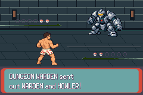

# Corrected south entry — retained STOP107

Parent approved only the north64→south128 correction, mirrored by its generator. Frozen source/host/route execution **cf7263503f74bf70bcad1a9d3212a4ca181b96f4**. [Correction contract](../../../../../floor1/v01-battle-entry-correction-contract.md). Same host SHA25656d3d11cfaabb7fcdeee879a3fcf87c00b53f46035c4109502f7bf5f41618673; corrected route SHA256afbd80b02d9d5acb9f63669f967fac3edc8eb00a2d2352e778f4114acb51bc27. Game engine, policy, forty-eight commands, cadence, assertions and bounds unchanged. No game change or second asset lift.

**First baseline entered trainer858, then STOP107/27 partial assertions at visual frame2675; 2676 recorded frames, 4720 absolute frames, 1372 in-battle frames.** The ordinary policy attempt was claimed once, but native currentMove/turn remained0 throughout the retained trace; no move executed. All four HP values remain38/42/30/30. Save030b12fd3516351b0935b9298f24d0a2078fb33afecbccb6ba3a9b4c2db6b73c unchanged. Candidate was prepared only, with no execution claim. No further emulator execution, replay or retry.

[Original exact STOP](STOP.json) · [Frozen baseline](baseline-identity.json) · [Partial summary](baseline-summary.json) · [Prepared candidate](unexecuted-candidate-identity.json) · [Diagnosis and limits](diagnosis.json).

The terminal native capture still displays trainer send-out, before duo/foe HUD completion. The route's `visual ready` enables exact pose enforcement using only in-battle/turn0, while native send-out can create an active sprite whose first picture copy has not reached VRAM. Native BattleMainCB2 runs tasks after animation/OAM construction; CreateSpriteAt marks sprites inUse/allocates tiles, frame-image copying runs later through animation/request/VBlank stages. **Premature intro/send-out enforcement is the likely cause.** The host retained neither offending battler/sprite/VRAM nor copy queue at reason107, so the exact offending actor/pixels/queue cannot be asserted or reconstructed. Baseline Warden animated front frame0/1 independently equal its accepted static frame; no candidate game-failure claim.

[Complete actual native entry/send-out clip](baseline-sendout-stop.mp4):2676 unmodified240×160 frames at262144/4389fps,44.803482s. PNG conversion and video encoding occurred offline after STOP; no added game frames. Actual capture shows accepted baseline trainer art; candidate's smaller Warden/action poses/HUD remain unexecuted and unreviewed.

Offline linked-symbol audit also found the frozen host selects `.gcc2_compiled.` before named function aliases at314 baseline/315 candidate addresses (311/312 distinct function aliases). Thus callback-name identities can alias different functions. Terminal opponent callback has this ambiguous compiler-label identity; it cannot uniquely prove OpponentDummy. This is a separate observer limitation, not a game change or retroactive exact-controller acceptance. Future observer correction must qualify native sprite ownership/copy/phase and unambiguous function identity while retaining all gameplay, pixel and comparison gates.

The host sampled heap without a reason101 stop, but no BV_PEAK/FINISH footer was reached: full allocation peaks/palette restoration/all17 poses/repeated swaps/held warning/contact/recovery/faint/exit/matched candidate controls remain **pending**. Complete private raw trace/key context stays local outside uploads. Original source d1dc4792 STOP35/22partial/5685/zero combat, Save and source/captures remain byte-identical and separate. All historical failures/controller records and missing legacy/C01/human pacing/full-floor limitations remain.

Next dependency is parent review of the retained STOP107 diagnosis and observer limitations. No host fix, additional execution, merge, rollout, strategy search or broad first-clear/legacy acceptance in this correction increment. Draft PR114 remains unmerged.

Supported private Library retention succeeded: one unchanged ordinary Save, safe logs/preparations and2692 original PPM captures (2676 complete clip frames plus16 helper captures). [Safe durability receipt](private-retention.json); denied raw trace/key context/symbols/executables/ROM/ELF excluded and only local.
