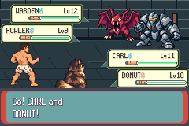
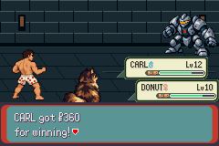

# Native readiness/callback correction — retained retirement STOP105

Parent authorised observer-only readiness/function-symbol corrections, focused offline negatives, then ONE fresh baseline/candidate pair conditional on baseline PASS. Frozen tested source **8ee0595461cff3bc5da6b5ea353067308e087076**. Host SHA256ee16cfe1e3fe3b826c33fa145e8c879ca4ac7b7fdc1eee2165caab406affd9c6; compiled host6f01f9a9cf1321615c2c3ef6dc120bff76f68c2d5fe91b875bf60b435152fa80. South route afbd80b02d9d5acb9f63669f967fac3edc8eb00a2d2352e778f4114acb51bc27 and all game/fortify policy/cadence/assertions/30000 battle+36000 visual bounds unchanged. [Contract](../../../../../floor1/v01-battle-observer-phase-contract.md).

**Baseline STOP105/27 partial assertions at visual14987:14988 retained frames/17032 absolute/13684 in-battle frames, one ordinary entered attempt.** Native readiness passed at3155; actual registered ownership/first picture copying verified for all4 battlers at HandleTurnActionSelectionState/turn0. All transition frames remained recorded. Candidate prepared only/no Save/no execution claim. No further emulator execution or blind retry after STOP.

[Original STOP](STOP.json) · [Frozen baseline](baseline-identity.json) · [Summary](baseline-summary.json) · [Prepared unexecuted candidate](unexecuted-candidate-identity.json) · [Exact native diagnostic](native-stop-diagnostic.json) · [Source-backed diagnosis](diagnosis.json) · [Offline reduction of actual trace/VRAM](actual-summary.json).

## Implemented and offline verified

Readiness requests introduce no input/wait. Gate latches only at native first-turn selection, all4 registered native position/frame-image buffers with restored send-out owner/species, first animation begun, no overlapping queued picture copies and completed2048-byte hardware picture. Live registered ownership/known-pixel/action/warning/swap/palette/faint/exit/budget assertions remain strict. Unknown pixels after readiness still fail immediately; action before qualification fails.

Callbacks use ARM ELF STT_FUNC authority: .gcc2_compiled./NOTYPE/routing labels excluded; local object scopes and sorted true aliases with checked extents, canonical SHA256 tokens and collision-free32-bit IDs verified across both builds. Reject unresolved/ambiguous callback identities, unknown nonzero callback/phase. Both symbol inputs frozen by digest.15904 baseline/15921 candidate verified identities,2 true-alias groups each. No controller/name comparison claim for the earlier ambiguous host.

[Actual offline result](offline-result.json) and [actual observer log](offline-observer.log): send-out/unfilled VRAM, registered ownership/native readiness/pending copies, unknown pixels after qualification, alias order/label filtering/ambiguity/unknown callbacks and exact actor/sprite/phase/copy diagnostics. Actual native ABI assertions compiled with pinned agbcc against native structs; zero emulator frames. Two initial offline tooling attempts (unsupported -quiet; unused unit functions) remain local/privately archived; final cases pass. No native game compile failure introduced or game/ROM relink.

## Actual baseline evidence and limits

[Complete native clip](baseline-native-battle-stop.mp4):14988 original240×160 frames at262144/4389fps,250.939682s. Offline encoding/PNG conversion added no game frames. Full ready HUD, WIND UP, support/native animations, faint and terminal payout frames inspected; these show **accepted baseline art**, not candidate poses or smaller Warden.

Retained actual trace contains all six moves355/356/357/358/359/360 (STRIKE/BRACE/SPARK/WEAKEN/WINDUP/SLAM), turns0–8 and one fixed fortify/offence attempt. Duo minimum battle HP27/22; terminal HP30/0/22/0 and native outcome1. Both foes defeated, Warden faint observed. Actual payout capture displays$360. These observations are partial battle evidence; final policy/victory/resource/reward/field/Save assertions were not reached and no new first-clear acceptance is claimed. Ordinary Save030b12fd3516351b0935b9298f24d0a2078fb33afecbccb6ba3a9b4c2db6b73c remains byte-identical; no manual Save after battle.

## Exact new STOP and source diagnosis

Actor0/sprite9, stage3 registered-buffer ownership, verified native phase **L:battle_main.o:FreeResetData_ReturnToOvOrDoEvolutions**, CB2 **G:BattleMainCB2**, native copy_count0/empty queue. All4 ownership predicates were false; surviving Carl/Donut sprite structures still existed. Frozen source frees MonSpritesGfx/resources during native fade/retirement while battle flag/CB2 still remain active, before sprite reset/field return. Thus the observer still requires live picture ownership in a legitimate retirement phase. MonSpritesGfx registry pointer was not separately serialized; no invented raw value. Exact selected actor/sprite/phase/queue plus actual local VRAM were retained.

All3 local VRAM blocks at STOP still match known baseline fixtures exactly: Carl0, Warden17, Donut6. This is a live-ownership retirement gate failure, not evidence of unknown pixels or candidate game failure. Offline predicate reproduction with the actual frozen header and a retired-registry/still-live-sprite fixture returns105 foractor0; distinct from actual game evidence, zero emulator execution. No host/engine fix applied after STOP.

Partial actual peaks through this STOP:14788 sampled frames,49 sprites/654 OBJ tiles/7 palettes/91212 heap used/22660 free minimum. No full BV_PEAK/FINISH footer, completed field exit, candidate peak comparison or new hardware/stack claim.

## Preserved and next dependency

STOP35/source d1dc4792/22partial/5685/zero combat and STOP107/source cf726350/27/4720/one entered attempt/zero moves remain byte-identical and separate, with their unchanged Saves and candidates unexecuted. All historical strategy/controller records remain; original legacy inputs still missing and fresh inputs do not substitute.

Parent review of this exact retirement diagnosis is next. Unapplied proposal: qualify verified native retirement separately, retain every transition/state/capture, assert reset/retired buffers/no writes and actual field exit; preserve all live ownership/pixel/action gates before retirement. No automatic retry, separate diagnostic replay, game/policy change, new task/schedule, merge, rollout, broader first-clear/C01/legacy/full-floor/later district claim. Matching candidate, all17 live poses, warning/contact/recovery/repeated swaps, smaller Warden/HUD, restored palettes, complete peak/resource/reward/exit/Save gates remain pending. Draft PR114 stays unmerged.

Supported private Library retention confirmed:5999176-byte solid archive,15174 byte-verified entries, one unchanged ordinary Save, safe logs/offline cases/preparations,15108 original PPMs (14988 full clip+120 helpers), one actual native clip. Archive SHA2568e4653f960e6ed828f01d9d07845315d4c8e9a952c7415df700d358fccdf288e. Denied raw state/key/VRAM .bin and full symbols/executables/ROM/ELF stay local outside uploads.

[Safe durability receipt](private-retention.json). Larger ZIP/helper read-only discovery failure retained locally; no Library mutation began before the byte-identical solid repackaging.
