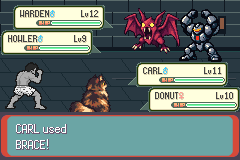
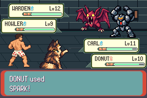
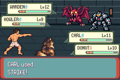
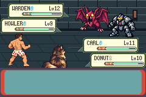

# One optimized candidate — first STOP117

**One candidate executed and failed; no baseline restart, retry or post-stop stepping.** Native exit117 at requested visual8536,27 partial assertions. No complete PASS or merge. Counts are now **six baselines/four candidates**, preserving all earlier failures/controller/three strategy records. Parent independently accepted fa8fcf2b/214a10a2 and authorised this single frozen candidate under the [validation contract](../../../../../floor1/v01-retained-candidate-validation-contract.md). Existing [draft PR114](https://github.com/12nuskek/DungeonCrawlerCarlemon/pull/114)/[tracking issue106](https://github.com/12nuskek/DungeonCrawlerCarlemon/issues/106).

## Frozen execution and preflight

| Artifact | Exact identity |
| --- | --- |
| Execution source | `fa8fcf2b964271dc4999fbdcda09feace61730bc` |
| Storage implementation | `214a10a214bda76422bf59aaa71df9c42766360e` |
| Game source | `2feadf56764c0d89c3dde9ef4622ea6d43b32f69` |
| Engine | `baac7fee52e2133fa6192799ef3851f629f188d7` |
| ROM SHA256 | `a022b2a5030214f8cbeb0621af47e6cb9a47208424aa86f56b67862b5028f8d4` |
| ELF SHA256 | `f31a5a8b2cb1602df378a7ca66b3cee8bbcea86de000536ab6f55acd727d0218` |
| Executed host source SHA256 | `1647352d92b3fa6f0135cf80f4c48df1c2a8a3818b711fd94651390a6334977f` |
| Executed host binary SHA256 | `a17ea5134e700efd77552d9a279fd4d6dd94294d443683b8e9fbfe142361ccbd` |
| Ordinary input/output Save SHA256 | `030b12fd3516351b0935b9298f24d0a2078fb33afecbccb6ba3a9b4c2db6b73c` |
| Route SHA256 | `afbd80b02d9d5acb9f63669f967fac3edc8eb00a2d2352e778f4114acb51bc27` |

[Identity](identity.json) equals the exclusive [claim](execution-claim.json). mGBA0.10.5 librarya1d7713c verified, exact generated host recompiled to the approved binary without invocation during preparation. All source/controller/route/policy/assertion code remained unchanged. Fixed fortify policy/all13 setKeys/30k battle/36k visual bounds retained. The input is the previously reconstructed ordinary Arena approach35.3/8,7, levels11/10 with Potion1/SCRAP2, not original unavailable legacy inputs or the historical Potion0 target.

[Original-reference verification](reference-verification.json) rechecked exact f3ceae89 original complete PASS40269443-byte stream/SHA849a1585, all original build/source/host/Save/route/fixture/identity/claim/summary/meta/state/control/typed-finish hashes,15379 B/15627 F/real E/EOF. Exclusive expected copy is byte-exact. Explicit candidate-only retained-reference option was used. Failed4e295249 remains partial timing evidence through13956, never the oracle. No new baseline/fresh-baseline acceptance substitution.

[Preparation preflight](preparation-preflight.json):7192190976 available versus7064285184 required. [Immediate execution-driver preflight](immediate-execution-preflight.json):7178899456 available versus7051018240 remaining after13266944 verified allocated bytes. The frozen runner repeats its integrity/storage check after the reference copy, immediately before Save/claim/game creation; successful process creation requires that check. Its internal available-byte value was not separately logged and is not reconstructed. Both mandated stages passed. No evidence deletion, budget bypass, disk/platform/billing change or quota sign-in.

## Actual first failure and retained causal window

[Summary](summary.json), [safe native first failure](native-first-failure.json), [visual diagnostic](visual-stop.json), [STOP](STOP.json), [runtime proof](runtime-proof.json), [safe replay](replay-safe.log), [errors](errors.log). Full raw log/control lines remain private;21 key-bearing pilot lines omitted from the safe projection, exact prefix hash retained.

- Native readiness3155 passed with all four owned sprite buffers/first hardware copies verified.
- At visual8536/input10581, the candidate emitted **F** while the original reference expected **B**, ordinal8402/count0; first differing typed-header byte0. Actual absolute10581 versus expected pre-drain10580. Input keys agree; no EOF/stream error. The comparison stops before reading/comparing the failed expected full snapshot; no snapshot validity is claimed for that frame.
- 8402 prior complete2560-byte boundaries and8536 prior F records were accepted. All21 ordinary control lines match the exact original prefix ([proof](control-prefix.json)). This is partial acceptance only, not old PASS transfer.
- Recorder summaries represent657139 generated observations in10581 chunks; full-run counts/hash chain valid.140 lossless detail records begin at latest accepted ordinal8401/input10578/visual8533. They contain the16-record anchor suffix then complete48/36/40-record chunks, whose full payload hashes independently match summaries. Primary reason117 frozen, no119/no FINISH/no later chunks. Maximum startup2044/2046 and active13/250 windows; storage did not cause this stop ([review](storage-runtime-review.json)). Discarded earlier detail is not recoverable.
- Detail25792 bytes/SHA `26e46f498407bd92cae2dc17ac78f388788247a665821a55e55de434264cded5`; summaries1946936 bytes/SHA `c8a397c67955104e13b5e9d69057acbd2a6c94db3d1394ba45a98e7a4538bcd3`. Raw files remain private/local.

[Safe causal projection](causal-window-safe.json) compares the new candidate to actual original-baseline4e295249 observations over visual8533–8536 using each build's own verified ELF function identities. This is available newer baseline timing, not recovered f3 historical CPU/IRQ timing.

| Observed point in visual8536 | Actual original baseline4e295249 | Actual candidatefa8fcf2b |
| --- | --- | --- |
| BattleMainCB2 entry | global2971870945 | global2971870945 |
| Read/dispatch/CB1/CB2 iteration counters | 10296/10296/8917/10296 | 10296/10296/8917/10296 |
| CB2 resume | global2971919469 | not observed before drain |
| Wait entry | global2971919771 | not reached before drain |
| Wait clear | global2971919801 | not reached before drain |
| After video drain | global2971920685; Wait polling | global2971920688; RunTextPrinters rawPC080047ea |
| Typed record for this frame | B, then F | F; strict117 before B |

The baseline reached Wait914 emulated cycles before its own after-drain observation, or917 before the candidate's after-drain observation; the candidate was still inside CB2. Main flag remained5 during the intervening callbacks/VBlank observations, with no candidate Wait clear after the last accepted anchor. This directly proves the new boundary-timing divergence. It does not identify an earlier discarded cause, recover missing historical observations, demonstrate a correction or justify realignment/waiver. No new CPU execution or source edit was used for this review.

## Actual captures and motion inspection

All images below are actual **executionfa8fcf2b/game2feadf56** captures from the frozen fortify route. Native PNG pixels match their PPMs exactly. No generated concept/native source candidate is presented as runtime evidence.

Readiness3155; all four native-owned pictures verified,27 total assertions remained partial:

Partial BRACE4419, SPARK7959 and STRIKE8430:

First STOP117; this emergency capture equals last completed8535 and is not an invented additional visual interval:

Inspected consecutive native windows: [BRACE4419–4434](actual-brace-16frames.png), [SPARK7959–7974](actual-spark-16frames.png), [STRIKE8430–8445](actual-strike-16frames.png), [final8520–8535](actual-causal-last-16frames.png). Each contact sheet pastes unscaled actual240×160 frames with labels in gutters; every source tile is pixel-exact. BRACE changes Carl's pose/tint, SPARK moves an effect across Donut's action, STRIKE shows Carl's extended arm and impact on the opponent. Text and HP gauges remain readable in these samples; final frames clear the text box before the stop. This limited partial review does not establish full actions/recovery/pacing or a visual rollout. [Capture](capture-proof.json) and [window proofs](motion-window-proof.json).

8536 completed numbered PPMs0–8535 and8667 total PPMs retained. The local lossless native clip contains exactly8536 frames at262144/4389fps,142.915741 seconds,240×160; **every decoded RGB pixel matches every ordered original capture**. Emergency duplicate excluded; no resizing/interpolation/audio claim. Clip SHA `319a44580041e4ba2ffe7ecd6c717da03cf9066c6def10bebbe980a0ec739b9b`,10514899 bytes; sequence SHA338d4c2e94d3f0718b45fb1d4b4df0b17e0c2dc27ff4eb0783c6f35a18db0845. [Media proof](media-proof.json). The full clip/captures/logs/Save remain local; no Library retry/alternative upload route or durable private-delivery claim. Only these representative screenshots and safe projections are published.

## Preservation and next dependency

[Preservation](preservation.json): all nine earlier claims/hash identities, original reference/Save/archive2002f5e4 and all historical failures/controllers/three strategy failures preserved. Exactly one new candidate claim; counts6 baseline/4 candidate. Game/host/route/policy/assertions unchanged, all earlier captures retained. Denied raw datasets/keys/private symbols/VRAM/binaries/ROMs/Saves stay outside Git/uploads. Original deleted-environment legacy inputs/patrol raw logs/missing historical timing remain missing; fresh inputs do not restore legacy acceptance.

There is no E/BV_FINISH/BV_PEAK/BV_WARNING/pilot completion, victory, cleanup, field return, reward/resource/Save/equivalence acceptance.27 partial assertions and screenshots do not satisfy the finish gate. Legacy/C01, human pacing and full-floor checks remain unresolved. Parent review of this first STOP117/causal window is next; no retry, baseline restart, further emulator execution/source edits/waiver/merge/rollout/expansion follow automatically. Existing PR114 remains draft/unmerged; nine-district Floor1/Book1 scope retained. All68 heads/65 PRs reconciled at start, mainc6d647a8/accepted plan/historical bodies preserved. CI checks/statuses/workflow runs0 indicate absence, not PASS.

Timestamp clarification — 2026-10-09 parent review: baseline after-drain2971920685 versus candidate2971920688, not a common observed timestamp. Baseline Wait2971919771 is914 cycles before its own observation or917 before the candidate's. These aggregate after-drain observations do not establish an exact internal video callback timestamp. No lost iteration or post-stop native boundary is inferred.
