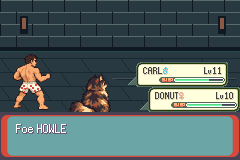

# V01 storage and retained-reference offline checkpoint

Implemented and compiled, offline tests passed, **no gameplay execution**, draft PR114/unmerged. Source `214a10a214bda76422bf59aaa71df9c42766360e`; starting publication268fa9a8; existing [PR114](https://github.com/12nuskek/DungeonCrawlerCarlemon/pull/114) and existing [tracking issue106](https://github.com/12nuskek/DungeonCrawlerCarlemon/issues/106). No new issue/task/schedule or Library transfer. [Contract](../../../../../floor1/v01-storage-reference-contract.md).

The earlier full-history recorder required28,672,406,296 bytes, exceeding available space. This checkpoint retains complete frame summaries/hash continuity and lossless detail from the most recent accepted native boundary through the current frame. All original observations and complete2560/typed B/F/E comparisons run before any detail is discarded. Discarded records cannot be reconstructed from summaries; this is **not lossless full-history storage** and is not a demonstrated remedy for any historical gameplay failure.

## Actual offline evidence

- [offline-result.json](offline-result.json): PASS2968 writer/comparison cases and425 format/binding/preflight cases. Includes every2560 state byte and29 metadata byte mutation; all reject before accepting an anchor. Rotation,250 active/2046 startup limits, first stop/freeze, every184-byte short write in both files, overflow and strict117 precedence pass. No CPU/event/interpreter/ROM/Save load or gameplay host invocation.
- [writer-stress.log](writer-stress.log): file/counter/read-only retained-snapshot tests only. The zeroed synthetic board initially omitted mTiming.relativeCycles, causing a fixture diagnostic failure; it was diagnosed and fixed before rerun. Production code and assertions were not relaxed. The final identity test also stopped on differing ELF FILE-symbol basenames; compilation now uses the production basename observer.c. The failed development outputs remain private and separate.
- [legacy-capacity-stress.log](legacy-capacity-stress.log): PASS352 legacy backend cases, all38044 maximum4096-record frame flushes plus separate FINISH through a byte-checked counting sink. No28GB file or CPU execution. Prior216 legacy parser cases remain historical; they are not claimed freshly rerun here.
- All999932 actual records of the retained failed baseline were replayed as **file data only**, producing16001 summaries. Every frame SHA matches the original payload; chain/cumulative counts match. The final18 records byte-match the original from the most recent accepted native boundary. Maximum retained startup chunks2044; final anchor ordinal13720. Original actual trace remains SHAaac0963fde9fbd6237f44dd8082ddca59f6b40627a8b6857a017c82673b8669a. New summary SHA521cd2699aa47d704f36d985477581cdf52db09025002c52ff40fe36ba332f41; new detail SHA99f4f400d42ca6ef4eb68546aa8d3480d39eaa9f29e96a7a6be5747b91d1a30d. No new typed E, PASS or runtime image was invented.
- [reference-verification.json](reference-verification.json): original complete executionf3ceae89 reverified against exact original build, source, identity/claim/summary/log/route/Save/fixture pins and published metadata. Raw40269443 bytes/SHA849a1585,15379 B,15627 F,248 zero frames, maximum consecutive zero12, initial zero0 and real E. Every full snapshot/checksum/control/input/metadata/typed-finish hash matches. Failed4e295249 partial data cannot serve as an oracle. Original unavailable legacy saves remain unavailable.
- [storage-bound.json](storage-bound.json), [working-bound.json](working-bound.json), [storage-preflight.json](storage-preflight.json): combined bound7,064,285,184 bytes, observed free7,192,756,224 at final check. Startup detail1,541,996,576; active detail188,416,032; summary7,000,312 bytes. Full capture/helper export/reference/log/working/metadata/filesystem costs included. Recheck mandatory before any future preparation and game process; no guaranteed future fit.
- [build-identity.json](build-identity.json), [source-file-hashes.json](source-file-hashes.json): generated host SHA1647352d92b3fa6f0135cf80f4c48df1c2a8a3818b711fd94651390a6334977f; compiled production observer.c binarya17ea5134e700efd77552d9a279fd4d6dd94294d443683b8e9fbfe142361ccbd. Fixed record buffer753664 bytes plus88-byte storage context/bounded SHA stack. Surrounding host normalisation reproduces capacity host64a924e8 exactly after removing reviewed storage hooks; all13 setKeys, ordinary route, policy,30k battle/36k visual bounds and strict comparison paths retained.
- [preservation.json](preservation.json): nine existing claims unchanged, six baselines/three candidates, no fresh claim/preparation. Local STOP119 archive SHA2002f5e41fbaa23fce16f6765410af8373568099fb0bcba20d7493d1718535bd/11231496 bytes and ordinary Save030b hash reverified. All old STOP35/107/105/103/117/119 and controller/three strategy records retained. Five Library transfers remain failed/cancelled, none retried; no new finalized ID or durable fresh-backup claim.

Game/art source unchanged: optimized2feadf56764c0d89c3dde9ef4622ea6d43b32f69, enginebaac7fee52e2133fa6192799ef3851f629f188d7, ROMa022b2a5030214f8cbeb0621af47e6cb9a47208424aa86f56b67862b5028f8d4, ELFf31a5a8b2cb1602df378a7ca66b3cee8bbcea86de000536ab6f55acd727d0218. The pinned game products were hashed/read for integrity only; no new game build was needed for this host-only increment. Compile success and offline PASS do not establish gameplay equivalence.

## Reconciliation and publication

Before publication all68 heads/65 PRs matched the starting inventory; PR114 was the only open PR, draft/unmerged, base mainc6d647a815ffce44a2419a2cf83b6c2c094359f0. Starting268fa9a8 had zero checks/statuses/workflow runs: absence, not CI PASS. Accepted plan SHA9b3e5d6f607a5345f73ea06dc38211d1c1a085bcd1d505a5772d4fb88e71ef27 and complete historical status bodies preserved. Only the existing task branch is normally advanced; no force push/protection change/merge or history deletion. Publication metadata contains the concrete source and parent pins; final head/CI state is checked after push.

Only hashes, counts, safe source/fixture reports and contracts are published. Raw datasets, actual keys, full private symbols, decoded party identities, VRAM, executables, ROMs and Saves remain outside Git/uploads. New summary/detail files are0600 in a0700 local private validation root; no durable external claim for them.

No new screenshot applies to an offline storage/binding change. This preserved actual image is from **4e295249 original-baseline STOP119**, not a new execution or current candidate acceptance:

Parent storage/host/reference review is the next dependency. There is no baseline restart or candidate preparation/execution here. Any later separately authorised ONE candidate must use this explicit retained complete reference contract, reverify original bytes and fresh storage, freeze the exact reviewed source/build/host/ordinary Save/route/policy, and stop first failure. Historical cause/remedy, complete candidate actions/motion/victory/cleanup/reward/Save/equivalence, original legacy-input/C01, human pacing and full-floor gates remain open. Nine-district Floor1/Book1 opening scope unchanged; no acceptance transfer, waiver, retry, rollout or expansion.
