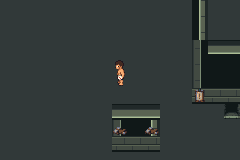
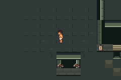
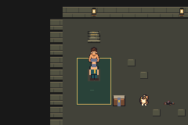
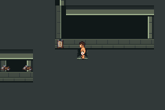
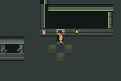
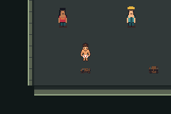
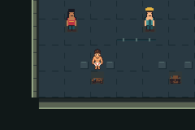
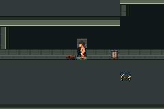
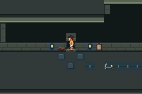

# V01 environment-only visible pilot

Implemented, compiled and bounded runtime verified; **draft/unmerged**, parent
visible-pilot review next. Base is PR111's verified ordinary merge
`54526744eb7ed961007ffe6100f976a1e7448e8b`. The accepted G01e integration and
historical failure/controller records remain separate and unchanged.

Game/assets/build source: `2748afa8bca3e3f405c8da3342c9938fd1e5d3df`.
Host, separate corrected route and both actual executions:
`45fd1550be6c6f895a20e66bc63d5d4027a241e2`.
Candidate engine tree: `fc20261a125a62357fc90293c53a2995e31fe855`.
Candidate ROM SHA256:
`76dd6ae4606ad52167e7cdad5966ae02c695b968407b6e7c3b9bc5c66d0cc4e5`.
Candidate ELF SHA256:
`b99a602cb3250883e1a508c984da3415e44dad928ae542b90a51e93b7de75053`.
Before uses the fresh committed integration build at a83777b9, whose engine is
identical to this 54526744 base: ROM
`23c77a0c3eb86bac74aee25b189c147f172601d29403cbd485f665aec705b167`.
Exact full before ELF, tooling, fixtures, route and host hashes are in
[build-identity.json](build-identity.json).

## Native environment change

Six engine asset files change. Field71, Quiet17 and Workshop117 unique cells:
native junction slabs/scuffs/cracks; warm safe-door lintel/lamps/pools and Quiet
mat; cold Workshop floor/lamps, workbench/cache approach repairs and optional
conduit cue. Actor/warp/dynamic-state cells are excluded. All map dimensions,
collision/elevation bits and per-cell behavior/layer attributes match the base.
All C, events, scripts, encounters, anchors, route widths, save layout, characters
and battle animations are unchanged. The old atlas/metatile/attribute prefixes
and all palette files are unchanged. [Independent diff checks](static-review.json)
and [placement/source manifest](../../../../../scripts/contracts/f1-v01-environment-assets.json)
record the exact cells and inspected existing native PNG identities.

The existing native package verifier passed123 checksums,91 native PNG identities
and721 static checks. Generated concepts remain references; they are not runtime
captures. Missing original prop masters/optional packed4bpp remain missing and did
not block verified PNG reuse. No new concept batch or master reconstruction.

## Actual equivalent traversal

One separate before and one candidate execution on the frozen settled route:
**116+116 assertions**, zero emulator errors, **8188 absolute frames each** under
24000, zero battles/attempts/actions/Save. Actual ordinary cold boot, existing
arena exit, Field junction circuit, blocked pillar attempt, Quiet/guide/mat
approaches, Field returns, Workshop/workbench/cache and optional spur checks pass.
Thirty explicit state checkpoints and five complete re-entry comparisons each.
Native phase sampling: before6094 valid/50 deferred; candidate6093/51 deferred.
One extra deferred candidate frame is retained by the unchanged phase gate;
absolute clocks, position expectations and final state agree. No tolerance,
re-anchor, injected state, battle replay or timing/RNG search.

Input/output ordinary Save SHA256 is unchanged in both cases:
`030b12fd3516351b0935b9298f24d0a2078fb33afecbccb6ba3a9b4c2db6b73c`.
This is PR110's reconstructed ordinary manual save at arena35.3/8,7, Carl11/Donut10,
HP38/30, PP8/40/2/40, Potion1/SCRAP2, patrols resolved, boss/preparation unset.
It is not a recovered original legacy save. Live native walking counter47→53
crosses127→0 once at5773; source-derived friendship89/81→91/83, exact reconstructed
checksum/ciphertext, all other600 party bytes/count/flags/logical resources verified.
Final live position35.0/43,42; disk save remains its original arena state. No new
manual Save/cold-persistence acceptance is claimed by this visual-only check.

[Before summary](before-summary.json) and [candidate summary](after-summary.json)
give actual clocks, scene views and allocation peaks. Existing pure host checks
passed2872 walking cases and1353 additional phase/clock cases; fresh hosts compile
with `-std=gnu11 -Wall -Wextra -Werror`. The game compiled from an isolated Git
archive with `make -C engine -j2`, exact Emerald731ad5/agbccda598c tooling and
verified upstream multiboot blobs. No stock-ROM comparison claim for this custom
game. Full native text build/emulator logs are privately retained.

## Actual allocation and hardware evidence

Every scene view checks the complete native connected-map interior (Field3072
words, rooms224), including unchanged flag-driven overlays; uploaded secondary
tile bytes at VRAM06004000; palette banks6/7/8 at050000c0; and actual BG1/2/3
controls/tilemaps. BG char base0,4bpp,32×32 screen blocks29/28/30,2048 bytes each.
Atlas192→196 unique tiles,208 allocated: actual upload6144→6656 bytes, **+512**;
metatiles180→206. No new palette bank. Junction referenced BG tiles20→31,
max630→707, mask0048→00c8; Quiet guide14→32/max594→691; Workshop bench20→34,
max594→705, mask00c8→01c8. These count referenced BG tile IDs, not OBJ allocation.

| Visited scene | Object / sprite / OBJ tile / OBJ palette peaks, both | Heap used peak before→after | Minimum free before→after |
| --- | --- | --- | --- |
| Field | 8 / 12 / 64 / 2 | 11648→11648 | 102944→102944 |
| Quiet | 6 / 10 / 56 / 2 | 11648→11648 | 102944→102944 |
| Workshop | 5 / 9 / 44 / 2 | 11648→11648 | 102944→102944 |
| Warden approach boot, no combat | 2 / 6 / 36 / 2 | 34176→34688 | 80384→79872 |

Actual native heap headers/list/total114688 bytes verified on each source-valid
sample. Candidate boot heap peak increases512 bytes; no equal-heap claim.
Checkpoint room was not visited (zero samples). Linked EWRAM249704/IWRAM30892,
SaveBlock1 15752/SaveBlock2 3884 remain unchanged; ROM linked14933292 bytes.
No runtime stack peak, hardware speed/performance or battle-scene measurement.

## Actual native images and ordinary-speed clips

Each image is unscaled240×160 from the indicated independent emulator execution.
Both use host/route source45fd1550, beforeROM23c77/candidateROM76dd.
Fourteen equivalent scene views plus one actual collision frame per case are
retained here. [Capture/frame hashes and provenance](capture-provenance.json).

| Scene / assertion | Before | Candidate |
| --- | --- | --- |
| Junction traversal and loaded scene |  |  |
| Quiet guide approach / exact room |  |  |
| Existing safe doorway / return warp |  |  |
| Workshop workbench approach |  |  |
| Optional cue / approach |  |  |

[Before ordinary walking](before/ordinary-walking.mp4) /
[candidate ordinary walking](after/ordinary-walking.mp4):720 consecutive actual
native frames each,240×160,262144/4389 fps (~59.7275),12.054749 seconds. Normal
speed, no interpolation/time compression. Clips cover the same junction circuit
and blocked input. The container lacked ffmpeg: both native executions exited0
and captured frames/PNG conversion completed before encoder FileNotFoundError
(outer Python exit1). Host ffmpeg encoded those existing frames offline; ffprobe
verified frame count/rate/size. No emulator re-execution or changed source/gates.

## Preserved first failure and limitations

Original baseline source2748afa8 stopped at3932 frames,25 assertions, exit14:
next up batch reached29,23 instead of29,24 after blocked right animation.
[Original STOP](original-baseline-STOP.json), raw log, claim and partial frames are
retained separately; original candidate was prepared but never executed.
No final raw stop-frame snapshot exists for this ordinary exit14; previous stable
snapshots/per-frame log/actual frames exist locally. Do not invent one.

Native `CheckMovementInputNotOnBike` bypasses turn delay while still MOVING;
custom blocked batch lacked the40-frame zero-input settle used after every other
walking batch. [Separate diagnosed contract](../../../../floor1/v01-environment-settled-contract.md)
adds that one settle only. Original route/host/assertions/game/assets remain
unchanged; failed25 assertions do not count toward the new pair's232.

[Private retention receipt](private-retention.json): new ordinary saves, complete
text logs, original STOP/claims, every actual raw frame/PNG and clips saved to
supported private Library. All native .bin diagnostic buffers, including
key-bearing encoding contexts, remain local outside uploads; no ROMs/ELFs/binaries,
credentials or denied old datasets were uploaded or committed. Original16 legacy
saves/raw logs/original patrol-complete save remain unrecovered. Fresh inputs never
substitute for their acceptance gate. All historical strategy failures/controllers
remain unchanged. No uninterrupted C01/human pacing/nine-district completion or
broad V01 rollout claim. Parent visible-pilot review is the next dependency before
any separately scoped character/reaction/action-bound battle stage.

Publication preflight found no open PR and main54526744 unchanged; all existing
remote branch heads retained. Main protection disabled/rulesets empty; previous
403 administration read retained, no bypass. Empty check/status/workflow results
are **absent CI, not success**. [Safe preflight record](publication-preflight.json).
