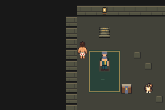
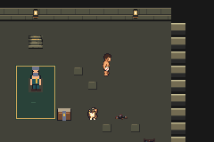
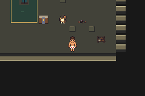
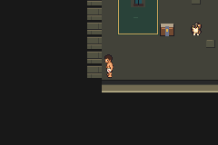
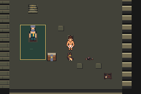
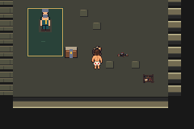
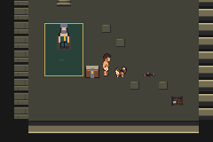
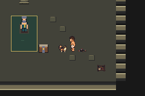
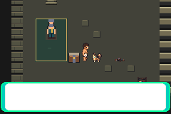
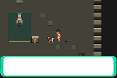

# V01 overworld character stage — actual runtime review

**Implemented, compiled and bounded emulator checks passed; character stage remains unmerged pending parent visual review.** Environment PR112 was accepted by the parent and Kurt, then normally merged at `c2f0d74759bb35b2f25e99f104e48f88635f049f`. Its reviewed tree and both parents are recorded in [environment-merge.json](environment-merge.json). All 65 non-main heads remain unchanged. CI checks/statuses/workflows were absent, not passing.

Carl's nine authoritative 16×32 gait frames and Donut's three 16×16 standing frames were inspected and reused exactly. Right-facing art uses native hardware mirroring. One cleaned side-facing attention pose was appended to Donut's existing graphics ID and object slot; it raises the head while keeping palette, transparency, feet and pivot. The existing Talk interaction displays it for 24 native frames and restores the standing animation. Its custom table uses the standard native step-animation registration metadata. No new follower, movement task, script wait, dialogue, collision, encounter, reward or save ABI. Environment pixels and maps are unchanged. Source art and generated masters are distinct from the actual captures here; no concept batch was generated.

## Exact identities and evidence

| Identity | Baseline | Corrected candidate |
| --- | --- | --- |
| Main/base | `c2f0d74759bb35b2f25e99f104e48f88635f049f` | same |
| Execution/host source | `640be7827e2cf302ed88b202836beafd68953e90` | `4938927da512543ca9aeea9527c103c84955e632` |
| Game build | `2748afa8bca3e3f405c8da3342c9938fd1e5d3df` | `4938927da512543ca9aeea9527c103c84955e632` |
| Engine tree | `fc20261a125a62357fc90293c53a2995e31fe855` | `76001ee128785714b7c15aef6d9c95630587d0a9` |
| ROM SHA256 | `76dd6ae4606ad52167e7cdad5966ae02c695b968407b6e7c3b9bc5c66d0cc4e5` | `ae1e9d36a94ed2eaa9d8fc79d790a2dc47173b932551891d889c657e12ca8461` |
| ELF SHA256 | `b99a602cb3250883e1a508c984da3415e44dad928ae542b90a51e93b7de75053` | `2fb481bdb041772fef7aa0ed15deb6a30b7a24c54f9f6d487c2b733fe26fb066` |
| Actual native result | 64 assertions / exit 0 / zero errors | 64 assertions / exit 0 / zero errors |

[Before identity](before/identity.json), [after identity](after/identity.json), [before actual summary](before/summary.json), [after actual summary](after/summary.json), [pinned fresh build](build-setup.json), [reviewed source invariants](static-review.json).

The same 153-command readiness-aware route SHA256 `0ab00e9eeca779d8af7dc121176339b6057432c562856703a74cee3d4dc67937` and generated host SHA256 `12f1f27d74139bfca3aae881de86049e411250e6f980d5b4f2e9bb6ca1b3f5bf` were used. Each execution consumed 7,924 absolute frames, with 5,859 valid stable samples, 21 deferred samples, 16 explicit checkpoints and two re-entry comparisons. The accepted baseline execution is reused by identity; it was not repeated or relabelled as a new claim. No Warden or other battle started. Input/output ordinary Save remained exactly `030b12fd3516351b0935b9298f24d0a2078fb33afecbccb6ba3a9b4c2db6b73c`. The live walking counter advanced 47→126 without a friendship boundary; native friendship, full party, flags and resources remained exact. No manual Save or new cold-persistence claim is made in this stage.

Across 4,329 character samples each, actual OBJ VRAM matched all nine Carl native frames and mirrored gait 2/7/8. Donut's candidate matched all three standing frames, mirrored side and fourth attention frame; west/east attention each occupied exactly 24 actual frames. Hardware palette bytes matched both native palettes. Carl remained graphics ID/slot/sprite 0, 16×32, pivot −8/−16; Donut remained ID 203, slot/sprite 5, 16×16, pivot −8/−8 and the same coordinates. Each of four existing conversations took exactly 704 frames in both builds, with controls ready and resources exact afterwards. Five actual scene checks per case retained exact Quiet interior words, loaded secondary BG data and palette banks 6/7/8.

| Visited scene | Samples per case | Peak objects / sprites | Allocated OBJ tiles / palette slots | Heap used / minimum free bytes |
| --- | --- | --- | --- | --- |
| Field | 649 | 6 / 10 | 64 / 2 | 11,648 / 102,944 |
| Quiet | 5,007 | 6 / 10 | 56 / 2 | 11,648 / 102,944 |
| Warden approach (noncombat boot) | 714 | 2 / 6 | 36 / 2 | 34,688 / 79,872 |

Before/after sampled budgets are identical. Workshop and Checkpoint were not visited; zero samples there are not budget acceptance. Native heap headers/bounds/sums and allocation bitmaps were checked. Linked candidate EWRAM 249,712 bytes is +8 for visual state; IWRAM 30,892 unchanged; linked ROM 14,933,748 is +456. SaveBlock1/2/storage sizes remain 15,752/3,884/33,744. These linked sizes are separate from runtime peaks; no stack, hardware performance or battle budget claim.

## Actual screenshots and ordinary-speed clips

All screenshots below are native 240×160 emulator captures. No art mockups or fabricated states. Candidate tested SHA is `4938927d`; baseline execution SHA is `640be782`, with base `c2f0d747` and game/ROM identities above.

| Carl direction | Before | After |
| --- | --- | --- |
| North |  |  |
| East |  |  |
| South |  |  |
| West |  |  |

| Donut standing | Before | After |
| --- | --- | --- |
| North |  |  |
| South |  |  |
| West |  |  |
| East |  |  |

Actual first observed west/east attention pose (second native reaction frame):

 

| Ordinary input sequence | Before | After | Actual frames |
| --- | --- | --- | --- |
| Four-direction gait | [clip](before/directions.mp4) | [clip](after/directions.mp4) | 752 |
| Existing north talk | [clip](before/talk-north.mp4) | [clip](after/talk-north.mp4) | 704 |
| Existing south talk | [clip](before/talk-south.mp4) | [clip](after/talk-south.mp4) | 704 |
| Existing west talk / reaction | [clip](before/talk-west.mp4) | [clip](after/talk-west.mp4) | 704 |
| Existing east talk / reaction | [clip](before/talk-east.mp4) | [clip](after/talk-east.mp4) | 704 |

Each accepted case has 3,568 actual captured clip frames. Native rate `262144/4389` fps is preserved by offline ffmpeg; ffprobe verifies exact frame counts, rate and native dimensions. No emulator was rerun to encode media. [Encoding record](clip-encoding.json) distinguishes all four executions, including retained failures. Frame/image/clip hashes: [artifact index](artifact-index.json).

## Preserved failures and diagnosis

1. Original baseline `2a76829f`: STOP97 after 61 assertions at 7,924 frames. Observer incorrectly treated Sprite.hFlip override as effective mirroring, producing mirrored masks zero. Actual native XOR source cases prove hardware OAM.attr1 bit12 supplies effective flip. The candidate in that original pair was never executed. [Original STOP](original-observer-stop.json), [four native XOR cases](oam-offline.txt).
2. Separately claimed effective-flip baseline `640be782` passed 64; its candidate on game `2a76829f` / ROM `4cfc89f8a7b1193b3e0c5013dd183b284165bc39e029524818452ccb93fddfd0` STOP97/61 at 7,924. Donut's north-facing object retained the down image: the custom animation table was absent from native sStepAnimTables, so SetStepAnim changed animNum but skipped SeekSpriteAnim. Both 24-frame reactions and conversations passed, but full direction/budget acceptance failed. [Candidate STOP](unregistered-candidate-stop.json), [actual registry reproduction/correction](registry-offline.txt).
3. Corrected candidate `4938927d` adds one registry entry with exactly Standard's 1/3/0/2 metadata. A new exclusive candidate claim passed against the retained accepted baseline. Route, cadence and every visual/gameplay gate remained unchanged. No automatic retries, relaxed assertions, RNG/timing search or fourth strategy. The hook's [ten offline lifecycle/negative cases](hook-offline.txt) also passed.

Both failures, original claims, actual stop clocks, logs and frames remain separate. All three historical strategy failures and controllers remain unchanged. Legacy-input acceptance remains unavailable: the original 16 legacy saves/raw logs/patrol-complete input from the deleted environment were not recovered. Fresh ordinary saves never substitute for them.

## Private durability and next dependency

Supported private Library retention succeeded for `DungeonCrawlerCarlemon-V01-overworld-20261009.zip`: 36,460,857 bytes, SHA256 `78d9dbaa8dce6b8a392793480ddd54f702416a31696b15a349075bdd349bab56`. The 14,661-file archive contains four separately labelled ordinary saves, complete safe text logs/claims/metadata, 14,385 original PPM captures, representative PNGs, and all 20 ordinary-speed clips across failures and accepted cases. Duplicate sequential PNG derivatives are excluded; every original PPM is retained. ROM/ELF/executables/symbol dumps are excluded. Key-bearing/denied native .bin diagnostics remain local outside uploads, a stated durability limitation. Local Library identity xattrs were verified. [Safe retention receipt](private-retention.json).

**Stop for parent visual review of this scoped draft.** Battle action-bound poses, C01 timing/human pacing, full nine-district production and full-floor acceptance remain later dependencies. No merge or broader visual rollout of this character stage is claimed or authorised by its runtime results.
