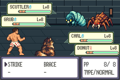
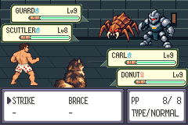
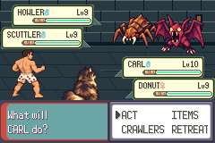
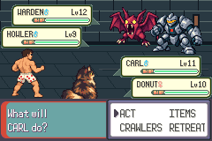
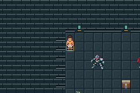

# I01 opponent artwork: integration evidence

Base: `eb73f725d0c5c1488386e56f28f8080eb3a6f884` (S03 merged).
Asset-only package: PR33, head `2c9a1b8ec8cde57cb064d12153a2fc438a10b77b`.
Tested source: `81b232ae41647b5e456e45ed73d51a170f17fb58`.
Production ROM SHA256:
`f46643a4a2eb0065e75ed33ea2baafe533d5508a8ee45922282108e778e43948`.

The five existing opponents now use the source-derived native candidates reviewed
by the parent: Scuttler, Grub, Guard, Howler and Warden. Four existing map tokens
and five icons use the unchanged shared palette. No Grub map object, enemy,
encounter, stat, AI, move, collision, save-layout or timing change was added.

The first real trial capture exposed Scuttler feet behind Carl's HP panel. The
exporter now lifts battle pixels eight rows within each existing transparent
64×64 canvas. No opaque pixels are removed, resized or recolored. Original
candidate masters remain intact. Guard's inherited Spinda spot renderer is a
no-op so personality cannot change its authored pixels. Complete sets are owned
by `opponent_art.py`; the old geometric exporter cannot overwrite them.

## Validation

Run `bash scripts/test-i01.sh` using [the documented tools](../../testing.md).
The runner builds an isolated committed archive, compiles the mGBA 0.10.5 host
with warnings as errors, drives normal controls and rejects emulator errors.
Its final source/head guard detects concurrent edits.

- 1,053 runtime assertions in 62 sessions: 860 production and 193 explicitly
  labeled capacity/depletion fixture assertions; all 62 error logs empty.
- Nine exact RGB555 framebuffer comparisons: every opaque source pixel of five
  battle fronts and four map tokens appears at its expected native color. This
  detects clipping, palette substitution and Guard procedural markings.
- Two complete content regenerations preserve all 7,385 graphic/tileset files,
  normalizing only upstream palette text line endings. Native source conversion
  separately reproduces all 41 generated outputs twice; 24 PNG format checks pass.
- Actual battle/map/menu/summary/ending screenshots are reviewed alongside logs.
  The full suite rechecks combat, optional preparation, recovery, collection guards,
  rewards, crafting, quests, cold saves, protagonist palettes and movement.

Complete logs, input routes, ROM identities, pixel match positions and frame
hashes are archived here. Fixture ROMs are diagnostic only and never delivered
as playable builds. No ROM, save or executable is committed. Failed palette
preflight and pre-placement visual evidence are retained under `diagnostics/`.

Enemy icons/back views are not exposed by the permanent two-crawler roster;
file/palette contracts are checked without adding a collection interface to
inspect otherwise unreachable UI. Production menu/summary checks cover Carl and
Donut and preserve their existing palette behavior.

## Precise limits

The six cold-retry routes prove battle re-entry, not victory in each exact
recovered-save attempt. Separate routes prove wins. Only the prepared approach
has a successful uninterrupted fresh route; segmented unprepared victory passes,
while two earlier continuous unprepared attempts lost. Accessible recovery is
verified; a fixed strategy is not guaranteed across damage/targeting variation.

The continuous route is 90,586 emulated frames (25m16.655s at 59.7275 Hz), including
53,700 fixed idle frames, 4,951 scripted button frames and 31,935 battle-pilot
frames. Startup is included. There are no mid-route reboots. This is not a human
completion time and does not establish the 20–30 minute design target.

Source art is generated, deterministically converted and lightly corrected, not
hand-drawn animation. Opponent backs duplicate fronts; battle/icon frame pairs
are static duplicates. Donut and enemy tokens are stationary. Inherited audio,
attack/send-out effects, some UI frames and labels remain documented placeholders.
No later-book story or canon-monster claim is introduced.

This completes requested improvement cycle 1. No further substantive regression
was found in this review; stop rather than invent additional cycles. Await the
user's playtest before Stage 6 or broader presentation/system work.

Before images explicitly identify S03 or the failed b82dff4 placement. All other
captures use tested 81b232a. `SHA256SUMS` covers this directory except itself.
Integration/merge and private delivery status are recorded in progress.md/PR32.
