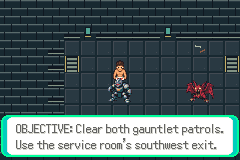
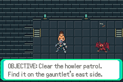
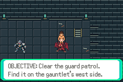

# N00b: remaining patrol objectives

Base a9491f17c82a9da99fdca9acde21be612aac0260 (N00 merged).
Tested source8e9d0d05c4529d45aa268c8cc04cbde853bf1d72.
Production ROM SHA256:
862302c8cad5c4d2c0c22565af7fb24cdfd7c89dbb2a405d2ad3cdae2193e0a8.

The Journal now distinguishes both patrols pending, only guard pending, only
howler pending, and both cleared. It reads existing trainer flags, adds no state,
and retains the same page count and remaining Journal behavior.

`bash scripts/test-n00b.sh` with ../../testing.md toolchain: isolated committed
archive build, mGBA0.10.5 host compiled with warnings as errors, 416 assertions
across23 production sessions; all23 emulator error logs empty. Includes all373
unchanged N00 core assertions, four cold Journal routes ×8, and11 alternate-order
battle/save assertions. Nine exact opponent framebuffer checks pass. Every actual
objective image was reviewed and fits the native text window.

The howler-first state is earned in an ordinary battle using the offensive input
policy, saved normally and cold reloaded. The initial fortify policy lost with
normal recovery; its failed assertion/log/route are preserved under diagnostics.
No game/balance change was made to force the result. The source engine and ROM
are identical between that diagnostic and the final committed test-route fix.

Before evidence uses N00 production ROM (testedf3514ca, SHA2561a9d4b24…999573)
and a copy of the ordinary guard-cleared manual save; eight assertions pass.
It demonstrates the old stale 'both patrols' page on the same state and position.
The before process is separate from the final23/416 count. No memory/save edits,
fixture ROMs, or fabricated captures. ROMs, executables and saves remain local.

This verifies both encounter orders and persistence of these objective states.
It does not extend earlier six defeat-retry checks beyond battle re-entry or turn
automated frame timing into human completion time.

