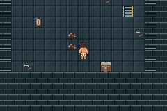
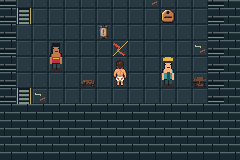

# N01 first visual increment: semantic props

Tested c51012486790bf344883deae73d9e4df783091a0; implementation base
f8fc81750386032c940e82aaabf40e1c82e4e073 (audited reference kit merge into N01).
Main integration base d36f3af20c9b690a6249141fad5e4d3e82f54e98.
ROM SHA256 ec3cdf914b55d36da913db570ab83ad1cffbcd59869ab71c9e47c4fe075c55f9.

Six selected native masters distinguish nine existing objects. Six explicitly
unused graphics slots76–81 reuse the existing MovingBox shared palette. Rubble
no longer uses Donut's NPC1 colors. No coordinates, scripts, state, collision,
save layout, dynamic graphics range or approved protagonist/opponent art changes.

`bash scripts/test-n01-props.sh` with docs/testing.md tools built a clean committed
archive and ran24 production sessions /434 assertions,24 empty emulator error
logs, nine exact opponent framebuffer checks and six exact prop framebuffer
checks. All1176 map/border cells, six non-graphic event contracts and49 approved
asset hashes pass. All changed prop types and all six unobstructed room views
were visually inspected. Two exports reproduce the six game PNGs byte-for-byte.

Actual matched baseline captures/routes are in ../before (N00 f3514ca). Actual
after captures here use c510124. The rooms route cold-loads an ordinary completed
manual save; no RAM writes or fixture injection. No ROM/save/executable committed.

The partial source kit lacks the original main reference sheet and optional packed
output. Complete source-sheet reproduction remains unavailable; independent game
export uses accepted native PNG masters. Architecture and state feedback are not
implemented by this prop increment. Ordinary supply/wrap crates still share art;
static cleared-encounter/cache feedback and repeated room shells remain pending.

