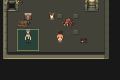
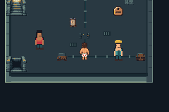
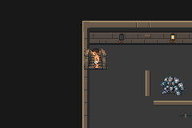

# N01 room composition and presentation-cache compatibility

Base eee114c07792a37e2c281d8807f774be85b5845a (PR41 props).
Tested runtime source cd6946e90fb95095ca2883509dfad19890a78848.
Production ROM SHA256:
17e97672a2a3a6b6f7b670d3d901f4e6be21425a8eb92407a4c91be874cec637.

Selected native materials replace the repeated floor grid and brick-filled border.
Room-specific arrangements establish a rest nook, damaged workshop, two patrol
bays, framed gate and stair overlook.158 used8x8 tiles/160 allocated,157 metatiles,
BG banks6–9. All1176 collision/elevation/behavior values, six event layouts and49
approved character/opponent asset hashes remain identical. Actual room outlines
are still rectangular; a separate geometry increment is planned.

The fresh candidate8e0690b passed434 assertions but an ordinary older save exposed
cached metatile IDs from the previous atlas: garbled graphics and failed exit.
`diagnostics/stale-cache` preserves the failure. The compatibility commit rebuilds
DCC maps from current layout plus existing persistent flags and refreshes matching
object graphic IDs. It preserves position, gameplay state and save layout; stock
maps retain their original path. No save files or RAM were edited.

With the toolchain in ../../testing.md, run:

```sh
DCC_LEGACY_RUN=/path/to/completed/I01/run bash scripts/test-n01-rooms.sh
```

The older save source is I01 tested81b232ae41647b5e456e45ed73d51a170f17fb58,
production ROMf46643a4…e43948, generated by its normal test-i01 routes.
`legacy-inputs.sha256` identifies the three ordinary inputs. Saves stay private.

-27 production processes /475 assertions (434 current-build +41 older-save).
-All27 emulator error logs empty; nine opponent+eight prop exact pixel checks.
-Three cold old-save cases retain levels, action uses, achievements, quest/crafting
 outcomes, inventory and completion state; completed save traverses all six rooms.
-Supplementary same-save recheck passes18 assertions using the exact ordinary
 pre-fix input that previously failed. It is separate from the27/475 count.
-Actual12 current room views, legacy views and representative motion frames
 inspected. walking.gif/json preserve the recorded sequence and frame identity.
-Two complete exports in a clean source archive preserve all8807 tracked source
 assets, normalizing palette line endings only. Two workspace exports also pass.

Export validation found a removed shared `colors` variable still needed by the
unchanged battle palette. The follow-up script correction restores that palette
explicitly. All engine files/assets remain identical to runtime-tested cd6946e;
this correction was validated by the two full exports rather than claiming a
second runtime build. No omitted candidate source artifact was recreated/uploaded.
Full source-sheet reproduction remains unavailable; native PNG masters independently
reproduce the game assets.

Matched before captures are ../props (c510124) and ../before (f3514ca). These are
actual240x160 emulator frames, not assembly diagrams. No generated ROM, save or
executable is committed. Initial recovery/pacing limits remain unchanged.




