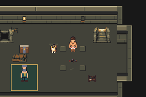

# N04 victory from recovered saves

Test-source commit: `ee340e181ce830412f9b2ebbd9ae9a1c1a73f655`.
Base: `3eba7aded3402bb2c48bcef7dd2311ad313210f9`.
Unchanged engine compiled/tested at `b530fa661254c2c4b5ef1d75ce4010c2d5d741ec`.
ROM SHA256: `dc321def80b7b3d60d0dd5103c73a77d8104135b0ff055a02456656bb76a0891`.

All six ordinary recovery saves now reach victory, survive a resolved repeat
interaction without duplicate XP, and retain their state through manual save and
cold reload. These are the exact inputs from the accepted N03 defeat routes,
identified by the six input hashes. No save bytes or game RAM were edited.

| Recovered encounter | Existing strategy | Victory checks | Cold checks |
|---|---|---:|---:|
| Trial | Direct attacks | 27 | 8 |
| Guard | Early defense/debuff | 27 | 8 |
| Howler | Direct attacks | 27 | 8 |
| Unprepared warden | Three early BRACE/WEAKEN turns | 33 | 8 |
| Carl-down loss | Three early BRACE/WEAKEN turns | 27 | 8 |
| Prepared warden | Direct attacks | 27 | 8 |

12 production emulator sessions / 216 assertions pass, with 12 empty error logs.
All original retry assertions remain before the added victory steps. Cold checks
verify cleared/progression flags, expected XP/equipment and the observed pre-reset
health, status and action uses. Actual victory/cold frames were reviewed; logs,
complete controller routes and persistent snapshots are alongside them.

```sh
DCC_RECOVERY_BASE_RUN=/path/to/accepted/N03/run python3 scripts/test-n04.py
```

The runner requires the accepted 76-session/1,303-check N03 baseline, validates
its production checksum, and rejects any engine/harness source difference before
reusing that clean build. This task changes tests/docs only; no new engine build
or balance change is claimed. `identity.json` records the exact source/build
relationship. Combined same-ROM evidence is 88 sessions / 1,519 assertions,
including the earlier 193 explicitly labeled fixture assertions.

This closes the earlier six-retries-prove-re-entry-only limitation for this ROM.
Prepared uninterrupted completion and segmented unprepared completion remain the
separate campaign-route evidence. Human pacing/playtest is still pending. No ROM,
save, harness executable or diagnostic build binary is committed.




