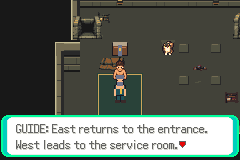
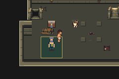

# N05 faster repeat recovery, full final regression

Base: `413523a0ecb85458f2392620d15456c2bfb845bb` (N04 merged).
Tested source: `eaf073d434a9347dfc2ed921f5f44d163563964b`.
Production ROM SHA256:
`8e7e8c20c8dde66488d9374ec90e80391a02c255ad4a0a422e7392f04f1ccfb6`.

Repeat guide visits now restore both protagonists and show one contextual page.
Before the trial it retains the BRACE/WEAKEN hint; after victory it points to the
west ladder. The full first visit is unchanged. There are no new flags, fees,
combat changes, map changes or save-layout changes.

Two ordinary cold-save probes reproduce the previous extra paging: interaction
plus one confirmation still leaves advice open and blocks movement. The same
input on the new ROM closes the page and moves Carl from (4,7) to (5,7), with
full HP/status/action recovery. Baseline exit 14 is the expected reproduction,
not a failed fix or an acceptance pass. `before-readable` waits longer for the
old advice to finish typing; it is labeled separately and still uses two A presses.

| Before: old advice still holds control | After: one contextual recovery page |
|---|---|
|  |  |



Clean isolated build and actual mGBA 0.10.5 replay:

- 78 sessions / 1,315 assertions: 1,122 production and 193 explicitly labeled
  diagnostic-fixture checks. All 78 emulator error logs empty.
- All previous 1,303 assertions retained, plus six before-trial and six after-trial
  control-return checks. Required legacy inputs and exact totals enforced.
- 38 exact rendered comparisons: nine opponents, 18 object/frame cases and 11
  background states. One object case is a labeled capacity fixture.
- All six exact recovered saves then win and cold-reload on this same ROM:
  12 additional production sessions / 216 assertions, all error logs empty.
- Combined: **90 emulator sessions / 1,531 assertions**, comprising 1,338 production
  and 193 diagnostic-fixture checks. No save edits or game RAM writes.
- First-use guide pages, both repeat hints, six room views, state pairs and recovered
  victories reviewed as actual emulator images. Engine assets are unchanged from
  N03; its deterministic export evidence remains applicable.

Use the pinned environment in [testing](../../../testing.md):

```sh
DCC_LEGACY_RUN=/path/to/completed/I01/run \
DCC_CORNER_SAVE=/path/to/ordinary/N01-corner.sav bash scripts/test-n05.sh
DCC_RECOVERY_BASE_RUN=/path/to/accepted/N05/run python3 scripts/test-n04.py
```

`../recovery/identity.json` records the same source/build identity; recovery inputs
have exact hashes and all normal controller routes are retained. Complete raw
build/replay logs and selected actual captures are here and in `../recovery`.
The immutable `production.gba` checksum was recorded before diagnostic rebuilds.
No ROM, save, executable or fixture binary is committed.

The prepared uninterrupted completion route passes. Unprepared wins and the six
same-recovered-save wins are verified separately; do not relabel these as an
uninterrupted unprepared playthrough. Human reading/decision time and the 20–30
minute target remain unmeasured. Static poses, stationary Donut, inherited audio
and some interface elements, compressed chronology and the partial environment
source kit remain disclosed. Stage 6 awaits the user's playtest.
