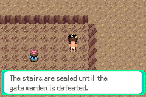
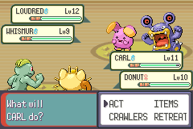
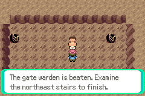
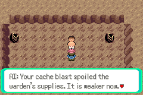
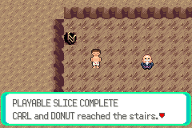
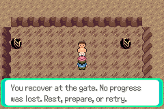
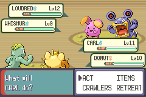

# S01 connected-slice acceptance evidence

Base `369a9ea0dbe8aa61d7f091da533d18c6efafd5fb` (D02 merge).
Tested source `2e8de08292a8a4fe380fda06accdb2b97c798401`.
Production ROM SHA256 `ce16d2fd150917e8d865563fd76fedea571cefc6aaf74da4fdbd780f38617248`.
Implemented PASS; isolated compilation PASS; runtime PASS; integration pending.

`bash scripts/test-s01.sh` with the environment in [testing](../../testing.md)
archives the committed source, regenerates the pinned compiler and all game products,
builds the host with `-Wall -Wextra -Werror`, and drives real mGBA0.10.5 through
normal buttons. Host reads RAM for assertions; it never writes game state.
357 assertions pass in18 production-ROM processes, with18 empty emulator error logs.
All30 selected actual framebuffer PNGs were visually reviewed: readable dialogue,
transitions, combat outcomes and ending, with explicitly provisional upstream art.
SHA256SUMS covers85 source routes/logs/metadata/images. No ROM/save/executable included.

| Route | Assertions | Evidence |
| --- | ---: | --- |
| setup |32| Fresh introduction/rewards (R02 setup-rewards.route) |
| trial |53| Trial win/loot (R02 victory-loot.route) |
| rest |34| Cold save/re-entry/recovery (R02 reload-reentry.route) |
| gates |17| Boss and staircase locked before patrol wins |
| guard |19| First-turn BRACE, victory/repeat/save |
| guard-rest |12| Depletion persists; backtrack and guide recovery |
| howler |16| First-turn WEAKEN, victory/repeat/save |
| boss-rest |14| Depleted cold save then full guide recovery |
| boss-pattern |9| Actual WIND UP/SLAM cadence, countered stages/resources |
| boss-unprepared |25| Defense-first win, no gear/preparation/healing use |
| stairs |10| Cancel, confirm, completion and manual save |
| ending-reload |15| Cold completion, return route, no repeat boss XP |
| preparation |21| Ordinary Scrap→Charge→cache, optional advantage |
| boss-prepared |24| Faster offense wins without BRACE/healing use |
| prepared-ending |12| Cold prepared win, stairs and save |
| prepared-reload |12| Prepared completion persists after cold boot |
| boss-defeat |21| Both incapacitated, local free recovery, immediate save |
| defeat-reload |11| Cold recovered state, retained patrols, retry battle |

Prepared and defeat routes copy ordinary manual flash saves from the same fresh
production progression. There is no fixture ROM, RAM injection or emulator savestate.
The pattern route ends mid-battle without saving; the next cold boot resumes the
last manual save. Branches remain separate so strategy results are comparable.

Unprepared level12 warden falls after BRACE/WEAKEN preparation followed by attacks:
Carl12 XP974 HP8, Donut10 XP1284 HP10. Potion1 and Scrap2 remain unused, no held gear,
quest or trap required. Prepared level10 warden falls to faster STRIKE/SPARK offense:
Carl11 XP940 HP21, Donut10 XP1250 HP24; BRACE untouched and medicine retained.
Both boss flags/stair completion survive cold saves; repeated conversations grant
no extra XP. Controlled defeat uses ordinary STRIKE ally-targeting to incapacitate
Donut, then the warden defeats Carl. This tests recovery, not a recommended tactic.
Both HP0 are observed; local recovery restores HP38/30 and resources8/40,2/40,
keeps prior patrol progress and leaves boss/stairs unset. Immediate save, cold boot
and retry pass. No S01 production defect/fix; route timing corrections only.

This verifies S01 connectivity/combat/progression, not completed S02 artwork/UI,
S03 full regression or the user's playtest. No measured20–30-minute human session
is claimed: automated waits/reboots are not a pacing measurement. Remaining stock
sprites/tiles/icons/animations and inherited labels are scheduled S02 work.
