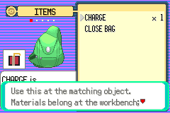
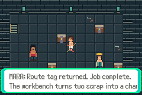

# Independent S02 menu checks while art is blocked

Tested production source `a242983b6f6d061dd2c5bd4916c34f8b1fd10266`, ROM SHA256
`26ef6bff3466499592b994de02293efe338362b79fb9da69a55039206ad0b921` from the isolated
S02 build run-0dHXqs. Reused D02 materials16/craft13/blast-use17 routes on a new
ordinary save:46 assertions PASS,3 empty error logs. No fixtures/RAM writes.
The charge-use message is crawler-facing and the ordinary recipe/cache/medicine
sequence still works. No character-art acceptance implied.

A further completed-quest Journal check exposed an overlong second line. The
before screenshot below is actual a242983 output and shows clipping. That text
was shortened to “Two scrap make one charge.” An incremental8-assertion retest
passes, including unchanged quest/cache flags, HP/status/resources and movement
return. The full S02 runner now includes all four extra routes (182 assertions,
10 processes); that expanded isolated suite is pending replacement art/integration.
Do not describe the old128-check run as the new182-check suite.

