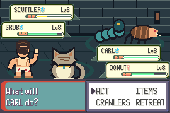
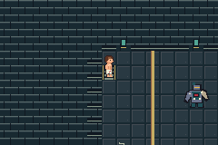
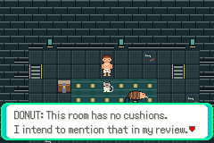
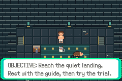

# Current S02 in-engine preview — WIP,2026-10-06

Actual mGBA framebuffer captures from tested source
`5fd9217c639afcc306246dded0e77aeda55f3de4`, isolated run-a7awMe.
Build PASS;128 assertions across6 production-ROM processes PASS;6 empty errors.
Final S02 acceptance is pending visual corrections and integration. These are
gameplay screens, not concept art. No ROM/save is distributed.

- duo-battle.png: trial route31, both crawlers acting, original battle backdrop.
- dungeon.png: fresh setup32, original floor/wall/prop palette.
- gate.png: gates17, original warden/room stripes/lamps.
- donut-scene.png: UI13, original stationary Donut and dialogue.
- journal.png: UI13, objective/rules and return to field verified.

Original geometry remains simple prototype art. Follow-up review identified a
repeating title tile and clipped summary heading, now being corrected; slight
fur/shading and arena-floor polish is also underway. No claim that original art
is finished art, that S03 regression passed, or that the slice is release-ready.

