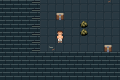
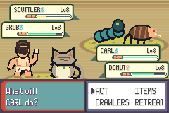
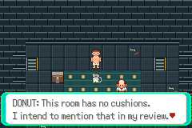
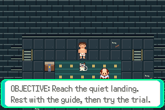
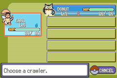

# S02 work-in-progress preview — 2026-10-06

Actual mGBA captures from source `5963c8fdd3f719fb207760230e913e286e79aafb`.
This is an EARLIER S02 checkpoint, not final acceptance. Newer source `5fd9217`
adds original NPCs/title/battle arena and UI corrections; its isolated suite is
running. Fresh setup32 and UI13 assertions pass at this checkpoint. The duo
battle capture comes from a partial replay that stops at an outdated exact
damage expectation; it proves rendered art only, not completed battle acceptance.
The later updated trial31 and rest34 routes pass exploratory checks separately.

Original Carl/Donut battle/icons, stone dungeon tiles, Donut scene and Journal
are visible. Human NPCs, battle backdrop and some labels in THESE images were
still placeholders subsequently replaced/corrected. No ROM or save included.

