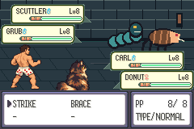

# Replacement battle preview — partial S02 evidence

Actual mGBA 0.10.5 production-ROM framebuffer, not a generated reference.
Tested commit: `ae32d3ff5497a117e1411195dc678192ab134a1f`.
ROM SHA-256: `3ae0c0734ca9b469642a501cb6be57985d4e39da744f1c4a0f1a83d3cd9db5c4`.
Clean isolated build: `artifacts/s02/run-5uuRHD`, `scripts/test-s02.sh`.
Route: `docs/evidence/s02/trial.route`, following fresh setup and UI route.
31 battle-route assertions PASS, empty emulator error log. Both crawlers act;
victory, XP, reward and saving assertions pass. See raw trial log.

This is a partial preview. Matching exploration replacement and its movement/
palette checks remain pending. S02 PR27 is draft and unmerged; S03 full slice
regression remains pending. Static duplicate battle frames are intentional.

The expanded isolated S02 suite subsequently passed all 182 assertions across
10 production emulator processes, with 10 empty error logs. This does not waive
the pending exploration-art acceptance or S03 full progression regression.
