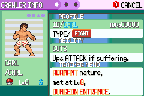
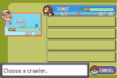
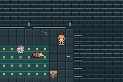

# S02 presentation and interface evidence

Base: `abf9875af2ffead2a342b8a5835c1e3dff157ec0` (S01).
Tested source: `c9062dabb81341bf0525eead8d89ea7ba62043f5`.
Production SHA256: `7a0a87273a6b53bd9104afa2029fd99fe6cee93d30f56dc01881b6adbdcb7b72`.
Implemented and clean compiled; **199 runtime assertions in11 production emulator
processes PASS**,11 empty error logs. Visual review passed for this scoped change.
Integration state is recorded in docs/progress.md / PR27 / issue26. S03 full slice
regression and user playtest are still separate gates; this is not slice completion.

Run `bash scripts/test-s02.sh` using [the documented toolchain](../../testing.md).
The runner archives the exact source commit, regenerates compiler/game products,
builds the host with `-Wall -Wextra -Werror`, and drives mGBA0.10.5 with normal
buttons. No fixture ROM, RAM writes or injected savestates. Hardware palette reads
verify rendering state; screenshots below are actual240×160 framebuffers.

| Route | Checks | Purpose |
| --- | ---: | --- |
| title |1| Corrected title and transparent tile0 |
| setup |34| Fresh tutorial, interaction, transitions and deterministic rewards |
| ui |15| Protagonist scene, Journal, roster/summary and medicine menus |
| trial |33| Both actions, win/XP, rewards, medicine use, save and palette return |
| rest |36| Cold reward/resource state, repeated interactions and free recovery |
| movement |9| Four directions, contact frames, matching coordinates and palettes |
| gates |17| Connected zones, locked boss/stairs and backtracking |
| menu-materials |16| Optional quest/material route and manual save |
| menu-craft |13| Recipe/output/consumption and reload |
| menu-blast |17| Trap, cache charge use and persistence |
| menu-journal |8| Completed objective text fits; Journal leaves state/movement intact |

Routes and raw build/emulator logs are archived alongside captures. The three
menu routes and gates are unchanged copies of previously authored routes. PNGs
prefixed `before-` name their older tested source; all other PNGs use c9062da.
`SHA256SUMS` covers this directory except itself. No ROM/save/executable is stored.

The user rejected the initial geometric sprites and approved the improved native
battle candidates, also requiring matching exploration. [Art provenance](../../art-references/README.md)
distinguishes generated references, native conversion and authored pixel cleanup.
Both protagonists now use approved battle masters and matching exploration art.
Carl's right movement mirrors left; Donut is stationary in existing scenes.
Battle animation/intro frames remain static duplicates. Other remaining inherited
assets are explicitly listed in [the content ledger](../../content-ledger.md).

Visual regression caught before acceptance: Donut incorrectly used pink/blue
NPC colors on a2de128. Its four-bit paletteSlot discarded +16. The corrected
implementation reserves the existing NPC1 slot during dungeon map initialization
and returns the correct tag for reload consumers; no hardware bank or save fields
added. A hardware-color regression failed on the old ROM (23391 versus4196) and
passes at field/menu/battle/reload checkpoints on the corrected ROM.

Carl's head/torso stay anchored across walk contacts. Actual left/up/right/down
captures were reviewed for direction, clipping, palette stability and foot motion.
Art checks cover49 indexed images, seven battle/icon contracts, protagonist frame
packing/margins/palettes, title/arena budgets and11 dungeon metatile behaviors.
All12 map/border collision/elevation fields match S01. No combat rules or save
layout changed. The trial route's recorded outcome remains Carl9 XP495/Donut9
XP805; medicine and recovery preserve their expected resource states.

Title tile0 repetition and clipped Journal text were also corrected during S02;
old title evidence is retained. New dungeon/NPC art, Journal and summary changes
still need S03 full completion/alternate strategy/defeat regressions. This scoped
suite never substitutes for those checks.
